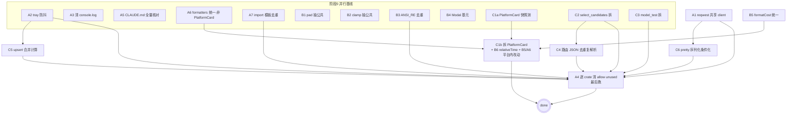

# Implement — deep-audit-optimize

## subtask 总览(19 exec)

| ID | 来源 | 目标 | 资源(主文件) | 依赖 | 验收 |
|---|---|---|---|---|---|
| A1 | perf F1 | reqwest::Client 按 use_proxy 维度缓存共享(复用 TLS/连接池) | http_client.rs:33 / forward.rs:267 | — | cargo clippy+test;每请求不重建 client |
| A2 | perf F2 | tray-refresh 监听端 trailing 防抖(或仅终态 emit) | log.rs:164 / app_setup.rs:395 | — | cargo clippy+test;单请求菜单重建 ≤1 次 |
| A3 | quality F2 | 清 console.log debug 残留 | LogSettingsSection.tsx:33,36 | — | yarn build+test+check:i18n;grep console.log=0 |
| A4 | quality F1 | 清 179 处 #[allow(unused_imports)] 死 import,逐 crate 增量 | 7 crate(commands_system/platform/aidog_core/ai_tools/proxy/tray/config) | 所有 Rust 逻辑 Agent 完成 | 每 crate cargo check 0 warning;禁 cascade |
| A5 | arch F1 | CLAUDE.md 全量核对(路径+页数 18+「前端无测试」错+crate 布局+Protocol 67 变体) | CLAUDE.md | — | 所有 file:line 引用可点开核对 |
| A6 | arch F5 | 15 处 .toLocaleString → formatters.ts::formatDateTime(非 PlatformCard 部分) | src/ 全局 grep | — | yarn build+test+check:i18n;grep .toLocaleString 仅余 formatters.ts |
| A7 | quality F14 | 去 13 处 commands_*/src/*.rs 文件头 import 模板重复 | commands_*/src/*.rs | — | cargo clippy;import 模板抽公共 use |
| B1 | quality F6 | pad 抽 formatters.ts 公共版 | formatters.ts + formSections.tsx:26,416 + ScheduledBackupSection.tsx:25 | — | yarn build+test;原 3 处 pad 调公共 |
| B2 | quality F7 | clamp 抽公共(签名归一) | formatters.ts/shared + popover.tsx:76/PlatformCard.tsx:790/usageColor.ts:56 | — | yarn build+test;3 处 clamp 签名一致 |
| B3 | quality F8 | ANSI_RE OnceLock 去重(catalog.rs 两函数合一) | catalog.rs:90,232 | — | cargo clippy+test;OnceLock 单实例 |
| B4 | arch F4 | 抽 components/shared/Modal.tsx 基元,收敛 9 个 *Modal / 22 处 createPortal | components/shared/Modal.tsx + 9 *Modal | — | yarn build+test+check:i18n;createPortal 统一走 Modal |
| B5 | arch F8 | $${formatCost(x)} ≥3 处 → formatCostUsd(PlatformCard/Groups 内部分,与 C1b 协同) | PlatformCard/Groups | 并入 C1b 在 PlatformCard 的改动 | yarn build+test |
| C1a | quality F5(预备) | 补 PlatformCard characterization 快照测锁定 render 行为 | PlatformCard.test.tsx(新建) | — | yarn test 快照通过 |
| C1b | quality F5+B6 | 拆 PlatformCard 914 行为内部 sub-component(props/导出零变)+ B6 relativeTime 合并入 formatRelativeTime + B5/A6 在 PlatformCard 内的改动 | PlatformCard.tsx:77,774 | C1a + A6(非 PlatformCard 部分先完) + B5 | yarn build+test+check:i18n;12 import 点零影响;快照测过 |
| C2 | quality F9 | select_candidates_ctx 232行/19分支 拆分(签名不变) | router/candidates.rs:46 | — | cargo clippy+test(test_candidates.rs 20+ case 全过) |
| C3 | quality F10 | model_test 272行 线性长函数拆阶段 | commands_ai_tools/model_test.rs:18 | — | cargo clippy+test |
| C4 | perf F5+F7 | 路由层 JSON 重复解析(2-3遍/平台)→ 一次解析传递 | candidates.rs:88,257 / handler.rs:216,305 | C2(candidates.rs 先拆完) | cargo clippy+test;每候选解析 ≤1 次 |
| C5 | perf F4 | upsert_log est_cost + get_platform 重复计算两次 → 合并 | log.rs:39-55,102-118 | A2(log.rs 先改完 tray) | cargo clippy+test |
| C6 | perf F3 | 上游请求体 pretty 二次序列化 → 仅 log 开启时付 | headers.rs:445 / forward.rs:291 | A1(forward.rs 先改完 client) | cargo clippy+test;关日志零序列化开销 |

## 派生 task(不在本 task exec)

### D 批 — 各 create 独立 task 先 planning
- D1: updateField (field:string,value:any) → 泛型/字面量 union(editors/* 10+ 处)
- D2: catch (e:any) 32 处 → unknown + narrowing
- D3: 26 处 eslint-disable exhaustive-deps 逐处审(掩盖真实依赖 bug?)
- D4(原 quality F13 已砍 Mutex,此处 D4 改为):settingsApi.get / read_claude_code_settings Record<string,any> → unknown(boundary F5)
- D5: 边界 F2(all_platform_usage_stats Record<number> → Record<string>)+ F4(RoutingMode 归一)
- D6: perf F6 stream usage 聚合每 chunk 全量 split → 增量解析

> 注:D 批原含 quality F13(Mutex unwrap 防毒),grill W5 已砍(low 价值);boundary F1/F3(latent 无消费点)亦砍。D 批剩 6 条聚焦类型/契约。

### E 批 — 架构决策专项,各独立 task
- E1: 全面迁移 feature-sliced(所有 feature 进 domains/<feature>/,pages+components 退场)— 含 E5 popover 三层归位
- E2: gateway 子目录 vs 扁平语义边界文档化(取舍标准)
- E3: services/api/types/part1-4.ts 按领域重切(platforms/groups/logs/settings/proxy...)
- E4: peak_hours / tray_render Rust↔TS 抽共享 fixtures 防漂移

## 调度图(DAG)

## 文件热点顺序化总结
- **PlatformCard.tsx**:A6(非该文件)+ C1a(测)→ C1b 独占拆分(含 B5/B6/A6 在该文件的改动)
- **formatters.ts**:B1/B2 加函数 ‖ A6 改 caller(不同文件,并行)
- **candidates.rs**:C2 拆 → C4 去重复解析
- **forward.rs**:A1 共享 client → C6 pretty 条件化
- **log.rs**:A2 tray → C5 upsert 合并
- **全 crate import**:A4 最后(所有 Rust 逻辑 Agent 完成后清)

## 砍清单(grill 裁决,不进本 task)
- perf F8(Protocol 小写化 format!+to_lowercase)— low
- perf F12(to_string().trim_matches 取 protocol 裸名)— low
- quality F13(Mutex .lock().unwrap() 5 处)— low(原拟入 D 批,grill W5 砍)
- boundary F1(ProxyLogDetail 缺 blocked_by/blocked_reason)— latent 无消费点
- boundary F3(Group 缺 sort_order)— latent 无消费点
