# Trellis 任务看板

| ID | 名称 | 描述 | 状态 | worktree | 前置 |
| --- | --- | --- | --- | --- | --- |
| platform-presets-overhaul | platform-presets 全面检修: glm 分家 + peak_hours model scope + 清非标准 slot + 全协议数据核对 | — | 已完成 | — | — |
| ctok-forward-models-audit | ctok 转发协议模型清单核实 | — | 已完成 | — | — |
| matrix-sizing | 模型矩阵组件尺寸统一增大 | — | 已完成 | — | — |
| coding-plan-flag | 协议层 is_coding_plan 字段 + 跨层消费 | — | 已完成 | — | — |
| endpoint-badge-protocol-label | PlatformCard endpoint badge 协议名补修 | — | 已完成 | — | — |
| protocols-from-presets | PROTOCOLS 常量改由 presets JSON 派生 | — | 已完成 | — | — |
| protocols-json-schema | JSON schema 扩展 + 5 cp key | — | 已完成 | — | — |
| protocols-rust-enum | Rust Protocol +5 cp 变体全链 | — | 已完成 | — | 07-10-protocols-json-schema |
| protocols-frontend-derive | 前端派生层 + 删 3 常量 + 调用点 async | — | 已完成 | — | 07-10-protocols-json-schema, 07-10-protocols-rust-enum |
| commands-restructure | src-tauri commands 按域合理分包 | — | 规划中 | — | 07-09-mitm-tables-to-setting, 07-10-protocols-rust-enum |
| deps-upgrade-stable | 依赖全部升级最新稳定版 | — | 已完成 | — | — |
| ws-skeleton | C1 workspace 骨架 + 空门禁 | — | 已完成 | — | — |
| core-extract | C2 aidog_core 提取 + 业务下沉 | — | 已完成 | — | 07-10-ws-skeleton, 07-10-protocols-rust-enum |
| cmd-platform | C3 commands-platform crate | — | 已完成 | — | 07-10-core-extract |
| cmd-proxy | C4 commands-proxy crate | — | 实施中 | — | 07-10-core-extract, 07-09-mitm-tables-to-setting |
| cmd-config | C5 commands-config crate | — | 规划中 | — | 07-10-core-extract |
| cmd-system | C6 commands-system crate | — | 规划中 | — | 07-10-core-extract |
| cmd-ai-tools | C7 commands-ai-tools crate | — | 规划中 | — | 07-10-core-extract |
| cmd-tray | C8 commands-tray crate（含 popover 域重划） | — | 规划中 | — | 07-10-core-extract |
| cmd-cli-env | C9 commands-cli-env crate | — | 规划中 | — | 07-10-core-extract |
| app-wiring | C10 app crate wiring + Tauri 验证 | — | 规划中 | — | 07-10-cmd-platform,07-10-cmd-proxy,07-10-cmd-config,07-10-cmd-system,07-10-cmd-ai-tools,07-10-cmd-tray,07-10-cmd-cli-env |
| mitm-tables-to-setting | 移除 mitm_ca/mitm_whitelist 表，数据迁 setting | — | 已完成 | — | — |
| client-types-json-sync | CLIENT_TYPES 移除 → defaults JSON 独立 + 远端同步 | — | 已完成 | — | — |
| client-types-headers-expand | client-types.json simulation header 全补全（~/.aidog 真实请求驱动） | — | 已完成 | — | — |
| protocol-name-display | 平台协议创建后锁定 + preset name 派生展示 | — | 已完成 | — | — |
| groups-delete-only-removes-from-group | Groups 单组平台点删除只移除分组未销毁 | — | 已完成 | — | — |
| presets-desc-remove-format | platform-presets.json 删 desc + peak_hours/models 单行压缩 | — | 实施中 | — | — |

## 依赖关系图 (DAG)

```mermaid
flowchart TD
  07-10-protocols-json-schema --> protocols-rust-enum
  07-10-protocols-json-schema --> protocols-frontend-derive
  07-10-protocols-rust-enum --> protocols-frontend-derive
  07-09-mitm-tables-to-setting --> commands-restructure
  07-10-protocols-rust-enum --> commands-restructure
  07-10-ws-skeleton --> core-extract
  07-10-protocols-rust-enum --> core-extract
  07-10-core-extract --> cmd-platform
  07-10-core-extract --> cmd-proxy
  07-09-mitm-tables-to-setting --> cmd-proxy
  07-10-core-extract --> cmd-config
  07-10-core-extract --> cmd-system
  07-10-core-extract --> cmd-ai-tools
  07-10-core-extract --> cmd-tray
  07-10-core-extract --> cmd-cli-env
  07-10-cmd-platform --> app-wiring
  07-10-cmd-proxy --> app-wiring
  07-10-cmd-config --> app-wiring
  07-10-cmd-system --> app-wiring
  07-10-cmd-ai-tools --> app-wiring
  07-10-cmd-tray --> app-wiring
  07-10-cmd-cli-env --> app-wiring
```

## Worktree ↔ Task 映射

| worktree | task | 创建源 |
| --- | --- | --- |
| /Users/luoxin/persons/lyxamour/aidog/.worktrees/07-10-commands-restructure | 07-10-commands-restructure | trellisx-start |
| /Users/luoxin/persons/lyxamour/aidog/.worktrees/07-10-presets-desc-remove-format | 07-10-presets-desc-remove-format | trellisx-start |
| /Users/luoxin/persons/lyxamour/aidog/.worktrees/07-10-cmd-proxy | 07-10-cmd-proxy | trellisx-start |
