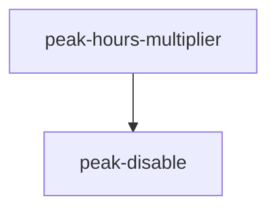

# Trellis 任务看板

| ID | 名称 | 描述 | 状态 | worktree | 前置 |
| --- | --- | --- | --- | --- | --- |
| remove-price-sync | 移除 price_sync 子系统 | — | 已完成 | — | — |
| peak-hours-multiplier | platform-presets 加高峰时段倍率 | — | 已完成 | — | — |
| presets-view-html | Makefile 加 presets 可视化 HTML 命令 | — | 已完成 | — | — |
| peak-disable | 平台高峰期禁用开关 disable_during_peak | — | 已完成 | — | peak-hours-multiplier |
| group-platform-delete-fix | 修复：分组内删平台只移出未删除（单组平台删除图标行为错） | — | 已完成 | — | — |
| group-copy-merge | 分组卡片复制按钮合并（密钥+claude/codex 启动命令三合一） | — | 已完成 | — | — |
| presets-html-json-escape-fix | fix: presets.html JSON.parse 嵌入实体炸（html.escape 误用） | — | 已完成 | — | — |
| codex-responses-api | codex 协议切 OpenAI Responses API | — | 已完成 | — | — |
| doubao-preset-dup-fix | doubao preset endpoint 结构修复（cp 三元混塞 → default+coding_plan 分离） | — | 已完成 | — | — |
| preset-data-completeness | platform preset 数据补全（model_list/default model/client_type 缺失） | — | 已完成 | — | — |
| remove-coding-plan-branch | 删 platform-presets coding_plan 分支去重 | — | 已完成 | — | — |
| presets-endpoint-completeness | 补全 platform-presets 协议端点 base_url | — | 已完成 | — | — |
| group-default-privacy-env | 新建 group 预填隐私 env 默认值 | — | 已完成 | — | — |

## 依赖关系图 (DAG)

## Worktree ↔ Task 映射

| worktree | task | 创建源 |
| --- | --- | --- |
