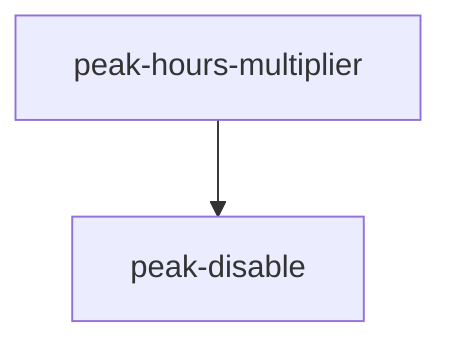

# Trellis 任务看板

| ID | 名称 | 描述 | 状态 | worktree | 前置 |
| --- | --- | --- | --- | --- | --- |
| remove-price-sync | 移除 price_sync 子系统 | — | 规划中 | — | — |
| peak-hours-multiplier | platform-presets 加高峰时段倍率 | — | 规划中 | — | — |
| presets-view-html | Makefile 加 presets 可视化 HTML 命令 | — | 规划中 | — | — |
| peak-disable | 平台高峰期禁用开关 disable_during_peak | — | 规划中 | — | peak-hours-multiplier |
| group-platform-delete-fix | 修复：分组内删平台只移出未删除（单组平台删除图标行为错） | — | 规划中 | — | — |

## 依赖关系图 (DAG)

## Worktree ↔ Task 映射

| worktree | task | 创建源 |
| --- | --- | --- |
