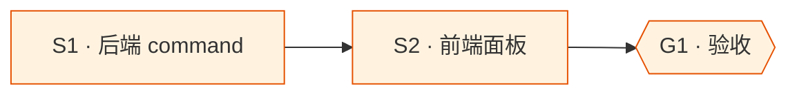

# model-testing

## Goal

新增 AI 平台模型测试功能，支持 5 种测试模式（默认快速测试 / 指定模型 / 批量模型 / 随机提示词批量 / 指定提示词），使用内置随机测试提示词（看似不像真实请求），允许用户自定义提示词，在平台管理页面内展示测试结果。

## What I already know

### 现状

- 协议转换层：`src-tauri/src/gateway/adapter/` 已有 `ChatRequest`, `convert_request`, 各协议 adapter
- 平台模型：`platforms` 表含 `available_models: Vec<String>`
- HTTP 客户端：proxy.rs 使用 `reqwest::Client`
- 前端平台页：`src/pages/Platforms.tsx`
- Tauri command 模式：`State<'_, Db>` 注入

### 调研结论

- 测试请求可复用 `convert_request` 构建 body，用 `reqwest::Client` 直接发到上游，不走 proxy 路由
- 内置提示词应简短、无害、明显是测试（如"What is 2+2?"级别）
- 批量测试可前端循环调用单次测试 command，避免后端复杂并发逻辑

## Assumptions (temporary)

- 测试结果仅展示成功/失败/延迟/简短回复预览，不需要完整流式
- 测试请求超时与系统超时设置一致
- 不需要测试历史记录持久化

## Open Questions

无 (范围已明确)

## Deliverable 矩阵

| ID | 交付物 | 类型 | 独立验收 | 优先级 |
| --- | --- | --- | --- | --- |
| D1 | Rust 后端测试 command（单次 + 结果结构） | diff | cargo check 通过 | P0 |
| D2 | 前端测试面板（5 种模式 UI + 结果展示） | UI | 交互正常，结果展示正确 | P0 |

## Requirements

### R1 (D1) — 后端测试 command

- R1.1 新增 Tauri command `model_test`，接受：platform_id, model(可选), prompt(可选), max_tokens(可选)
- R1.2 当 model 为空时，使用平台 default 模型
- R1.3 当 prompt 为空时，从内置提示词池随机选择
- R1.4 返回 `ModelTestResult`: success, model, prompt_preview, response_preview, duration_ms, input_tokens, output_tokens, error
- R1.5 使用平台的 base_url + api_key + protocol，复用 `convert_request` 构建 body
- R1.6 非流式请求，设置合理超时

### R2 (D2) — 前端测试面板

- R2.1 在平台卡片上新增「测试」按钮
- R2.2 测试面板包含：模型选择（下拉/多选）、提示词输入、测试按钮
- R2.3 支持用户描述的 5 种模式：
  1. 快速测试：默认模型 + 随机提示词
  2. 指定模型：单选模型
  3. 批量模型：多选模型逐个测试
  4. 随机提示词批量：多模型 + 多随机提示词
  5. 指定提示词：单模型 + 自定义提示词
- R2.4 结果表格：模型名、状态(✓/✗)、延迟、Token、回复预览
- R2.5 Liquid Glass 风格

## Subtask 拆分

| ID | Subtask | 所属 D | 边界 | 说明 |
| --- | --- | --- | --- | --- |
| S1 | 后端 model_test command | D1 | models.rs, lib.rs, adapter/ | 结构体 + command + 内置提示词 |
| S2 | 前端测试面板 | D2 | Platforms.tsx, api.ts, locales/ | UI + 5 种模式 + 结果展示 |

### Subtask 调度图



## Acceptance Criteria

- [ ] cargo check 通过
- [ ] 平台卡片出现测试按钮，点击打开面板
- [ ] 快速测试返回结果（成功或错误信息）
- [ ] 批量测试多模型逐个出结果

## Definition of Done

- Requirements 实现 + AC 勾选
- commit 完成
- worktree 合并 + 移除

## Out of Scope

- 流式测试
- 测试历史持久化
- 自动化定时测试
- 测试结果对比/排行榜

## Technical Notes

### 内置测试提示词

```
"Respond with only the word 'hello' in lowercase.",
"Calculate 7 × 13 and respond with only the number.",
"List exactly 3 primary colors, comma-separated.",
"What is the capital of France? Answer in one word.",
"Translate 'good morning' to Japanese. One word only.",
"Count the letters in 'artificial'. Respond with only the number.",
"What is 15% of 200? Answer with only the number.",
"Name the 4th planet from the Sun. One word.",
"What element has the symbol 'O'? One word.",
"How many days are in a leap year? Answer with only the number.",
```

### 验证命令

```bash
cd src-tauri && cargo check
cd .. && npx tsc --noEmit
```
