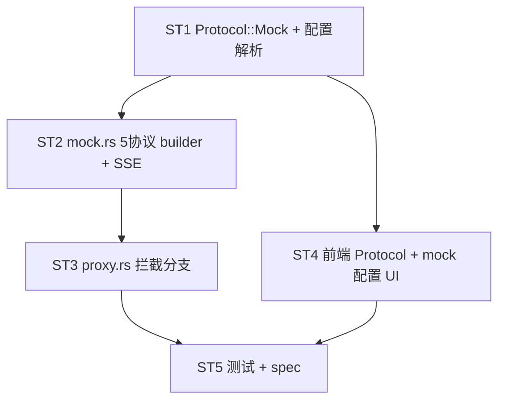

# Implement: mock 平台类型

## 执行层
- 后端 ST1+ST2+ST3 强耦合（Protocol 契约 → adapter/mock.rs builder → proxy 拦截整合），单 Rust agent 连贯做
- 前端 ST4 依赖 ST1 的 Protocol 契约，ST1 后可并行单 agent
- ST5 测试 + spec 在后端+前端就绪后

## Subtask（5 个，文件集划分）

| ID | 目标 | 文件集 | 依赖 |
| --- | --- | --- | --- |
| ST1 | Protocol::Mock + MockConfig + 三层配置解析 | models.rs, adapter/mod.rs, adapter/mock.rs(配置部分) | — |
| ST2 | adapter/mock.rs 响应 builder（5 协议非流式 + SSE 序列） | adapter/mock.rs | ST1 |
| ST3 | proxy.rs 拦截分支（覆盖整合/延迟/错误/超时/假token/分派/upsert） | proxy.rs | ST2 |
| ST4 | 前端 Protocol + mock 配置编辑 UI | api.ts, Platforms.tsx | ST1 |
| ST5 | 测试 + spec 沉淀 | tests, .trellis/spec/backend | ST3,ST4 |

## 调度图

## 验收（总纲）
- cargo build + tsc 0
- 5 协议非流式 builder + SSE + 三层覆盖 + error_mode 各分支测试通过
- 手测：mock 平台 + extra 配置 → 各 source_protocol 返对应格式 + 假 token 入 proxy_log
- spec 沉淀 mock 平台类型约定
