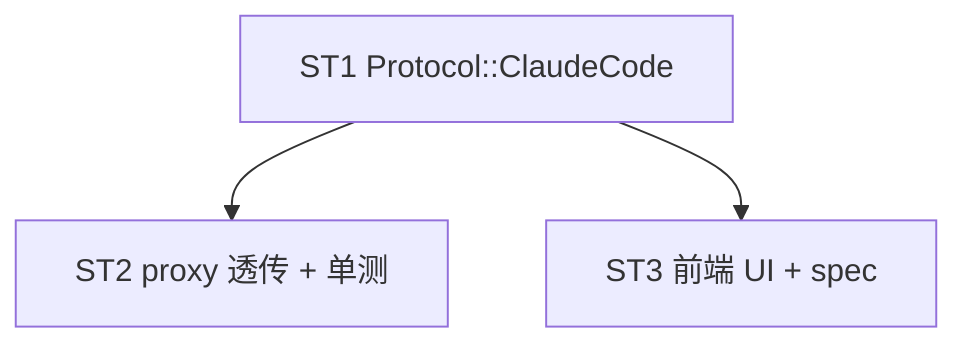

# Implement: Claude Code 订阅平台（纯透传）

## 执行层
- 后端 ST1+ST2 强耦合（Protocol::ClaudeCode → proxy 透传分支），单 Rust agent 连贯 + 后端单测
- 前端 ST3 依赖 ST1 Protocol 契约，可并行单 agent
- spec 沉淀随后端

## Subtask（3 个）

| ID | 目标 | 文件集 | 依赖 |
| --- | --- | --- | --- |
| ST1 | Protocol::ClaudeCode 变体（后端+前端契约） | models.rs, api.ts | — |
| ST2 | proxy.rs 透传（捕获 orig method/uri/headers + handle_passthrough + log + token + 单测） | proxy.rs | ST1 |
| ST3 | 前端配置 UI（base_url 提示/api_key 可空/endpoints 隐藏）+ spec | Platforms.tsx, spec/backend | ST1 |

## 调度图

## 验收
- cargo build + test + tsc 0
- 透传分支不调 convert_request / build_upstream_headers；header 剔 Host+Content-Length 保留 Authorization
- proxy_log 正常记录 + token 尽力解析
- spec 沉淀 CC 透传约定
- 手测：CC CLI → aidog → anthropic 原样透传
