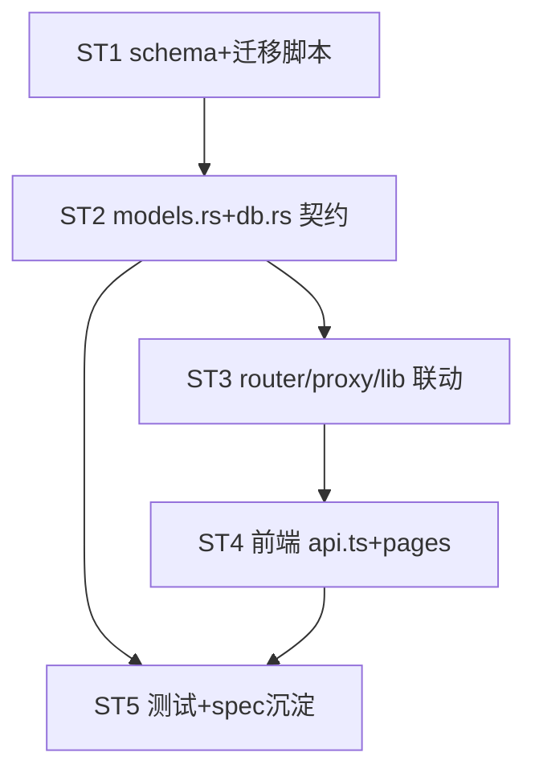

# Implement: DB Schema 规范化

## 执行层选择

强耦合 Rust 重构：`models.rs` 类型契约（id u64/String、时间 i64、protocol→platform_type、删 ModelMapping）是 db.rs / router.rs / 前端的共同上游。跨文件类型连锁，**不宜并行 sub-agent**（会争抢 models.rs 契约 + 反复编译冲突）。→ **main 串行实施**，每 subtask 完成即 `cargo build` 验证。

## Subtask 拆分（5 个，文件集划分）

| ID | 目标 | 文件集 | 依赖 |
| --- | --- | --- | --- |
| ST1 | schema DDL 重写 + 独立迁移脚本 | migrations/001_init.sql, scripts/migrate_db_v2.py | — |
| ST2 | Rust 模型 + DB 层（契约核心） | models.rs, db.rs | ST1 |
| ST3 | Rust 联动（路由/代理/命令） | router.rs, proxy.rs, lib.rs | ST2 |
| ST4 | 前端类型 + 页面 | services/api.ts, pages/*.tsx | ST3 |
| ST5 | 测试 + spec 沉淀 | tests, .trellis/spec/backend/ | ST2,ST4 |

## 调度图

## 验收（R6 总纲）

- 每 subtask 完成跑 `cargo build`（ST2-3）/ `tsc --noEmit`（ST4）
- 全部完成跑 `cargo test` + trellis-check
- 迁移脚本对 `~/.aidog/aidog.db` 实跑成功 + 行数校验 + 备份保留
- 10 条规范逐条核对（见 prd 规范清单）
- spec backend/db 层固化规范，后续遵守
