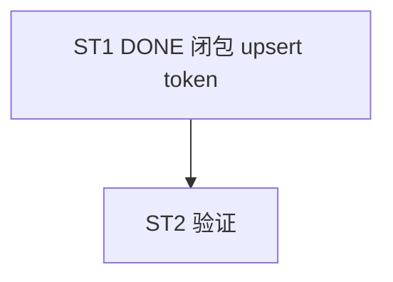

# Implement: 修复流式 proxy_log token=0

## 执行层
单文件小修（proxy.rs 流式分支），main 或单 agent 直做。

## Subtask
| ID | 目标 | 文件 | 依赖 |
| --- | --- | --- | --- |
| ST1 | [DONE] 闭包 upsert_log 更新最终 token | proxy.rs | — |
| ST2 | 验证（流式 token 非 0 + 非流式无回归 + 不重复 upsert） | proxy.rs(test/手测) | ST1 |

## 调度图

## 验收
- cargo build + test；流式 token 修正；非流式无回归；commit 仅 proxy.rs
