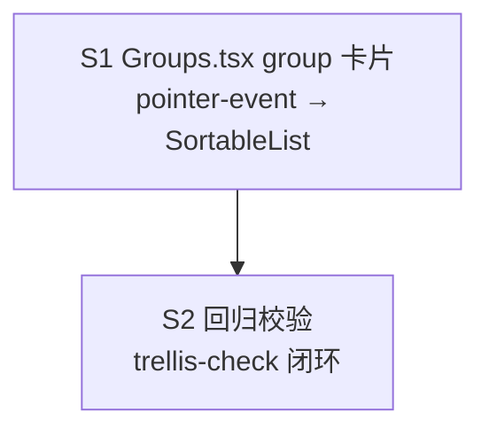

# Groups 列表卡片排序迁移 @dnd-kit

## 目标
承接 settings-ui-fixes R5「统一所有拖拽」遗留：`Groups.tsx` 的 **group 列表卡片排序**（当前 pointer-event 自实现）迁移到通用 `SortableList`，实现全项目拖拽 100% 收口 @dnd-kit。

## 背景
settings-ui-fixes 已把 platform 排序 + statusline + tray 迁移到 SortableList，但 group 列表卡片拖拽（`Groups.tsx:96-141`）用 pointer-event 自实现，不在上次 R5 的「原生 HTML5 draggable」grep 清理范围，遗留至今。

## 现状（待迁移）
- state：`groupDrag{from,to}` + `groupListRef` + `groupDragStartRef` + `groupDidDragRef`（`Groups.tsx:96-100`）
- handlers：`handleGroupPointerDown/Move/Up`（`102-141`），手写命中检测（`data-group-id` + getBoundingClientRect）
- 持久化：`groupApi.reorder(details.map(d => d.group.id))`（`135`）
- 渲染：group 卡片挂 `onPointerDown/Move/Up`（`670-672`）+ drag 视觉态（`636` pointerEvents）
- 防误触：`groupDidDragRef` 拖拽后 50ms 内忽略 click

## 需求
- 删除 `groupDrag` state + 3 个 ref + 3 个 pointer handler + 手写命中检测 + drag ghost 视觉
- group 卡片列表改用 `<SortableList<T> items onReorder renderItem strategy="vertical">`
- items 需稳定 string id（用 `String(detail.group.id)` 包装，参照已有 `SortablePlatform` 模式）
- `onReorder(next)` → `setDetails(next)` + `groupApi.reorder(next.map(d => d.group.id))`（持久化路径不变）
- 拖拽手柄分离：避免与卡片内点击/展开/编辑按钮冲突（用 handle.ref + listeners 挂专用手柄，或整卡片为手柄但 handle.isDragging 守卫点击）
- 保留 `groupApi.reorder` 跨层契约不变

## 验收标准
- `yarn tsc --noEmit` exit 0
- `yarn build` 成功
- `grep -nE 'onPointerDown|onPointerMove|onPointerUp|groupDrag|data-group-id' src/pages/Groups.tsx` 清零（group 列表拖拽残留清除）
- `grep -c 'SortableList' src/pages/Groups.tsx` ≥ 2（platform + group 两处均用）
- 全项目拖拽 100% @dnd-kit：`grep -rnE 'onPointerDown.*drag|draggable|onDragStart' src/pages/` 无拖拽残留
- 手测：group 列表拖拽排序正常 + 持久化（reorder 生效）+ 卡片点击/展开/编辑不被拖拽误触
- 遵守 frontend/conventions.md（禁新增 any / inline+glass / 错误 catch console.error）+ code-reuse-rules（收口单一 SortableList）

## Subtask 拆分

| ID | 范围 | 依赖 |
| --- | --- | --- |
| **S1** | `Groups.tsx` group 列表卡片拖拽 pointer-event → SortableList 迁移 | 无 |
| **S2** | 回归校验：tsc + build + 拖拽残留 grep 清零 + 手测项确认（trellis-check 闭环） | S1 |

## 调度图

单点改动单文件，无可并行 subtask（S2 为 check 闭环，依赖 S1）。

## 风险
- group 卡片含多个交互元素（展开/编辑/映射快加），拖拽手柄分离不当会误触 → 用专用 ☰ 手柄或 isDragging 守卫
- SortableList 要求 items 稳定 id，details 元素无顶层 id → 用 String(group.id) 包装（参照 SortablePlatform）
