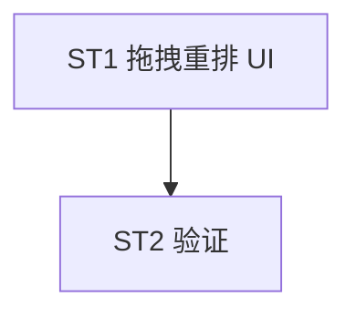

# Implement: 分组平台拖动排序

## 执行层
纯前端单文件（Groups.tsx），单前端 agent。

## Subtask
| ID | 目标 | 文件 | 依赖 |
| --- | --- | --- | --- |
| ST1 | editPlatformIds 列表 HTML5 拖拽重排 UI | Groups.tsx | — |
| ST2 | 验证（拖拽→save→priority 持久化→重载顺序） | Groups.tsx | ST1 |

## 调度图

## 验收
- tsc 0 / yarn build；拖拽重排 + priority 持久化；后端无改；commit 仅 Groups.tsx
