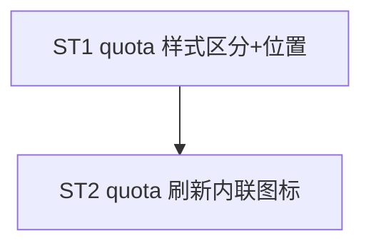

# Implement: 平台 quota 展示区分 + 刷新

## 执行层
纯前端单文件（Platforms.tsx），ST1+ST2 强耦合同区域 → 单前端 agent 连贯做。

## Subtask（2 个）
| ID | 目标 | 文件 | 依赖 |
| --- | --- | --- | --- |
| ST1 | quota 区与 usage 区分样式 + 位置（独立分组 + 标签 + 区别视觉） | Platforms.tsx | — |
| ST2 | 统一 quota 刷新（内联小图标 + handler + per-platform loading + 错误 toast） | Platforms.tsx | ST1 |

## 调度图

## 验收
- tsc 0 / yarn build
- quota（balance+coding plan）与 usage 视觉/位置明显区分
- 刷新图标点击 quotaApi.query 刷新 + loading + 错误 toast
- commit 仅限 Platforms.tsx quota 区（避免卷入别窗口 pricing）
