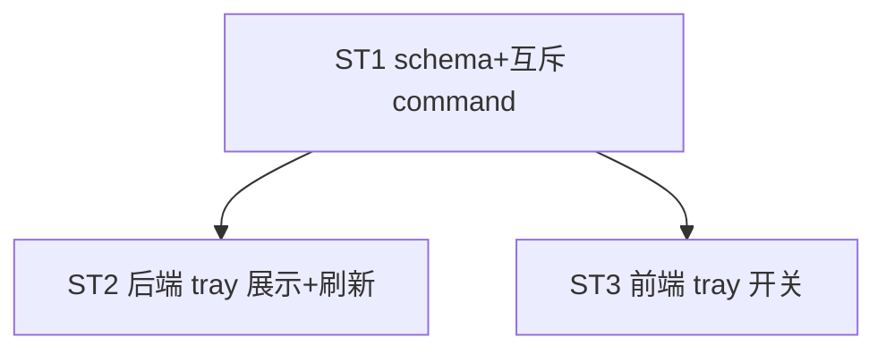

# Implement: 平台 quota 系统托盘展示

## 执行层
后端 ST1+ST2 强耦合（schema + tray 渲染），单后端 agent；前端 ST3 依赖 ST1 契约。

## Subtask
| ID | 目标 | 文件 | 依赖 |
| --- | --- | --- | --- |
| ST1 | platform 加 show_in_tray/tray_display 列 + 互斥 set command（migration 005 + db 链路 + command + api.ts） | 001_init.sql, db.rs, models.rs, lib.rs, api.ts | — |
| ST2 | 后端 tray 展示（build_tray_menu 加 quota item + set_title + refresh 触发：预估更新后/set 后） | lib.rs, estimate.rs/proxy.rs(触发) | ST1 |
| ST3 | 前端 tray 开关 UI（enabled 平台 + 互斥 + 余额/coding 选择） | Platforms.tsx, api.ts(trayApi) | ST1 |

## 调度图

## 验收
- cargo build+test+tsc
- enabled 平台 tray 开关 + 互斥单平台 + 余额/coding 二选一
- 系统托盘展示选定平台 quota（复用 est_*）+ 预估更新刷新
- commit 仅本 task 列（避别窗口）
