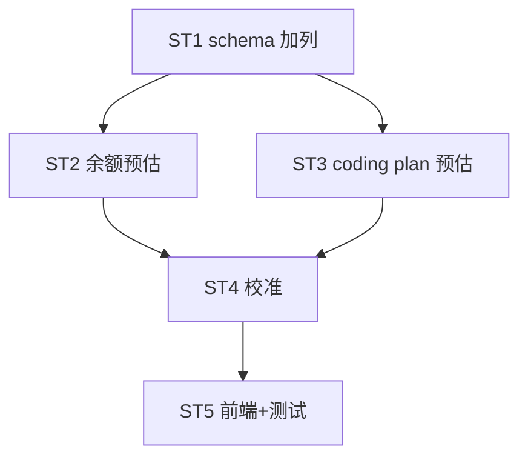

# Implement: quota 预估增量更新

## 执行层
后端强耦合（schema→余额预估→coding plan 预估→校准，共享 db.rs/proxy.rs/quota.rs），单后端 agent 连贯做 ST1-4 + 单测；前端 ST5 依赖 schema 契约。

## Subtask
| ID | 目标 | 文件 | 依赖 |
| --- | --- | --- | --- |
| ST1 | schema 加 4 列（001_init+004 ALTER+models+db.rs 两处 parser+create/update+api.ts） | 001_init.sql, db.rs, models.rs, api.ts | — |
| ST2 | 余额预估（resolve_price + 原子自减 SQL + proxy spawn） | db.rs, proxy.rs | ST1 |
| ST3 | coding plan 预估（Kimi 精确保留 limit/remaining + GLM/MiniMax 方案B 拟合） | db.rs, quota.rs, proxy.rs | ST1 |
| ST4 | 校准（5min/100次 → query_quota 覆盖+重置，锁外 async） | db.rs, proxy.rs | ST2,ST3 |
| ST5 | 前端展示预估值+标识 + 接刷新校准 + 测试 | Platforms.tsx | ST4 |

## 调度图

## 验收
- cargo build+test+tsc；预估增量更新（Kimi 精确/GLM-MiniMax 拟合）；5min/100次校准；不阻塞响应；并发安全（原子自减/平台级串行）
- commit 仅本 task 列（避别窗口冲突）
