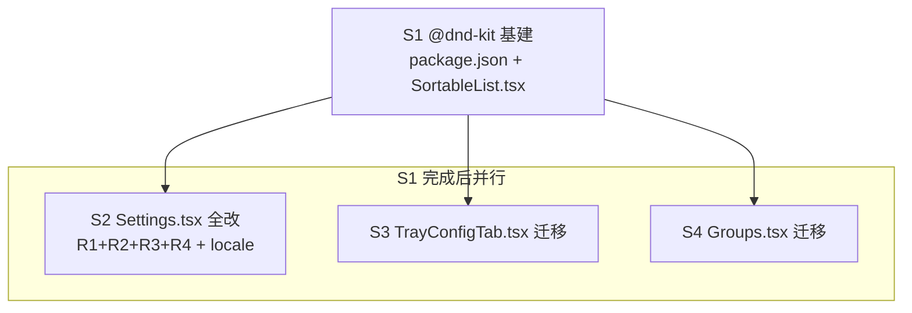

# Settings 页 Claude Code 配置 UI 修复 + 全项目拖拽统一

## 目标

修复 Settings 页（Claude Code 配置）4 类 UI 问题，并引入 `@dnd-kit` 统一重构**全项目所有拖拽位置**（3 处），替换现有原生 HTML5 drag。

## 背景

最近几个 commit（`fdeb126` 导入功能 / `ab9eb1c` statusline drag-sortable 重写）在 Settings 页引入了一批 UI 问题。用户 review 后提出 4 点 + 拖拽统一诉求。

## 需求清单

### R1 — 导入嵌套粒度
- 现状：`handleImportFromClaudeCode`（`Settings.tsx:4110`）只构建 **top-level key** 的 diff，`applyImport`（`Settings.tsx:4135`）整个 object 替换（`next[key] = source[key]`）
- 问题：嵌套子项（`permissions.allow[]` / `env.X` / `hooks.X`）无法单独取消勾选 —— 整个 top-level object 绑定导入，"无法关闭某些设置"
- 目标：DiffModal 支持嵌套子项级别的选择性导入（至少对 object/array 类型的 top-level key 展开到子项粒度）

### R2 — 去 icon
- 现状：① 左侧导航 `SectionIcon`（`Settings.tsx:4437`）② statusline segment 行内 `SectionIcon`（`Settings.tsx:2076`）
- 目标：两处 icon 都移除

### R3 — 状态行（StatusLinePanel）
- ① 拖拽交互坏：原生 HTML5 drag（`Settings.tsx:2054-2058`），无视觉占位反馈、Toggle/按钮嵌在 draggable 内易误触
- ② UI 样式不满意：segment 卡片布局/视觉
- ③ SegmentEditModal（`Settings.tsx:1815`）弹窗问题
- 目标：拖拽迁移到 @dnd-kit；优化 segment 卡片 UI；修复编辑弹窗

### R4 — 去头部文案
- 现状：`settings.title`（"Claude Code 配置"）+ `settings.desc`（"管理 Claude Code 全局设置（与官方文档完全对齐）"），渲染于 `Settings.tsx:4274-4279`，文案在 `locales/zh-CN.json:105-106` + `en-US.json:105-106`
- 目标：移除这部分文案

### R5 — @dnd-kit 统一重构全项目拖拽
全项目 3 处原生 HTML5 drag，全部迁移到 @dnd-kit：
1. `Settings.tsx:2054` — statusline segment 排序（= R3①）
2. `TrayConfigTab.tsx:379/453` — tray 列拖拽（single-line + two-line）
3. `Groups.tsx:406` — group 内 platform 排序

## Subtask 拆分

| ID | 范围（文件集） | 依赖 |
| --- | --- | --- |
| **S1** | @dnd-kit 基建：`package.json` 加依赖 + 新建 `src/components/SortableList.tsx` 通用封装 | 无（前置） |
| **S2** | `Settings.tsx`（全部改动：R1 导入粒度 + R2 去 icon + R3 statusline 拖拽迁移&UI&弹窗 + R4 文案）+ `locales/zh-CN.json` + `locales/en-US.json` | S1 |
| **S3** | `TrayConfigTab.tsx` 拖拽迁移到 SortableList | S1 |
| **S4** | `Groups.tsx` 拖拽迁移到 SortableList（覆盖搁置的 group-drag-sort task） | S1 |

**文件互斥设计**：S2/S3/S4 各独占不同文件（Settings.tsx / TrayConfigTab.tsx / Groups.tsx），S1 完成后三者**真并行**，无编辑冲突。S2 的 4 类 Settings 改动集中单文件由单执行者串行完成（避免同文件多 agent 冲突）。

## 调度图

关键路径：S1 → max(S2, S3, S4)。S2 最重（4 类改动），S3/S4 轻（拖拽迁移）。

## 验收标准

- `yarn tsc --noEmit` 退出码 0
- `yarn build` 成功
- R1：导入弹窗可对 `permissions`/`env`/`hooks` 等嵌套 key 展开到子项级勾选，取消子项不导入该子项
- R2：Settings 左侧导航 + statusline segment 行均无 icon
- R3：statusline segment @dnd-kit 流畅拖拽排序 + segment 卡片 UI 优化 + 编辑弹窗正常
- R4：Settings 页头部无 "Claude Code 配置" 标题 + "管理...官方文档完全对齐" 副标题
- R5：3 处拖拽全部 @dnd-kit，原生 `draggable`/`onDrop` 在 src/ 清零（`grep -rn 'draggable' src/` 仅剩 dnd-kit 内部）
- 全项目拖拽手测：statusline / tray / group 三处排序均正常

## 未决 / 风险

- **group-drag-sort task 重叠**：搁置的 `06-11-06-11-group-drag-sort`（空 planning）就是 Groups.tsx 拖拽，由本 task S4 覆盖。本 task 完成后 archive 该空 task（零信息损失），已在 design 注明。
- @dnd-kit 加依赖（~30KB）：用户已确认引入。
- SegmentEditModal "弹窗问题" 具体表现需 S2 执行时实跑确认（当前代码未见明显 bug，可能是 UI/交互体验）。
