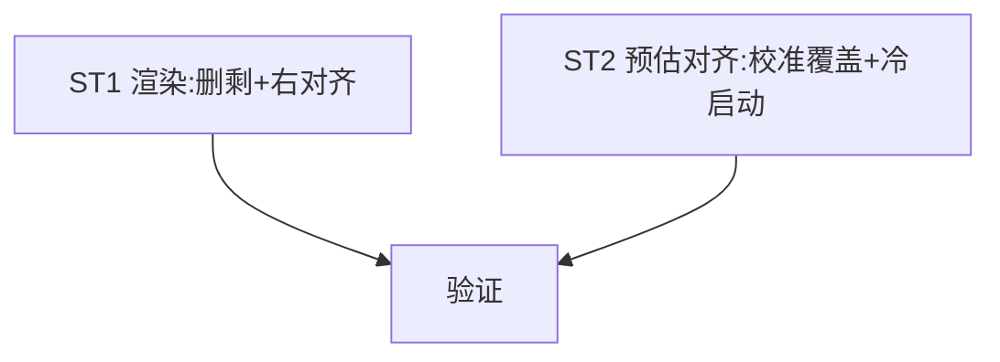

# Implement: tray 对齐/格式/预估对齐

## Subtask
| ID | 目标 | 文件 | 依赖 |
| --- | --- | --- | --- |
| ST1 | 渲染微调：删"剩" + 第二行右对齐(RightTab) | lib.rs | — |
| ST2 | 预估偏差/校准对齐：校准严格覆盖 est=真实 + 冷启动初始化真查 | estimate.rs, db.rs, lib.rs | — |

## 调度图

## 验收
- cargo test + tsc；第二行右对齐、coding 纯数字；校准后 est 对齐真实、冷启动初始化、预估偏差小
- commit 仅 tray/estimate 相关；GUI 用户验
