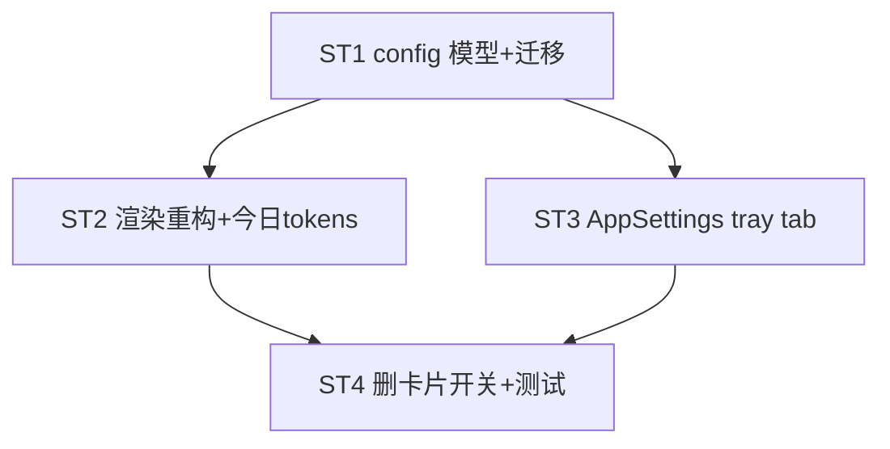

# Implement: 可配置 tray 面板

## 执行层
后端 ST1+ST2 强耦合（config 模型 + 渲染重构，lib.rs/db.rs）单 Rust agent；前端 ST3（AppSettings tab）依赖 ST1 config 契约；ST4 迁移+删开关收尾。

## Subtask
| ID | 目标 | 文件 | 依赖 |
| --- | --- | --- | --- |
| ST1 | TrayConfig 模型 + settings read/write + command + 迁移(旧→默认) | lib.rs, db.rs, models.rs, api.ts(trayConfigApi) | — |
| ST2 | tray 渲染重构(多 item NSMutableAttributedString 颜色三态/字号/排序/layout) + 今日 tokens + NSColor feature | lib.rs, db.rs, Cargo.toml | ST1 |
| ST3 | AppSettings tray tab(TrayConfigTab: 多选+拖拽排序+display+颜色三态+字号+开关+今日消耗+layout) | AppSettings.tsx, api.ts | ST1 |
| ST4 | 迁移生效 + 删 Platforms.tsx tray 开关 + 测试 | Platforms.tsx, tests | ST2,ST3 |

## 调度图

## 验收
- cargo build+test+tsc；tray 多 item(颜色/字号/排序/单两行)+今日 tokens；设置页配置+拖拽；迁移默认；删卡片开关
- 基于 a391ad4d 已落 lib.rs tray；commit 仅本 task
