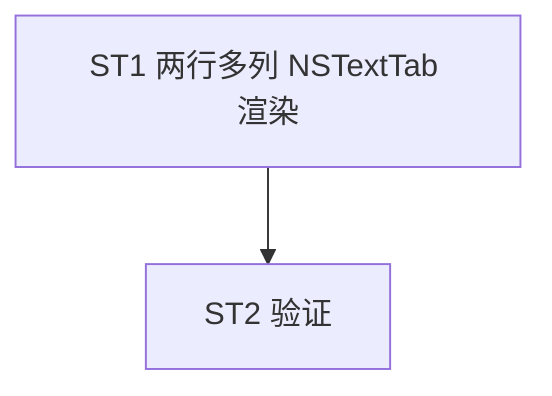

# Implement: tray 两行多列列对齐

## 执行层
后端 lib.rs 渲染重构（objc NSTextTab 多列），单 agent。

## Subtask
| ID | 目标 | 文件 | 依赖 |
| --- | --- | --- | --- |
| ST1 | lib.rs 渲染重构：两行多列 NSTextTab 列对齐 + per-column color/font + 单行项占位 + 删多item强制single | lib.rs | — |
| ST2 | 验证 cargo test/tsc + 列对齐逻辑 + 单行无回归 | lib.rs | ST1 |

## 调度图

## 验收
- cargo test + tsc；多平台两行列对齐(标签行/值行)；per-item 单/两行混合；per-column 色/字号；垂直居中；单行模式无回归
- NSTextTab 受阻则等宽+空格填充 fallback；GUI 用户验
- commit 仅 lib.rs
