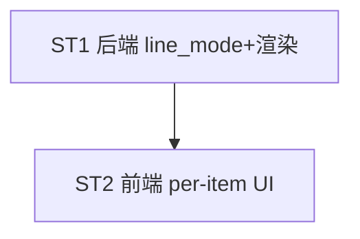

# Implement: tray per-item line_mode

## 执行层
跨层小改（line_mode 契约简单），单 agent 一气做 ST1+ST2。

## Subtask
| ID | 目标 | 文件 | 依赖 |
| --- | --- | --- | --- |
| ST1 | 后端 TrayItem line_mode + 渲染 per-item + 删全局 layout + 迁移 | models.rs, lib.rs | — |
| ST2 | 前端 per-item line_mode UI + api.ts + 删全局 layout 切换 | TrayConfigTab.tsx, api.ts | ST1 |

## 调度图

## 验收
- cargo test + tsc；每项独立单/两行；多 item 菜单栏 ≤2 行 fallback；删全局 layout；迁移旧 config
- commit 仅本 task tray 文件
