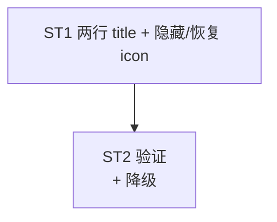

# Implement: 托盘两行 + 隐藏 logo

## 执行层
单文件 lib.rs tray 区小改，单后端 agent。

## Subtask
| ID | 目标 | 文件 | 依赖 |
| --- | --- | --- | --- |
| ST1 | tray_quota_text 两行(名+按类型余额) + refresh 有值隐 icon+两行 title / 无值恢复 | lib.rs | — |
| ST2 | 验证 \n 两行可行性 + 降级单行 + cargo build | lib.rs | ST1 |

## 调度图

## 验收
- cargo build 0；有值隐 icon+两行(名/余额, 降级单行)、无值恢复 icon；coding 剩余%/balance 总余额；commit 仅 lib.rs
