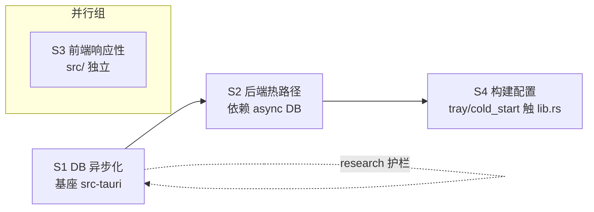

# 性能优化 P0+P1：后端热路径 + 前端响应性 + 构建体积

## Goal

降低 AiDog 桌面代理网关的 CPU / 内存占用，提升请求转发延迟、UI 响应性与实时性，且不改变任何现有功能行为。基于三方并行性能审计（后端 Rust / 前端 React / 构建配置）的 P0+P1 结论落地。

## What I already know（来自实测审计 + 亲验证据）

### 后端 Rust（proxy / db / estimate）
- `Client::builder().build()` 每请求重建（proxy.rs:706, 1115；lib.rs:412, 551）→ 连接池/TLS/DNS 缓存全废，每请求重握手。reqwest `RequestBuilder.timeout()` 支持 per-request 超时，可全局共享单 Client。
- `Db(std::sync::Mutex<Connection>)` 单连接全局串行（db.rs:3,7）；WAL 已开（db.rs:42）但无 `busy_timeout` / `synchronous` pragma。rusqlite blocking，async handler 内 lock+query 直接堵 tokio worker。
- 流式响应中 `upsert_proxy_log` 持锁写库（proxy.rs:313）→ 消费阻塞延迟脉冲。
- body 重复 parse（proxy.rs:500 + 539 解两次）+ pretty-print 再解（722）+ 多次 `.to_vec()` memcpy（780/804/1142/1219）。
- 流式每 chunk `serde_json::from_str`（proxy.rs:891），多数 SSE 行无需 parse。
- coding-plan JSON read-modify-write 在持锁内（estimate.rs:234-250）。

### 前端 React
- 轮询无可见性检测：Logs 3s（Logs.tsx:177）、详情 2s（:209）、Tray 30s（TrayConfigTab.tsx:162），后台不可见仍跑。
- `AppContext` value 每渲染新对象（AppContext.tsx:90-103 无 useMemo）→ 全树重渲。
- pinyin 搜索每 keystroke 全量算（Platforms.tsx:1744）无防抖无缓存；pinyin.ts 无 LRU 缓存。
- Platforms 巨石列表无 memo/虚拟化（Platforms.tsx:2065）→ 50+ 平台滚动掉帧。
- i18n 7 语言全量打包（locales/index.ts）。
- Groups 编辑 11 个 useState（Groups.tsx:113）；手写拖拽逐帧无 throttle（Platforms.tsx:994）。

### 构建 / 启动 / 体积
- Cargo **无** `[profile.release]`（默认 codegen-units=16, 无 LTO, 无 strip）。
- 前端主包 `index.js` 1.2MB 单文件无分包（vite.config.ts 无 manualChunks）。
- tray 菜单 `block_on` 阻塞 UI（lib.rs:1969）；cold_start 配额查询在 setup 触发。

### 已否决的两条 build-agent 错误结论
- **保留 reqwest `stream` feature** — proxy.rs 真用 `bytes_stream()` 流式转发，不可删。
- **保留 tokio multi-thread** — 并发流式代理 + 后台配额查询，current-thread 单线程串行化反伤吞吐；改为限 `worker_threads(2~4)` 省内存而不牺牲并发。

## Requirements（evolving）

### R1 后端热路径（P0）
- R1.1 全局共享单个 reqwest `Client`（存 state），超时改 per-request `RequestBuilder.timeout()` + connect_timeout 用 Client 默认。
- R1.2 DB 并发改造（策略待定，见 Open Questions）+ `busy_timeout` + `synchronous=NORMAL` pragma。
- R1.3 proxy_log 写改异步：mpsc channel → 后台批量 flush，热路径不持锁写库。
- R1.4 body 解析去重：单次 parse 缓存 `&Value`，日志用 Bytes 借用避免多次 `.to_vec()`。

### R2 后端 P1
- R2.1 流式 chunk 行级前缀检查替代逐行 serde parse，仅含 usage 行才 parse。
- R2.2 coding-plan delta 改锁外算、锁内短写。

### R3 前端响应性（P0）
- R3.1 三处轮询接 Page Visibility API，不可见暂停。
- R3.2 `AppContext` value useMemo 包裹。
- R3.3 pinyin 搜索 debounce 300ms + pinyin.ts LRU 缓存。
- R3.4 Platforms 列表拆 `PlatformCard` + React.memo，重算 useMemo。

### R4 前端 P1
- R4.1 i18n 改按需 / 仅打包当前 locale + en-US fallback。
- R4.2 Groups 编辑态 useState → useReducer。
- R4.3 手写拖拽 requestAnimationFrame throttle（或复用 SortableList）。

### R5 构建 / 体积
- R5.1 加 `[profile.release]`：`lto="thin"` + `codegen-units=1` + `strip=true` + `panic="abort"`。
- R5.2 Vite `manualChunks` 分包（react / pinyin / i18n / dnd）。
- R5.3 tokio runtime 限 `worker_threads`（2~4）。
- R5.4 tray 菜单 `block_on` → spawn + emit；cold_start 配额查询延迟到窗口 ready。

## Acceptance Criteria（evolving）

- [ ] 功能零回归：代理转发、流式 SSE、日志记录、配额/余额、统计聚合全部行为不变。
- [ ] `cargo build` 与 `tsc && vite build` 均 0 warning 0 error。
- [ ] proxy 热路径无每请求 `Client::builder()`；连接复用可验证（keep-alive）。
- [ ] DB 写不再阻塞 tokio worker / 流式消费。
- [ ] 三处轮询后台不可见时停止。
- [ ] AppContext 变更不触发无关全树重渲（React DevTools 验证）。
- [ ] release 二进制体积较优化前显著下降；首屏 JS 分包后主 chunk 明显减小。
- [ ] `panic="abort"` 不破坏现有 panic 捕获逻辑（需排查是否有依赖 unwind）。

## Definition of Done

- 单元/集成测试覆盖改动关键路径（DB 并发、log flush、Client 复用）。
- lint / typecheck / build 全绿。
- 行为变更（如 log 异步可见延迟）记入 spec / CLAUDE.md。
- 风险项（DB 改造、panic=abort）有回滚说明。

## Subtask 调度图

- **S3 ∥ S1**：无文件交集（src/ vs src-tauri/），同时开工。
- **S1 → S2**：严格串行，S1 零回归验证通过才解锁 S2（async DB 契约依赖）。
- **S2 → S4**：S4 的 tray/cold_start 改 lib.rs，与 S1/S2 同文件，排其后避冲突。

## Decision (ADR-lite)

**Context**: DB 当前 `std::sync::Mutex<Connection>` 单连接全局串行，rusqlite blocking 直接堵 tokio worker。三策略：spawn_blocking 最小侵入 / r2d2 池 / tokio-rusqlite 异步化。

**Decision**: 采用 **tokio-rusqlite 异步化**（用户选定）。原生 async 接口，内部后台线程执行 blocking SQL。

**Consequences**:
- 改动面最大：db.rs ~56 个 `lock()` 点 + lib.rs ~50 个 Tauri command + proxy/estimate/quota 全部 DB 调用方需转 `async`。
- 爆炸半径覆盖几乎所有后端模块 → **必须单独成 subtask 优先做，配特性测试护栏，独立验证零回归后再并入其他优化**。
- 收益：彻底解除 worker 阻塞，写不再串行堵塞流式消费。
- 回滚：DB 层为独立 subtask/PR，失败可单独回退不影响其余 P0+P1。

## Open Questions（Blocking / Preference）

- （已解决）DB 策略 → tokio-rusqlite。

## Out of Scope（explicit）

- 虚拟列表（react-window）—— 仅当平台数 >100 才需，本轮不做。
- 删除 reqwest stream / 改 tokio current-thread —— 已否决。
- CSP 收紧 —— 安全项非性能，另立任务。
- simd-json / 替换 JSON 库 —— 本轮不引入新重依赖。
- bundle targets 裁剪 —— 属发布策略非运行性能。

## Technical Notes

- 审计证据全部 file:line 已列于 What I already know。
- worktree: `.trellis/worktrees/06-12-p0-p1`。
- 跨层改动涉及 Rust（state 加 Client / channel）↔ TS（事件驱动替轮询可能需新 Tauri event）边界，遵 cross-layer-rules。
