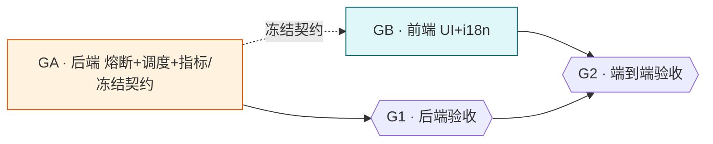

# Group 智能调度与熔断器

## Goal

为 aidog 增加：① **智能调度**（Group 层扩展 RoutingMode，新增 健康感知摘除 / 最小延迟 / 粘性会话 三策略，在现有 LoadBalance 加权随机 + Failover 优先级之上）；② **熔断器**（全局 Platform 级三态机 closed/open/half_open，失败平台临时摘出候选池，自动恢复）。配置 = 全局默认 + Platform(熔断参数)/Group(调度策略) 覆盖，均提供默认值。完成后：某平台连续失败被熔断摘除、恢复后自动加回；group 可选调度策略；Platform/Group 编辑页与系统设置可配且有默认值。

## What I already know
### 现状
- `Group.routing_mode: RoutingMode`（models.rs:485）：已有 LoadBalance（加权随机）/ Failover（priority 升序）。
- `GroupPlatform`：`weight`（加权随机）+ `priority`（failover 顺序）。
- router.rs：`select_candidates`(39) priority 排序 + probe/active 分桶 → `order_load_balance`(129) 加权随机定首选；`select_platform`(157) 按 RoutingMode 分派。
- 重试：proxy.rs 重试循环逐个换候选；per-group `max_retries`；401/403 → auto_disabled + 指数退避（memory platform-retry-failover）。
- Platform/Group 已有 per-实体字段惯例（timeout '0=继承系统'）。
### 调研结论
- [`research/reference-repo-scheduling-breaker.md`](research/reference-repo-scheduling-breaker.md) — ding113/claude-code-hub：熔断器标准三态机（默认 failure 5 / open 30min / half_open 2），作"准入门"在加权随机前踢 open 平台；retry 耗尽才 recordFailure 计一次；NON_RETRYABLE/网络错误默认不计。该仓库**无真正 group 级熔断**（粒度 provider），aidog 的 Platform 级熔断需自建（参考其 provider 级三态机）。sticky session 是独立机制（session→provider 绑定）。

## Assumptions (temporary)
- 熔断状态 + 指标内存维护（Map<platform_id, _>，单进程无需 Redis）。
- 熔断只管 5xx/超时临时性故障（自动恢复）；401/403 仍走现有 auto_disabled（凭证级永久，指数退避）。二者候选过滤取并集。
- 健康感知策略 ≈ 熔断摘除常开；最小延迟需 per-platform 延迟 EMA；粘性需 session 键提取。

## Open Questions
无（范围已明确，经 AskUserQuestion 锁定，见 Decision）。

## Deliverable 矩阵
| ID | 交付物 | 类型 | 独立验收 | 优先级 |
| --- | --- | --- | --- | --- |
| GA | 后端：熔断器(全局 Platform 三态机)+智能调度(RoutingMode 新策略)+指标采集+router/proxy 集成+全局默认 settings+Platform/Group 字段+契约冻结 | diff | `cargo test` 熔断状态机/调度选择单测；熔断与 auto_disabled 并集过滤单测 | P0 |
| GB | 前端：Platform 编辑页熔断配置 + Group 编辑页调度策略 + 全局默认 settings UI + i18n 7 语言 | UI | `yarn build` 过；各页可配且默认值生效；7 语言无缺键 | P0 |

## Child Task Map
本 task 为 parent，拆 2 child（backend/frontend，文件零交集，前端依赖后端契约）。共享架构见本目录 `design.md`。

| Child | Slug | Deliverable | 交付物 | 独立验收 | 依赖 | 状态 |
| --- | --- | --- | --- | --- | --- | --- |
| GA | `06-13-gsb-backend` | GA | 熔断器+智能调度+指标+集成+契约 | cargo test 状态机/调度/并集过滤 | 与 middleware 后端串行(共享 proxy.rs/models.rs) | planning |
| GB | `06-13-gsb-frontend` | GB | Platform/Group/全局 UI + i18n | yarn build；UI 可配默认生效；7 语言 | GA(仅契约) | planning |

### Child 调度图

> 跨树资源互斥：GA 改 `proxy.rs`(重试循环 recordFailure)+`models.rs`(Platform/Group/RoutingMode)+`router.rs`(候选过滤) → 与 middleware 树 C2/C3/C4 同改 proxy.rs/models.rs，**全局后端串行**（一次只跑一个后端 task）。GB 改前端文件，与 GA 零交集，GA 冻结契约后并行。

## Requirements
- **GR1**(GA) 熔断器：全局 Platform 级三态机；BreakerState Map<platform_id>；5xx/超时 retry 耗尽计一次失败，达阈值→Open（候选过滤踢出），open_secs 后→HalfOpen 放 half_open_max 探测，成功→Closed/失败→Open。
- **GR2**(GA) 熔断配置：Platform 新增 failure_threshold/open_secs/half_open_max（0=继承全局默认）；全局默认存系统设置 SchedulingBreakerSettings（默认 5/1800s/2）。
- **GR3**(GA) 与 auto_disabled 解耦：熔断(临时 5xx/超时自动恢复) vs auto_disabled(401/403 永久指数退避)；候选过滤取并集跳过；二者独立判定不互改状态。
- **GR4**(GA) 智能调度：RoutingMode 新增 HealthAware/LeastLatency/Sticky；策略选择在 Group 层（routing_mode）；全局默认调度策略 + Group 覆盖。
- **GR5**(GA) 指标：per-platform 延迟 EMA + 并发计数，内存维护，供 LeastLatency 排序。
- **GR6**(GA) Sticky：按 session 键（从请求提取，复用现有 session 概念若有，否则按客户端标识）映射 platform，失效/熔断时回退正常调度。
- **GR7**(GB) Platform 编辑页熔断配置 + Group 编辑页调度策略下拉 + 系统设置全局默认；空值显示"继承默认"。
- **GR8**(GB) i18n 7 语言全覆盖，ar-SA RTL 正常。

## Acceptance Criteria
- [ ] GA：cargo test 熔断状态机 closed→open→half_open→closed 单测过；LeastLatency 按延迟排序单测；熔断∪auto_disabled 并集过滤单测；HealthAware 摘除 open 平台单测。
- [ ] GA：cargo clippy --all-targets -- -D warnings 零警告。
- [ ] GA：熔断与 auto_disabled 互不覆盖状态（单测）。
- [ ] GB：yarn build 过；Platform/Group/全局 三处可配，空值继承默认；7 语言无缺键 ar-SA RTL 正常。
- [ ] 跨 child：GB 消费 GA 契约无漂移；端到端手测某平台连续 5xx 被熔断摘除、30min(或测试缩短)后恢复。

## Definition of Done
- Requirements 全实现 + AC 勾选；cargo build/clippy/test + yarn build 全绿；变更自动暂存提交；worktree 合并+移除；非平凡发现落 cortex（熔断器与 auto_disabled 分工 / 调度策略扩展）；bump 版本。

## Decision (ADR-lite)
**Context**: group 调度增强 + 熔断器，需定归属层 / 粒度 / 配置存储。
**Decision**（经 AskUserQuestion）:
1. 调度策略：健康感知摘除 + 最小延迟 + 粘性会话（在现有加权随机/优先级之上）。
2. 调度策略选择层 = **Group**（扩展 routing_mode）。
3. 熔断粒度 = **全局 Platform 级**（跨 group 共享，同 auto_disabled 语义）。
4. 配置 = 全局默认 + Platform(熔断)/Group(调度) 覆盖，0/空=继承默认。
**Consequences**:
- 熔断器从中间件树移来（用户决策），独立成本树；中间件树 error_rule 只产 retryable/non-retryable 信号，本树熔断可消费该信号或直接按 status/timeout 判定（MVP 直接判定，不强耦合 error_rule）。
- GA 改 proxy.rs/models.rs/router.rs，与 middleware 后端 child 全局串行。

## Out of Scope
- 中间件规则引擎（`06-13-request-response-middleware` 树）。
- 最小连接策略（用户未选，本次不做）；多实例/Redis 共享熔断状态（单进程不需要）。
- endpoint 级 / vendor-type 级熔断（参考仓库有，本次只做 Platform 级）。

## Technical Notes
### 文件位置
- 改 models.rs（Platform 熔断字段 + RoutingMode 新变体 + SchedulingBreakerSettings）、router.rs（候选过滤含熔断/健康/延迟/sticky）、proxy.rs（重试循环 recordSuccess/recordFailure 接线）、新增 scheduling.rs 或并入 router.rs（熔断状态机 + 指标 Map）、db.rs（Platform 字段 + settings）、lib.rs（commands）、api.ts（契约）。
- 前端 Platform/Group 编辑页 + AppSettings 全局默认 + i18n。
### 灰度/回滚
- 全局默认调度=现有模式、熔断阈值合理默认；Platform 空=继承。worktree 隔离。
### 验证命令
```bash
cd src-tauri && cargo test && cargo clippy --all-targets -- -D warnings
cd .. && yarn build
```
