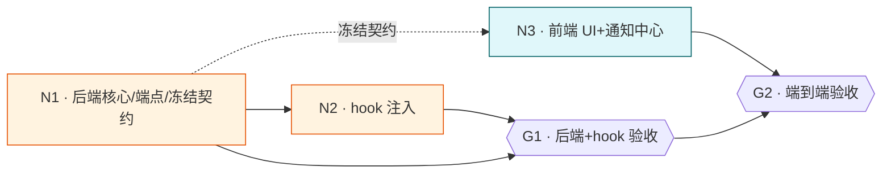

# 系统通知模块

## Goal

为 aidog 增加系统通知模块：支持 TTS 语音播报（跨平台，默认开启）/ 弹窗 / 提示音 / 应用内通知中心(收件箱) 多种呈现；用户按通知类型（任务完成/等待输入/错误失败/自定义）配置是否播报、是否弹窗、呈现形式；在 Codex 与 Claude Code 一键注入 hook（任务完成、等待输入），通知内容支持自定义 + 变量替换。完成后：触发事件经 hook → 本地端点 → 按类型设置 TTS/弹窗/收件箱呈现；设置页与通知中心可用。

## What I already know
### 现状
- aidog 已集成 `tauri_plugin_notification`（lib.rs:2397）→ 弹窗现成。
- hook 集成范式：`generate_statusline_script`（lib.rs:1604）生成脚本到 ~/.aidog/ + settings.{group}.json 注入 + `do_sync_group_settings` strip + ANTHROPIC_BASE_URL/AUTH_TOKEN 调本地 /api。
- Codex TOML 设置子系统 codex.rs（memory codex-config-subsystem）；Codex 有 notify 配置。
- Local API：/api/ POST，localhost-only，Bearer group_name。
- Rust 跨平台 TTS 可用 `tts` crate（封装 macOS NSSpeechSynthesizer / Windows WinRT-SAPI / Linux speech-dispatcher / WebSpeech）。
### 调研结论
- 无外部仓库参考（本请求未给 repo），纯 aidog 自研。

## Assumptions (temporary)
- 通知类型 = 任务完成/等待输入/错误失败 + 用户自定义类型。
- 收件箱 = 应用内通知中心（新页/面板，持久化历史 + 未读）。
- TTS 默认跨平台后端，用户可切 macOS say / WebSpeech；音量跟随系统（无独立设置）。
- hook 一键注入：写 Claude Code settings(Stop/Notification hook) + Codex notify config，脚本 POST 通知端点。
- 变量：{project}(cwd basename)/{status}/{time}/{session} 等，发送时替换。

## Deliverable 矩阵
| ID | 交付物 | 类型 | 独立验收 | 优先级 |
| --- | --- | --- | --- | --- |
| N1 | 后端通知核心：通知服务(TTS/弹窗/提示音/收件箱持久化) + NotificationSettings(按类型) + 类型枚举 + /api 通知端点 + commands + 契约冻结 | diff | cargo test 通知分发/设置/变量替换单测；端点收消息 | P0 |
| N2 | hook 集成：生成 Claude Code/Codex hook 脚本 + 一键注入 settings/TOML + 内置两类通知 + 变量替换 | diff | 注入后 settings/TOML 含 hook；脚本 POST 端点触发通知 | P0 |
| N3 | 前端：通知设置 UI(按类型 播报/弹窗/形式 + TTS 后端选择) + 通知中心(收件箱)页 + 一键注入入口 + i18n 7 语言 | UI | yarn build；设置可配；通知中心展示；7 语言无缺键 | P0 |

## Child Task Map
本 task 为 parent，拆 3 child。共享架构见 `design.md`。

| Child | Slug | Deliverable | 交付物 | 独立验收 | 依赖 | 状态 |
| --- | --- | --- | --- | --- | --- | --- |
| N1 | `06-13-notif-backend` | N1 | 通知核心 + 端点 + 契约 | cargo test 分发/设置/变量 | 与其他后端树串行(共享 lib.rs/models.rs) | planning |
| N2 | `06-13-notif-hooks` | N2 | hook 脚本生成 + 一键注入 | settings/TOML 含 hook；触发通知 | N1(端点+类型) | planning |
| N3 | `06-13-notif-frontend` | N3 | 设置 UI + 通知中心 + i18n | yarn build；UI 可用 | N1(契约) | planning |

### Child 调度图

> 跨树资源互斥：N1/N2 改 lib.rs/models.rs/db.rs/codex.rs → 与中间件树(C2-C4)、group树(GA) 同碰 lib.rs/models.rs，**全局后端串行**。N3 前端与 C5/GB 同碰 AppSettings/api.ts → 前端串行。

## Requirements
- **NR1**(N1) 通知类型枚举：task_complete/waiting_input/error/custom；NotificationSettings 按类型存 {tts:bool, popup:bool, form:仅弹窗|仅收件箱|仅提示音|完整播报}。
- **NR2**(N1) 呈现：TTS 播报（跨平台 tts crate，默认；可切 macOS say/WebSpeech）+ tauri 弹窗 + 提示音 + 收件箱持久化(SQLite notification 表 + 未读)。音量跟随系统。
- **NR3**(N1) /api 通知端点（localhost POST）：接收 {type, content, vars} → 变量替换 → 按类型设置分发。
- **NR4**(N1) 变量替换：{project}/{status}/{time}/{session} 等，发送时替换。
- **NR5**(N2) 生成 Claude Code hook 脚本（Stop=任务完成、Notification=等待输入）+ Codex notify 脚本；一键注入 Claude Code settings + Codex TOML（仿 statusline 注入/ strip 范式）。
- **NR6**(N2) 内置两类通知默认模板：「{project} 完成」「{project} 等待用户输入」，用户可改。
- **NR7**(N3) 设置 UI 按类型配置 + TTS 后端选择 + 通知中心页（历史/未读/清除）+ 一键注入按钮 + 7 语言 i18n（ar-SA RTL）。

## Acceptance Criteria
- [ ] N1：cargo test 通知分发(按类型 tts/popup/form)/设置往返/变量替换单测过；/api 端点收消息触发；cargo clippy 零警告。
- [ ] N2：一键注入后 Claude Code settings 含 Stop/Notification hook、Codex TOML 含 notify；hook 脚本 POST 端点触发通知（手测/集成）；strip 逻辑不污染 group settings。
- [ ] N3：yarn build 过；设置页按类型可配 + TTS 后端选择；通知中心展示历史/未读；一键注入入口可用；7 语言无缺键 ar-SA RTL。
- [ ] 跨 child：任务完成事件 → hook → 端点 → 按设置 TTS+弹窗+收件箱呈现（端到端手测）。

## Definition of Done
- Requirements 全实现 + AC 勾选；cargo build/clippy/test + yarn build 全绿；变更自动提交；worktree 合并+移除；非平凡发现落 cortex（跨平台 TTS / hook 注入范式）；bump 版本。

## Out of Scope
- 独立音量设置（音量系统统一，用户明确）。
- 远程/推送通知、移动端、邮件通知。
- 中间件树 / group 调度树范围。

## Decision (ADR-lite)
**Context**: 新通知模块，需定类型枚举/收件箱形态/hook 集成深度/TTS 实现。
**Decision**（经 AskUserQuestion）:
1. 类型：任务完成/等待输入/错误失败/自定义。
2. 收件箱 = 应用内通知中心。
3. hook = 一键注入（自动写 Claude Code settings + Codex TOML）。
4. TTS = 三后端支持（默认跨平台），用户可配，Windows 适配；音量跟随系统。
**Consequences**:
- 跨平台 TTS 引入 `tts` crate 依赖（或等价）。
- N1/N2 改 lib.rs/codex.rs，与其他后端树全局串行。

## Technical Notes
### 文件位置
- 新增 notification.rs（通知服务 + TTS + 分发 + 收件箱 CRUD）；改 models.rs(类型/设置/通知记录)、db.rs(notification 表 + settings)、lib.rs(commands + 端点 + hook 脚本生成 + 注入)、codex.rs(Codex notify 注入)、proxy.rs(若端点挂 axum router)、api.ts(契约)。
- 前端：通知设置组件 + 通知中心页 + AppSettings 入口 + i18n。
### 灰度/回滚
- 通知总开关；hook 注入可一键移除（strip）。worktree 隔离。
### 验证命令
```bash
cd src-tauri && cargo test && cargo clippy --all-targets -- -D warnings
cd .. && yarn build
```
