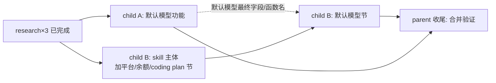

# PRD — 新增 aidog-add-platform 领域 skill（parent）

## 背景

aidog 内置 50+ 平台，「加/改一个平台」的配置散在前端 + 后端多处，且有反直觉真相（预设住前端、Protocol 须跨层双写、部分 adapter 是死代码）。新人/AI 加平台易踩坑。目标：把「加/改平台配置」固化成可执行的项目领域 skill。

调研期发现一个缺口：**aidog 当前无「平台预设默认模型」机制**（PlatformModels 5 槽默认全空，预设只给 endpoints 不给 models）。用户要的「无模型列表时展示默认模型 + 表单预填默认模型」是个未实现的功能。

## 决策（已与用户确认）

1. 默认模型：**先实现功能**（child A），再把它写进 skill。
2. skill **两种加平台路径都详述**（纯 OpenAI 兼容预设 + 加新 wire 协议），覆盖余额/coding plan/默认模型子流程。
3. skill 落点：项目级 `.claude/skills/aidog-add-platform/`，随仓库走、团队共享。

## 拆分（2 child）

| child | 交付 | 验收 |
|---|---|---|
| A `06-15-default-model` | 平台预设默认模型功能：预设加默认模型承载点 → 表单选平台时预填 → 无列表时展示默认 | `yarn build` 过；选主流平台表单 models 自动预填；cargo（若动后端）clippy/test 过 |
| B `06-15-add-platform-skill-doc` | `.claude/skills/aidog-add-platform/SKILL.md`（+ references 触点地图/子流程模板） | skill 自包含；两路径触点准确（对照 3 份 research）；含默认模型节（引用 A 实现） |

## 调度图

**并行组**：child A 与 child B 主体（B0）可并行启动（B 主体写加平台/余额/coding plan，不依赖 A）。
**依赖**：child B 的「默认模型」章节（B1）依赖 child A 落地后的最终字段名/函数名 → A 完成后再定稿 B1。

## 共享资源

- `research/01-platform-model-presets.md`（默认模型现状 + 平台数据模型 + 预设触点）
- `research/02-quota-coding-plan.md`（余额/coding plan 子流程模板）
- `research/03-proxy-frontend.md`（代理注入 + 前端/跨层触点）

三份 research 在 parent 目录，两 child 的 jsonl 均引用。

## 非目标

- 不重构现有平台预设结构
- 不给全部 50+ 平台填默认模型（child A 建机制 + 填主流平台，详见 child A prd）
- 不碰定价 UI（research 03 确认 PricingTab 无 Protocol 触点）
