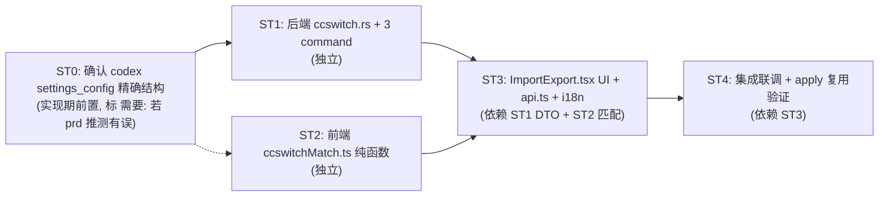

# 实现计划：导入 cc-switch 平台配置（MVP）

> 配套 `.trellis/tasks/06-16-cc-switch-import/prd.md`（决策已锁定：D3/D5/gemini 不导入，单一交付）。
> 本文档聚焦「怎么落地」，所有 file:line 已对齐 main 分支当前状态。

---

## 0. 决策快照（来自 prd.md，本节只读）

| 维度 | MVP 决策 |
|---|---|
| D1 平台类型识别 + base_url 回退链 | ✅ 做 |
| D2 模型映射（PlatformModels slot） | ✅ 做 |
| D3 代理配置（cc-switch proxy_config） | ❌ **不做**（语义不对齐，归 Out of Scope） |
| D4 密钥同步（api_key） | ✅ 做 |
| D5 自动更新/设备设置 | ❌ **不做**（无可靠映射，归 Out of Scope） |
| app_type 范围 | 仅 `claude` + `codex`（gemini 及其余不导入） |
| 交付形态 | **单一交付，无 child**（核心链路耦合紧） |
| 后端入口 | 新增 `ccswitch_detect` / `ccswitch_read` / `ccswitch_import` 三个 Tauri command |
| 匹配回退链位置 | **前端纯函数**（preset 住前端，禁 Rust 重复一份） |
| 冲突/写入复用 | 喂 `Payload.platform` → 现有 `apply.rs::apply()`（`src-tauri/src/gateway/import_export/apply.rs:187`） |

---

## 1. 现状锚点（aidog 侧，file:line 已核实）

### 后端（Rust）

| 锚点 | 路径:行 | 用途 |
|---|---|---|
| 导入导出模块入口 | `src-tauri/src/gateway/import_export/mod.rs:1-78` | `Payload` 定义（`platform: Vec<serde_json::Value>`，每元素 = Platform 的 JSON 序列化） |
| 冲突数据模型 | `src-tauri/src/gateway/import_export/mod.rs:112-153` | `ConflictItem` / `ImportPreview` / `Decision{Overwrite,Skip,Rename}` / `ConflictDecision` / `ImportReport` |
| apply 入口 | `src-tauri/src/gateway/import_export/apply.rs:187-204` | `pub async fn apply(payload: Payload, decisions: &[ConflictDecision], db: &Db)` —— **ccswitch_import 复用此函数**，无需经 .aidogx |
| 冲突检测 | `src-tauri/src/gateway/import_export/apply.rs:61` | `detect_conflicts(payload, db)` 按 `name` 探测现有 platform 冲突 |
| platform 写入 | `src-tauri/src/gateway/import_export/apply.rs:492` | `upsert_platform_row(db, name, effective_name, p)` |
| collect 序列化范式 | `src-tauri/src/gateway/import_export/collect.rs:33-38` | `list_platforms` → `serde_json::to_value` —— 证明前端构造同形 JSON 即可喂入 `Payload.platform` |
| Platform 模型 | `src-tauri/src/gateway/models.rs:408` | `pub struct Platform`（含 `models: PlatformModels` `:235`、`endpoints: Vec<PlatformEndpoint>` `:330`） |
| PlatformModels slot | `src-tauri/src/gateway/models.rs:235-247` | haiku/sonnet/opus/main slot（用于 D2 模型映射） |
| Tauri command 注册 | `src-tauri/src/lib.rs:3747-3748` | `import_read_file` / `import_apply` 的 invoke_handler 行（新增 ccswitch_* 紧随其后） |
| 现有 import 命令范式 | `src-tauri/src/lib.rs:1961-1983` | `import_read_file` / `import_apply` 的实现骨架（trace_id instrument + State<Db> + 错误处理） |

### 前端（TS）

| 锚点 | 路径:行 | 用途 |
|---|---|---|
| 平台预设单一事实源 | `src/pages/Platforms.tsx:17` | `PROTOCOLS: ProtocolOption[]`（含 `value` / `label` / `keywords` / `codingPlan?`）—— **匹配回退链消费此数组** |
| 默认 endpoints 骨架 | `src/pages/Platforms.tsx:150` | `function getDefaultEndpoints(protocol, codingPlan?)` —— 命中 preset 后取此骨架，再用实际 base_url 覆盖同协议 endpoint |
| 智能粘贴解析器 | `src/utils/platformPaste.ts:71,114,140` | `normalizeForMatch` / `guessProtocol(url)` / `matchPlatform(text, presets)` —— **匹配回退链复用这三个函数**，禁在 Rust 重写 |
| api.ts invoke 封装 | `src/services/api.ts` | Tauri invoke 调用范式 + TS 类型定义（加 CcProvider 类型 + 三个 invoke 封装） |
| ImportExport UI | `src/components/settings/ImportExport.tsx:33-138` | scope 卡片 + ConflictItem 决策 UI（集成点：第三块「从 cc-switch 导入」卡片） |
| i18n key 前缀 | `src/locales/*.json` 8 语言（`importExport.*` 现存约 20 个 key） | 新增 `importExport.ccswitch.*`；防线：`scripts/check-i18n.mjs` |

---

## 2. 改动清单

### 2.1 后端（Rust）

**新增模块**：`src-tauri/src/gateway/import_export/ccswitch.rs`（与 `collect.rs` / `apply.rs` 同级，在 `mod.rs` 注册 `pub mod ccswitch;`）。

模块职责：
1. **探测**：`~/.cc-switch/cc-switch.db`（SQLite）或 `~/.cc-switch/config.json`（旧 MultiAppConfig JSON）是否存在；尊重自定义目录探测（先 `dirs::home_dir().join(".cc-switch")`，后允许传入 override path）。
2. **读取 SQLite**：用 `rusqlite`（已在依赖树，确认：`src-tauri/Cargo.toml`）打开 `cc-switch.db`，`SELECT id, app_type, name, settings_config, website_url FROM providers WHERE app_type IN ('claude','codex')`。**禁 SELECT \***（避免读到 irrelevant 列）。
3. **读取旧 JSON**：解析 `~/.cc-switch/config.json` 的 `MultiAppConfig` 结构（参考 cc-switch `src-tauri/src/database/migration.rs:3` 的 `migrate_from_json`），提取 `providers` 数组并按 `app_type` 过滤。
4. **DTO 序列化**：把每行 provider 转成 `CcProvider`（中间表示，原始字段透传，**不做平台匹配**——匹配是前端纯函数职责）。

**DTO 定义**（`ccswitch.rs`）：

```rust
#[derive(Debug, Clone, Serialize, Deserialize)]
#[serde(rename_all = "camelCase")]
pub struct CcProvider {
    pub id: String,
    pub app_type: String,        // "claude" | "codex"（已 SQL 过滤，前端再校验）
    pub name: String,
    /// 原始 settings_config JSON（claude: {env:{...}}；codex: {auth:{OPENAI_API_KEY}, config_toml: "..."}）
    pub settings_config: serde_json::Value,
    pub website_url: Option<String>,
    /// 检测到的 base_url（claude 从 env.ANTHROPIC_BASE_URL；codex 从 config_toml 解析 base_url）
    /// 后端只做「提取」不做「匹配」，匹配走前端。
    pub detected_base_url: Option<String>,
    /// 检测到的 api_key（claude env.ANTHROPIC_AUTH_TOKEN/API_KEY；codex auth.OPENAI_API_KEY）
    pub detected_api_key: Option<String>,
}
```

> **注意 codex settings_config 列精确 JSON 结构**：prd「3. Codex 类」节已标 `需要:` —— SQLite 里 codex provider 的 `settings_config` 列是 cc-switch 内部 `ProviderConfig` serde 序列化的 JSON，含 `auth`（auth.json 内容）+ `config`（config.toml 文本）。**实现期需用真实 cc-switch.db 样本核实**：
> - 途径 1：开发者本机如装有 cc-switch，直接 `sqlite3 ~/.cc-switch/cc-switch.db "SELECT settings_config FROM providers WHERE app_type='codex' LIMIT 1"`。
> - 途径 2：`gh api repos/farion1231/cc-switch/contents/src-tauri/src/codex_config.rs` 读 `write_codex_live_atomic` 确认写入聚合结构。
> - 若 prd 推测有误（如 settings_config 不是 `{auth, config}` 而是别的形态），停手回报 `需要: <发现>`，不硬写解析逻辑。

**新增 Tauri command**（`src-tauri/src/lib.rs`，紧随 `import_apply:1983`）：

```rust
/// 探测 cc-switch 配置存在性 + 路径。
#[tauri::command]
#[tracing::instrument(skip_all, fields(trace_id = %crate::logging::new_trace_id()))]
async fn ccswitch_detect(
    override_path: Option<String>,
) -> Result<CcswitchDetection, String> { ... }

/// 读取 cc-switch providers（仅 claude/codex），返回原始 DTO 列表。
#[tauri::command]
#[tracing::instrument(skip_all, fields(trace_id = %crate::logging::new_trace_id()))]
async fn ccswitch_read(
    db: State<'_, Db>,                // 仅用于查询现有 platform name 以标冲突
    path: Option<String>,
) -> Result<CcswitchReadResult, String> { ... }

/// 导入：接收前端已匹配+转换好的 Payload.platform（Vec<serde_json::Value>）
/// + 用户决策，走 apply.rs::apply() 写入。
#[tauri::command]
#[tracing::instrument(skip_all, fields(trace_id = %crate::logging::new_trace_id()))]
async fn ccswitch_import(
    db: State<'_, Db>,
    platform_payload: Vec<serde_json::Value>,  // 前端转换好的 Platform JSON 数组
    decisions: Vec<ConflictDecision>,
) -> Result<ImportReport, String> {
    let payload = Payload {
        manifest: /* 合成最小 manifest */,
        platform: platform_payload,
        group: vec![],
        group_platform: vec![],
        setting: vec![],
        codex_global: None,
        codex_profiles: vec![],
        claude_code_global: None,
        claude_code_group_settings: vec![],
        skills: vec![],
    };
    gateway::import_export::apply::apply(payload, &decisions, &db).await
}
```

**关键复用点**：`ccswitch_import` 不调用 `detect_conflicts`（冲突检测在 `apply::apply` 内部 `apply_db` 阶段做，决策来自前端 preview 阶段——见下）。但为了前端能在导入前预览冲突，需提供 `ccswitch_read` 时同时返回「与现有同名 platform 的冲突标记」——直接调 `apply::detect_conflicts` 喂一个临时 Payload 即可，或前端拿现有 platforms 列表自己 diff（**推荐后者**，避免后端 detect_conflicts 暴露成需要 Payload 的接口）。

**register**：`src-tauri/src/lib.rs` 的 `invoke_handler`（约 `:3748` 后）追加三行 `ccswitch_detect, ccswitch_read, ccswitch_import,`。

**禁碰**：`.aidogx` 容器（container.rs）、SCOPE_* 常量（保持 7 项）、export 路径（collect.rs）。

### 2.2 前端（TS）

**新增模块**：`src/utils/ccswitchMatch.ts`（纯函数，与 `platformPaste.ts` 同目录，复用其导出的 `normalizeForMatch` / `guessProtocol` / `matchPlatform`；若这些函数当前未 export，先在 platformPaste.ts 加 `export`）。

**base_url 匹配回退链**（4 步）：

```ts
export interface CcMatchResult {
  protocol: Protocol;              // 命中的 platform_type
  codingPlan?: boolean;
  matchedBy: 'preset_keyword' | 'base_url_host' | 'protocol_fallback';
  endpoints: PlatformEndpoint[];   // getDefaultEndpoints 骨架 + 实际 base_url 覆盖
}

export function matchCcProvider(
  provider: CcProvider,
  protocols: ProtocolOption[],     // 从 Platforms.tsx PROTOCOLS 传入
): CcMatchResult {
  const baseUrl = provider.detectedBaseUrl ?? '';
  const text = `${provider.name} ${baseUrl}`;

  // 步骤 1：preset 关键词匹配（复用 matchPlatform）
  const hit = matchPlatform(text, protocols);
  if (hit) return buildMatch(hit, 'preset_keyword', baseUrl, protocols);

  // 步骤 2：base_url host 匹配（增强）
  const hostMatch = matchByBaseUrlHost(baseUrl, protocols);
  if (hostMatch) return buildMatch(hostMatch, 'base_url_host', baseUrl, protocols);

  // 步骤 3 + 4：协议回退（claude → anthropic；codex → openai_responses/openai）
  return buildFallback(provider, baseUrl, protocols);
}
```

**辅助函数 `buildMatch`**：
- 命中 preset → 调 `getDefaultEndpoints(protocol, codingPlan)`（`Platforms.tsx:150`）取骨架。
- 找到骨架中 `protocol === 命中 protocol` 的 endpoint，把 `base_url` 覆盖为 cc-switch 实际 base_url。
- 若 cc-switch base_url 为空（preset 模板），保留骨架默认 base_url。

**辅助函数 `matchByBaseUrlHost`**：
- 对每个 protocol 的 `getDefaultEndpoints()` 默认 base_url 取 host。
- normalize 后子串匹配（如 `open.bigmodel.cn` → glm、`api.moonshot.cn` → kimi）。
- 复用 `normalizeForMatch`（`platformPaste.ts:71`）。

**辅助函数 `buildFallback`**：
- `provider.appType === 'claude'`（或 baseUrl 含 `/anthrop`）→ `protocol: 'anthropic'`, `endpoints: [{ protocol: 'anthropic', base_url: baseUrl, client_type: 'claude_code' }]`。
- `provider.appType === 'codex'`：从 settings_config.config_toml 解析 `wire_api`，`wire_api === 'responses'` → `protocol: 'openai_responses'`；否则 `protocol: 'openai'`；endpoints: `[{ protocol, base_url: baseUrl, client_type: 'codex_tui' }]`。
- 复用 `guessProtocol(url)`（`platformPaste.ts:114`）做 URL 启发式（`/anthrop/`→anthropic、`/openai|\/v1/`→openai）。

**api.ts**：

```ts
export interface CcProvider {
  id: string;
  appType: 'claude' | 'codex';
  name: string;
  settingsConfig: Record<string, unknown>;
  websiteUrl?: string;
  detectedBaseUrl?: string;
  detectedApiKey?: string;
}

export const ccswitchApi = {
  detect: (overridePath?: string) => invoke<CcswitchDetection>('ccswitch_detect', { overridePath }),
  read: (path?: string) => invoke<CcswitchReadResult>('ccswitch_read', { path }),
  import: (platformPayload: unknown[], decisions: ConflictDecision[]) =>
    invoke<ImportReport>('ccswitch_import', { platformPayload, decisions }),
};
```

**ImportExport.tsx**（第三块「从 cc-switch 导入」卡片，位于现有「导出」+「导入 .aidogx」两块之后）：

UI 流程（详见 prd「选择性导入 UI 方案」节）：
1. 「检测 cc-switch」按钮 → `ccswitchApi.detect()`，显示路径或「未检测到，可手动选目录」（用 Tauri `dialog.open`）。
2. `ccswitchApi.read()` → provider 列表（级 1 多选，每行：checkbox + name + platform_type 徽标 + base_url + 冲突标记）。
3. 维度勾选条（级 2）：D1 平台类型 / D2 模型映射 / D4 密钥 三项（默认全勾；D3/D5 不在 UI 中）。
4. 「预览冲突」：对每个勾选 provider 调 `matchCcProvider` + 转换为 `Platform` JSON，与现有 platforms 比对 name，产生 `ConflictItem[]`；复用现有冲突弹窗（同 `ImportExport.tsx` 现有 ConflictItem 决策 UI）。
5. 「导入」：`ccswitchApi.import(platformPayload, decisions)` → `ImportReport`（applied/skipped/errors 展示）。

**转换函数**（前端，`ccswitchMatch.ts` 同时导出）：

```ts
export function ccProviderToPlatformJson(
  provider: CcProvider,
  match: CcMatchResult,
  dims: { d1: boolean; d2: boolean; d4: boolean },
): Record<string, unknown> {
  return {
    name: provider.name,
    platform_type: match.protocol,
    base_url: provider.detectedBaseUrl ?? getDefaultBaseUrl(match),
    api_key: dims.d4 ? (provider.detectedApiKey ?? '') : '',
    endpoints: match.endpoints,
    models: dims.d2 ? extractModels(provider) : PlatformModels.default(),
    // D1 总是隐含的（platform_type 即 D1）
  };
}
```

**i18n**：`src/locales/*.json` 8 语言新增 `importExport.ccswitch.*` key（zh-CN 先写，其余 7 语言用 `scripts/i18n-fill.mjs` 或人工翻译）：
- `ccswitch.title`、`ccswitch.detectBtn`、`ccswitch.detected`、`ccswitch.notDetected`、`ccswitch.selectDir`、`ccswitch.providerList`、`ccswitch.dimPlatformType`、`ccswitch.dimModels`、`ccswitch.dimApiKey`、`ccswitch.preview`、`ccswitch.importBtn`、`ccswitch.matched`、`ccswitch.fallback`、`ccswitch.conflict`、`ccswitch.noKey`。

**禁碰**：`Platforms.tsx` 的 `PROTOCOLS` 数组本身（只读消费）；`platformPaste.ts` 仅加必要的 `export` 修饰符，不改逻辑。

---

## 3. subtask 拆分（五要素）

> 单一交付但内部拆 4 个 subtask 便于并行 + 验收。ST1 与 ST2 可并行（无文件冲突），ST3 依赖 ST1 DTO + ST2 匹配函数，ST4 是集成联调。

### ST1. 后端 cc-switch 读取 + DTO + 三个 Tauri command

- **目标**：后端能探测 cc-switch 配置、读取 claude/codex provider 原始数据、接收前端转换好的 Payload 并走 apply::apply 写入。
- **产出**：
  - 新文件 `src-tauri/src/gateway/import_export/ccswitch.rs`（探测/读取/DTO）。
  - `src-tauri/src/gateway/import_export/mod.rs` 加 `pub mod ccswitch;` + `pub use ccswitch::CcProvider;`。
  - `src-tauri/src/lib.rs` 加三个 `#[tauri::command]` + invoke_handler 注册。
  - `cargo test`：ccswitch 模块单测（mock SQLite + 旧 JSON 样本）。
- **验证**：
  - `ccswitch_detect` 返回正确路径（用真实或 mock 的 `~/.cc-switch/cc-switch.db`）。
  - `ccswitch_read` 返回的 `CcProvider[]` 仅含 app_type=claude/codex。
  - `ccswitch_import` 喂一个 hand-crafted `Payload.platform` 能成功写入 db（用现有 `apply::apply` 路径）。
  - `cargo clippy` / `cargo test` 零 warning。
- **资源**：`src-tauri/src/gateway/import_export/{mod,apply,collect}.rs`、`lib.rs:1961-1983,3747-3748`、rusqlite 依赖。
- **依赖**：无（可先跑）。**前置条件**：实现期需先确认 codex settings_config 列精确 JSON 结构（标 `需要:` 若 prd 推测有误）。
- **并行性**：与 ST2 无文件冲突，可并行。

### ST2. 前端匹配回退链纯函数 + 单测

- **目标**：纯函数把 `CcProvider` + PROTOCOLS 转成 `CcMatchResult`（含 4 步回退链 + getDefaultEndpoints 骨架覆盖）。
- **产出**：
  - 新文件 `src/utils/ccswitchMatch.ts`（matchCcProvider + ccProviderToPlatformJson + 辅助函数）。
  - `src/utils/platformPaste.ts`：必要函数加 `export`（normalizeForMatch / guessProtocol / matchPlatform），不改逻辑。
  - 单测（无现有前端测试框架，写一个 `ccswitchMatch.test.ts` 用 node 直接跑，或加入未来测试脚手架；MVP 可用 console.assert + tsc 类型检查兜底，单测作为 follow-up）。
- **验证**：
  - 4 步回退链各覆盖一个 case（preset 命中 / host 命中 / claude 回退 / codex wire_api=responses 回退）。
  - tsc 零 error。
- **资源**：`src/pages/Platforms.tsx:17,150`、`src/utils/platformPaste.ts:71,114,140`、`src/services/api.ts`（CcProvider 类型定义，可与 ST1 DTO 对齐字段名）。
- **依赖**：与 ST1 的 DTO 字段名约定（提前对齐 camelCase 字段名即可，不必等 ST1 完成）。
- **并行性**：与 ST1 并行。

### ST3. ImportExport.tsx UI + api.ts + i18n

- **目标**：第三块「从 cc-switch 导入」卡片完整可用（检测/列表多选/维度勾选/预览冲突/导入）。
- **产出**：
  - `src/services/api.ts`：CcProvider 类型 + ccswitchApi 三方法。
  - `src/components/settings/ImportExport.tsx`：新增第三块卡片（约 200-300 行，可考虑拆到 `src/components/settings/CcSwitchImport.tsx` 子组件，ImportExport.tsx 仅 render）。
  - `src/locales/*.json` 8 语言：`importExport.ccswitch.*` key 全补。
- **验证**：
  - 检测按钮正确显示路径。
  - provider 列表级 1 多选 + 级 2 三维勾选。
  - 预览冲突弹窗复用现有 ConflictItem UI。
  - 导入成功后展示 ImportReport。
  - i18n 8 语言 `check-i18n.mjs` 零缺失。
  - tsc 零 error。
- **资源**：ST1 的 `ccswitch_*` command、ST2 的 `matchCcProvider` + `ccProviderToPlatformJson`、`ImportExport.tsx:33-138` 现有 UI 范式。
- **依赖**：ST1（command 可调）+ ST2（匹配函数可用）。
- **并行性**：ST1+ST2 完成后启动。

### ST4. 集成联调 + apply 复用验证

- **目标**：端到端跑通「cc-switch 真实配置 → aidog platform 入库」，验证 apply 复用路径无回归。
- **产出**：无新代码，仅 bugfix + 端到端测试记录。
- **验证**：
  - 用真实或 mock 的 cc-switch.db（claude + codex 各一个 provider）跑完整流程。
  - 冲突场景：与现有同名 platform 冲突 → Overwrite / Skip / Rename 三决策各验一次。
  - 空密钥 provider 不报错，api_key 留空。
  - codex wire_api=responses → endpoint protocol=openai_responses；wire_api=chat → openai。
  - gemini provider 不在列表中（SQL 过滤生效）。
  - 现有 `.aidogx` 导入导出回归（确保未误改 apply.rs / container.rs）。
  - `cargo clippy` / `cargo test` / tsc / check-i18n.mjs 全绿。
- **资源**：ST1+ST2+ST3 全部完成。
- **依赖**：ST3 完成。
- **并行性**：串行（最终关卡）。

---

## 4. subtask 调度图



ST1 与 ST2 并行；ST0 是前置确认步骤（不阻塞 ST2 启动，但 ST1 的 codex 解析逻辑依赖 ST0 结论）。

---

## 5. 风险与开放问题

### R1. codex settings_config 列精确 JSON 结构未实证

- **状态**：prd「3. Codex 类」节已标 `需要:`。SQLite 里 codex provider 的 `settings_config` 列是 cc-switch 内部 `ProviderConfig` serde 序列化结果，prd 推测为 `{auth: {OPENAI_API_KEY}, config: "<toml 文本>"}`，但**未经真实样本核实**。
- **缓解**：ST0 前置步骤，实现期第一件事就做：
  1. 开发者本机装 cc-switch → `sqlite3 ~/.cc-switch/cc-switch.db "SELECT settings_config FROM providers WHERE app_type='codex' LIMIT 1;" | jq .`。
  2. 或 `gh api repos/farion1231/cc-switch/contents/src-tauri/src/codex_config.rs`（读 `write_codex_live_atomic` 确认聚合写入结构）+ `src-tauri/src/database/schema.rs`（确认 ProviderConfig serde derive）。
- **若推测有误**：停手回报 `需要: cc-switch codex settings_config 实际结构为 <X>，prd/implement 需修订 DTO 字段`。

### R2. preset 住前端的腐化风险

- **描述**：`PROTOCOLS`（`Platforms.tsx:17`）是平台预设单一事实源。匹配回退链放前端纯函数复用它 —— 正确选择（记忆 `aidog-add-platform-skill` 反直觉点 1）。但若未来有人在 Rust 侧新增「后端平台匹配」逻辑，会双写腐化。
- **缓解**：在 `ccswitchMatch.ts` 顶部注释明确「禁在 Rust 重复实现 preset 匹配；后端只做原始数据读取 + DTO 透传」。code review 时检查。

### R3. 冲突检测的两条路径

- **描述**：现有 `apply::detect_conflicts`（`apply.rs:61`）需要完整 `Payload`。ccswitch_import 走 apply 时冲突检测在 `apply_db` 内部按 name 比 —— 前端 preview 阶段需要独立做一次冲突标记。
- **缓解**：前端 preview 用「现有 platforms 列表 name diff」（`list_platforms` 已有 command），不调后端 detect_conflicts。后端 apply 内部的冲突检测作为最终兜底（双保险）。

### R4. codex config.toml 解析在前端

- **描述**：codex provider 的 `wire_api` / `model` 在 config.toml 文本里，前端需解析 TOML。
- **缓解**：前端引入轻量 TOML parser（如 `smol-toml`），或后端在 `ccswitch_read` 阶段就把 config.toml 解析成结构化 JSON 放进 DTO（`settings_config.config_parsed`）—— **推荐后者**，避免前端引入 TOML 依赖。ST1 DTO 需相应扩展。

### R5. 旧 config.json 迁移路径

- **描述**：cc-switch 旧版 `~/.cc-switch/config.json`（MultiAppConfig）仍需支持（prd「1. 存储位置」节）。
- **缓解**：ST1 的 `ccswitch_detect` 同时探测两种源；`ccswitch_read` 优先 SQLite，不存在则回退 JSON。JSON 解析参考 cc-switch `src-tauri/src/database/migration.rs:3-68` 的 `migrate_from_json` 逻辑。

---

## 6. 五要素自检（parent 任务级）

| 要素 | 内容 |
|---|---|
| **目标** | aidog 导入导出模块新增「从 cc-switch 导入」入口，支持选择性导入 claude/codex provider（D1+D2+D4），复用现有 apply 冲突机制 |
| **产出** | 后端 ccswitch.rs + 3 command；前端 ccswitchMatch.ts + ImportExport.tsx 第三块 + api.ts + i18n 8 语言；apply.rs 零改动（纯复用） |
| **验证** | 4 subtask 各自 AC + ST4 端到端：真实 cc-switch.db 跑通 claude/codex 导入 + 冲突三决策 + 空密钥 + wire_api 分流 + gemini 过滤 + .aidogx 回归 |
| **资源** | prd.md 调研结论（cc-switch 仓库结构 + 字段映射表）、aidog import_export 模块、Platforms.tsx preset、platformPaste.ts 匹配函数 |
| **依赖** | ST0（codex settings_config 实证）前置；ST1+ST2 并行；ST3 依赖 ST1+ST2；ST4 依赖 ST3 |

### AC 映射（prd 验收标准 → subtask）

| prd AC | 责任 subtask |
|---|---|
| 检测 cc-switch 配置（DB/config.json） | ST1 |
| 列出 claude/codex provider（gemini 过滤） | ST1 |
| platform_type 识别 + 4 步回退链 + 单测 | ST2 |
| 模型映射落 PlatformModels slot | ST2（转换函数）+ ST3（维度勾选） |
| 密钥落 api_key + 空密钥不报错 | ST2（转换）+ ST3（UI） |
| 选择性导入（provider 多选 + D1/D2/D4 维度） | ST3 |
| 冲突走现有 Overwrite/Skip/Rename | ST3（前端 preview）+ ST1（后端 apply 兜底） |
| ccswitch_* command + apply.rs 复用 + ImportExport.tsx 第三块 + 不新增 scope | ST1 + ST3 |
| cargo clippy/test/tsc 零 warning + i18n 8 语言零缺失 | ST1 + ST3 + ST4 |
| 调研结论可追溯到仓库文件路径 | ST1（代码注释引用 prd Research References） |

---

## 7. 不做清单（决策锁定，实现期禁 scope creep）

- D3 代理配置（cc-switch proxy_config）—— 用户决策不导入。
- D5 自动更新/设备设置 —— 用户决策不导入。
- gemini / opencode / hermes / openclaw / omo app_type —— 用户决策仅 claude + codex。
- aidog → cc-switch 反向导出。
- 加密 / .aidogx 容器（cc-switch import 是明文外部源）。
- 吃 cc-switch 的 .sql 导出文件（直接读原始存储）。
- 新增 export scope（ALL_SCOPES 保持 7 项）。
- 在 Rust 侧重复实现 preset 匹配（preset 住前端）。

如实现期发现需要重新评估以上任何一项，**停手回报 `需要: <问题>`**，不擅自扩 scope。
