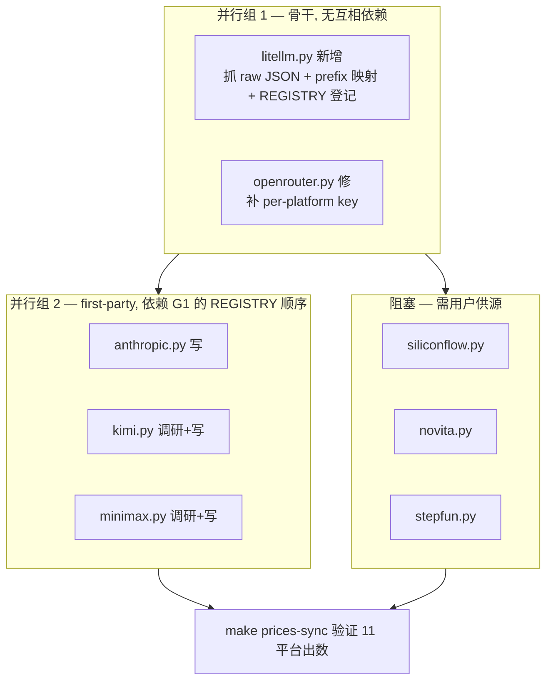

# PRD — Pricing 全平台覆盖 (LiteLLM 兜底骨干 + first-party 最佳信源)

## 背景

`make prices-sync` 跑 11 scraper, 实际出数仅 4 (deepseek/gemini/openai/openrouter = 331 模型)。问题:

1. **openrouter 骨干缺陷**: `scrapers/openrouter.py:87` 抓 307 模型只挂 `pricing["openrouter"]`, 仅设 `default_platform` (PREFIX_MAP 映射), **pricing dict 未补 first-party platform key** → anthropic/glm/kimi/minimax/siliconflow/novita/stepfun 七平台 per-platform 价 = 0, 靠 top-level fallback (openrouter markup 偏高, source 不准)。
2. **7 first-party stub 全空**: anthropic/glm/kimi/minimax/siliconflow/novita/stepfun 均 `return {}` (官方页 JS 渲染, 注释判无稳定抓取)。
3. 无 LiteLLM 聚合骨干兜底。

> openai/openrouter 偶发 `InvalidURL: Invalid port: ':'` FAIL 是旧跑假象 (env 已恢复, 实跑两都 OK)。本任务不修该偶发 (疑似临时 env proxy, 非代码缺陷)。

## 用户决策 (已拍板)

- **LiteLLM 作兜底骨干** (聚合, 广覆盖, fallback 价)
- **各平台 first-party 抓取 = 最佳信源** (有则优先覆盖 LiteLLM)
- resolve_price 回退链: first-party (`pricing[platform]`) → LiteLLM 兜底 → top-level

## 目标

`make prices-sync` 后, 11 平台均有价 (first-party 一手优先, LiteLLM 兜底, openrouter 骨干补 max_tokens/context), `data/models.json` 各平台 per-platform pricing 条目 ≥ 1。7 first-party 平台不再"空跳过"误导。

## 方案

### 核心: litellm 骨干 scraper (新增 `scrapers/litellm.py`)

- 抓 `https://raw.githubusercontent.com/BerriAI/litellm/main/model_prices_and_context_window.json` (BerriAI/litellm main, 100+ provider, 字段 `input_cost_per_token`/`output_cost_per_token`/`max_input_tokens`/`max_output_tokens` ≡ aidog schema)
- 按 LiteLLM prefix 映射 platform_type (与 Rust Protocol serde 裸名一致):

| LiteLLM prefix | platform_type |
|---|---|
| `openai/` | openai |
| `anthropic/` | anthropic |
| `gemini/` / `vertex_ai/` | gemini |
| `deepseek/` | deepseek |
| `zai/` | glm |
| `moonshot/` | kimi |
| `minimax/` | minimax |
| (siliconflow/novita/stepfun 无 LiteLLM prefix) | — 不覆盖 |

- 每模型: 写 `pricing[<platform_type>]` (per-platform 兜底价) + `pricing["litellm"]` (原始 litellm key, source 可追溯) + max_tokens/context (若 first-party/openrouter 未设)
- 模型名: 去 prefix 取后半 (`zai/glm-4.6` → `glm-4.6`), 与 openrouter 归一策略一致

### 优先级机制 (REGISTRY 顺序 + _merge 首次非空)

`aggregate.py:_ensure_platform_pricing` (line 86-98): per-platform 字段首次非空优先, 后续不覆盖。靠 **REGISTRY 顺序** 定优先级, **不改 Rust resolve_price** (db.rs:3009 回退链 `pricing[platform]` 已含 litellm 兜底):

```
first-party (deepseek/gemini/openai/anthropic/...) → litellm (兜底) → openrouter (max_tokens 骨干 + 备用价)
```

- first-party 先注册: 占 `pricing[platform]` key, litellm 后到不覆盖 (字段已非 None)
- first-party 缺 (return {}): litellm 填 `pricing[platform]`
- openrouter 仍提供 max_tokens/context 骨干 (litellm 也有, 互补充)

### openrouter.py 修正

补 per-platform pricing key: PREFIX_MAP 命中模型同时写 `pricing[<platform_type>]` (openrouter 价)。但 openrouter **在 litellm 之后注册** → litellm 已填的平台 openrouter 不覆盖 (markup 价劣后)。仅对 litellm 未覆盖的模型 (如 siliconflow/novita/stepfun 路由) 补 openrouter 价兜底。

### first-party scraper 接入 (最佳信源, 逐平台)

| 平台 | LiteLLM 兜底 | first-party 可行性 | 行动 |
|---|---|---|---|
| anthropic | ✅ | anthropic.com/pricing 静态表 / 文档 | **写 first-party** |
| glm (zhipu) | ✅ zai/ | bigmodel.cn/pricing JS 渲染 | LiteLLM 兜底足, first-party 可选 (Q) |
| kimi (moonshot) | ✅ | platform.moonshot.cn/docs | **调研 + 写** |
| minimax | ✅ | platform.minimaxi.com/document/Price | **调研 + 写** |
| siliconflow | ❌ 无 prefix | siliconflow.cn/pricing /v1/models 需鉴权 | **需用户供源** |
| novita | ❌ | novita.ai/pricing | **需用户供源** |
| stepfun | ❌ | platform.stepfun.com/docs/pricing | **需用户供源** |

## subtask 划分

见 `implement.md`。

## mermaid 调度图



## 边界 / 验收

- ✅ `make prices-sync` 后 11 平台均有 per-platform pricing 条目 (除阻塞的 siliconflow/novita/stepfun 待源)
- ✅ litellm 兜底覆盖 glm/kimi/minimax/anthropic (LiteLLM JSON 核实命中)
- ✅ openrouter 不再仅挂 openrouter key, 补 per-platform (对 litellm 未覆盖模型)
- ✅ REGISTRY 顺序: first-party → litellm → openrouter
- ✅ `cargo test` (db.rs resolve_price / apply_context_tier 现有测试不破) + `make prices-sync` 实跑通过
- ✅ 不改 Rust resolve_price (db.rs:3009 回退链不动)
- ⛔ 不提交 `data/models.json` (生成产物, CLAUDE.md 硬规)
- ⛔ 不臆造 siliconflow/novita/stepfun 抓取源 (标 `需要:` 问用户)

## 需要 (问用户)

1. **siliconflow / novita / stepfun** 官方抓取源? (LiteLLM 无 prefix 覆盖; 官方页多为 JS 渲染或需鉴权) — 提供 URL / API / 已知可抓处, 或确认走 openrouter 兜底 (markup 偏高)
2. **glm / kimi / minimax** 是否要 first-party 一手 (LiteLLM 已兜底, 一手更准但维护成本)? 还是接受 LiteLLM 兜底?
