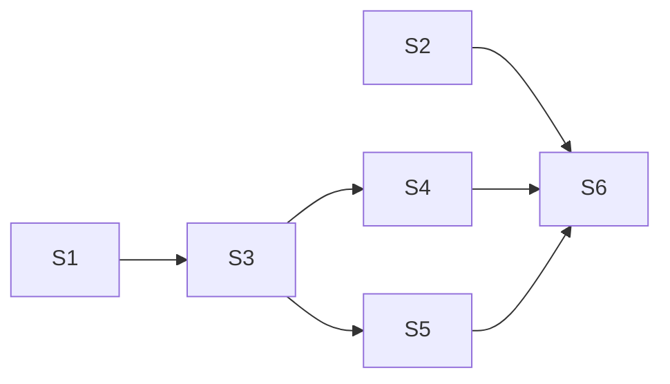

# PRD — 单测覆盖率≥80%（真实覆盖面全补）

> research: `.trellis/workspace/nico/research-coverage-baseline.md`
> 口径决策（用户定）: **真实覆盖面全补**（禁 vitest 默认假象，coverage.include 强制全量统计）

## 目标
前后端真实 line coverage ≥80%（非 vitest 默认 import 链假象）。

## 基线（research 实测）
| 维度 | 默认统计 line% | 真实全量 line% | 缺口 |
|---|---|---|---|
| Rust | 87.47% | 87.47%（已全量） | commands/ 34% + app_setup 天然难测；真缺口 passthrough.rs(166 missed)/apply/mod.rs(124)/forward.rs(95) |
| 前端 | 94.99%（假象） | 个位数（84/94 文件零测试不进分母） | pages 0/18, settings 0/14, platforms 0/4, formatters 38% |

## 交付项

### S1 — vitest 全量统计配置（阻塞 S3-S5 验收）
- 新增 `vitest.config.ts`：`coverage: { include: ['src/**/*.{ts,tsx}'], exclude: [test 文件自身/locales/themes] }`
- `yarn test:cov` 跑出真实基线 %（预期暴跌到个位数）→ 作为补测前基准
- 验收：`yarn test:cov` 输出含全文件覆盖率表

### S2 — Rust 3 大缺口分支补（与前端并行，文件集不相交）
- `gateway/proxy/passthrough.rs`（166 missed, 34.9%）→ 补 `test_passthrough.rs` 分支
- `gateway/import_export/apply/mod.rs`（124 missed, 71.6%）→ 补 `test_apply.rs`（或现有）分支
- `gateway/proxy/forward.rs`（95 missed, 71.3%）→ 补 `test_forward.rs` 分支
- 验收：三文件 line% ≥80%；`cargo llvm-cov --summary-only` 总数不降

### S3 — 前端 invoke mock harness（阻塞 S4-S6）
- 抽 `src/test/setup.ts`（或扩 api.test.ts mockIPC 模式）：统一 mockIPC + Tauri event + i18n init
- vitest config `setupFiles` 引入
- 验收：S4-S6 测试复用 harness 不重写 mock

### S4 — 前端 pages 测试（18 个，最大批量）
- `src/pages/`: Platforms/Groups/Logs/Settings/AppSettings/CodexSettings/ModelTestPanel/PricingTab/Stats 等 18 个
- 优先级：Platforms/Groups/Logs（核心交互）> Settings 族 > Stats
- 每页测：mount 渲染 + 关键交互（toggle/submit/nav）+ invoke 调用断言
- 验收：每 page 有 test 文件，关键分支覆盖

### S5 — 前端 settings + platforms 组件测试
- `src/components/settings/`（14 个：editors/Header/AnchorNav/UnsavedModal 等）
- `src/components/platforms/`（4 个）
- 验收：组件 mount + props 交互覆盖

### S6 — formatters 补 + 最终验收
- `src/utils/formatters.ts`（38%, L77-108 未覆盖）→ 补 formatters.test.ts 分支
- 最终：`yarn test:cov` 真实全量 line% ≥80%（前后端各自）
- `cd src-tauri && cargo llvm-cov --summary-only` line% ≥80%

## 调度

- S1/S2/S3 可并行（文件集不相交：vitest config / Rust test / 前端 harness）
- S4/S5 依赖 S3 harness
- S6 最后验收

## 验收（task 整体）
1. `vitest.config.ts` 含 coverage.include 全量统计
2. 前端真实 line% ≥80%（`yarn test:cov` 全文件表证）
3. Rust line% ≥80%（cargo llvm-cov，已 87.47% 保底）
4. 三 Rust 缺口文件各自 ≥80%
5. 18 pages + 14 settings + 4 platforms 各有 test 文件

## 非目标
- 不追 100%（80% 即收，YAGNI）
- 不测 locales/themes/纯类型文件
- 不改生产代码逻辑（仅补测试 + vitest config + harness）

## 风险
- 巨型 task（39+ test 文件）→ 拆 subtask 串行/并行编排，避免单 agent 上下文爆
- Tauri invoke mock 复杂（event/listen/async）→ S3 harness 先行降成本
- pages 测试依赖 navGuard/UnsavedModal 状态机 → 注意跨组件 state mock
- 与 tab 改名 task（改 CodingToolsSettings）+ sensenova（改 adapter）文件集相交时段 → coverage 前端测试 S4/S5 排 tab finish 后，Rust S2 排 sensenova finish 后（或文件集确认不相交可并行）

## 排队
当前 tab 改名 exec + sensenova research 跑中。coverage exec 排两者 finish 后启动（巨型 task 需专注，避免三路巨型编排失控）。planning prd 就绪可随时 start。
