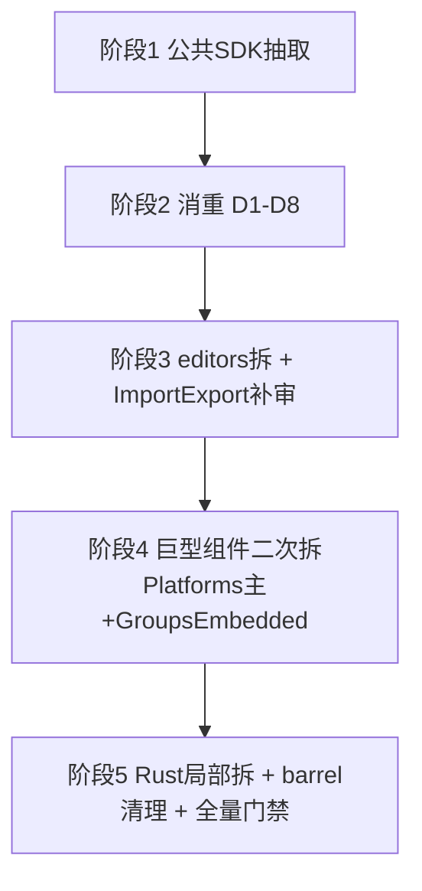

# design — 全仓架构重设计

> brainstorm 产物（main 同步前台 + research 3 份 + 用户 4 决策）。exec 编排（subtask DAG / 文件集 / 并发组）落 `implement.md`（start 后 trellisx-orchestrate 产）。

## 决策锁（用户 2026-07-02 AskUserQuestion）

| # | 决策点 | 锁定 |
|---|---|---|
| 1 | 迁移策略 | **渐进分阶段**（按依赖序分批，每阶段独立 commit + yarn build + check:i18n，可编译可回滚） |
| 2 | 执行载体 | **subagent 编排**（main 动态 DAG 调度，并发上限 2，完成即派；不开 workflow） |
| 3 | 巨型组件二次拆 | **UI 区块 + hook 混合**（先抽 hook 收 state → 再按 JSX 区块抽子组件） |
| 4 | 回归保障 | **build + i18n 门禁 + 关键路径手测**（不前置测试，补测归 test-coverage-80 task） |

## 目标目录结构（前端）

```
src/
  domains/                          ← 新：跨页复用的域 SDK + UI（消"page 充当 SDK"倒置）
    platforms/
      constants.ts                  PROTOCOLS/ENDPOINT_PROTOCOLS/CLIENT_TYPES/PROTOCOL_LABELS/PROTOCOL_COLORS/HEALTH_COLORS/MODEL_SLOTS/DEFAULT_NAMES/QUOTA_CONCURRENCY/MOCK_ERROR_MODES + type
      defaults.ts                   getDefaultEndpoints/getDefaultModels/getDefaultModelList/defaultClientForProtocol
      health.ts                     healthStatus/allModelValues/computeQuotaDisplay/tierLabel/formatResetCountdown/computeManualBudgetDisplay + QuotaDisplay/ManualBudgetDisplay/newManualBudget
      autoCategorize.ts             EstCodingTier/Plan/parseEstCodingPlan/autoCategorize
      query.ts                      platformMatchesQuery（D10 消重）
      models.ts                     MODEL_SLOTS 富结构 + allModelValues（D3/D4 single source）
      SearchableProtocolSelect.tsx
      MockConfigEditor.tsx
      index.ts                      barrel
    groups/
      routing.ts                    ROUTING_MODES/routingModeLabel/routingModeDesc（D1 消重，SchedulingSettings 共用）
      commands.ts                   buildClaudeCommand/buildCodexCommand/shellSquote
      editReducer.ts                EditState/EMPTY_EDIT/EditAction/editReducer/upsertPlatformInto
      GroupIcon.tsx
      PlatformPicker.tsx            SortablePlatform/PICKER_F/PlatformPicker
      GroupTestPanel.tsx            GroupRow/GroupTestStatus/GroupTestRow/GroupTestPanel/BATCH_TEST_CONCURRENCY
      index.ts
    settings/                       ← editors.tsx 拆出（见拆分映射 §3）
      tokens.ts→ 见 shared（F/S 上移）
      icons.tsx / EnvEditor.tsx / PermissionsSection.tsx / SandboxSection.tsx /
      StatusLineSection.tsx / ImportDiff.tsx / PluginsSection.tsx /
      HooksSection.tsx + HooksSectionInline.tsx + hooks-types.ts / FieldRenderer.tsx
      index.ts                      barrel（保持 `from "components/settings/editors"` 兼容路径或一次性改全消费方）
    shared/
      tokens.ts                     F/S 通用版（title/label/body/hint/small + kpi）— D2/D8 消重源
      CopyButton.tsx                D6 消重源（icon? 超集）
      stableStringify.ts            D5 消重源
      （现有 CompactCard/StatChip/BalanceBar/CostTrendChart/colorScale/usageColor/formatters 留 components/shared/）
  services/
    api/                            ← api.ts 拆（见拆分映射 §4）
      types.ts + platforms/groups/proxy/settings/tray/scheduling/notification/system/stats/pricing/skills/mcp/exchange + index.ts(barrel)
  pages/
    Platforms/                      Platforms.tsx(主组件二次拆) + FormSection.tsx + index.ts
    Groups/                         GroupListItem.tsx + GroupsEmbedded.tsx(二次拆) + index.ts
    Settings.tsx/CodexSettings.tsx/...（其余页保留，仅改 import）
  components/
    settings/                       editors.tsx 删除，剩余组件保留
    platforms/                      PlatformCard/usePlatformCards/ShareModal（import 改指 domains/platforms）
    shared/                         现有共享组件
  utils/ context/ themes/ locales/ assets/   基本不动（仅 utils/deepMerge isPlainObject 加语义注释 D7）
```

**包边界（dependency-graph §4 确认无环）**：`@aidog/api`（所有人依赖）← `shared` ← `platforms` ← `groups` ← `settings` ← `pages/`。`groups → platforms` 单向；`settings` 不依赖 platforms/groups。

## 拆分映射（引 research，不重复逐行）

| 巨型文件 | 拆前 | 拆后 | 依据 |
|---|---|---|---|
| `editors.tsx` | 4609 | 9 子文件（最大 SandboxSection ~785 临界） | research/section-split-map §1 |
| `Platforms.tsx` | 3568 | 8 文件（域 SDK 4 + UI 2 + 页面 2，主组件二次拆） | §2 |
| `Groups.tsx` | 2195 | 9 文件（域 SDK 6 + 页面 2 + barrel，GroupsEmbedded 二次拆） | §3 |
| `api.ts` | 2072 | 13 域文件 + types + barrel（最大 types ~430） | §4 |
| `ImportExport.tsx` | 1525 | **research 未覆盖，阶段 3 内补 mini-audit** | 待审 |

消重 12 处（D1-D12）引 research/duplication-audit.md，D7 保留两份加注释，D10 待阶段 2 确认。

## 阶段调度（渐进，阶段间串行，阶段内按文件集判并发）



**阶段 1 — 公共 SDK 抽取（纯移文件 + barrel，无业务改动）**
- **1a** `api.ts → services/api/*`（文件集：services/api.ts 唯一，与 1b/1c/1d 不相交）→ 可与 1b 并发
- **1b** shared tokens（F/S）抽 → `domains/shared/tokens.ts`（改 editors/Platforms/Groups/Logs/Stats/Home/PricingTab 顶部，删本地定义 + 改 import）
- **1c** platforms 域 SDK 抽 → `domains/platforms/*`（改 Platforms.tsx 顶部 SDK export 迁出 + 7 消费方 import 改指 domains/platforms；依赖 1b 已改完 Platforms 顶部）
- **1d** groups 域 SDK 抽 → `domains/groups/*`（改 Groups.tsx 顶部 SDK export 迁出 + 消费方 import；依赖 1b）
- **调度**：1a ‖ (1b → 1c → 1d)。1b/1c/1d 文件集相交（Platforms.tsx/Groups.tsx 顶部）→ **串行**；1a 独立 → 与 1b 并发起步。并发上限 2

**阶段 2 — 消重**（依赖阶段 1 domains/ 已建）
- routingModeLabel 迁 domains/groups/routing（SchedulingSettings + Groups 共用）
- allModelValues/MODEL_SLOTS 统一指 domains/platforms/models
- stableStringify 迁 shared（Settings/CodexSettings）
- CopyButton 迁 shared（Home/Groups）
- D7 isPlainObject 两份加语义注释（不合）

**阶段 3 — editors.tsx 拆 + ImportExport 补审**
- editors.tsx → domains/settings/* 9 子文件（SandboxSection 临界 785，Hook 域拆 3）
- ImportExport.tsx 1525 行 mini-audit（结构同 editors 思路，按 import/diff/export 域聚簇）
- 全消费方 import 更新（Settings/CodexSettings/services-schema）

**阶段 4 — 巨型组件二次拆**（UI 区块 + hook 混合）
- Platforms 主组件 2119 行：抽 `usePlatformForm`/`usePlatformQuota`/`usePlatformCreate` hook → 再抽 `<PlatformsHeader>`/`<PlatformList>`/`<PlatformEditForm>`/`<PlatformCreateModal>` 子组件，目标每个 <600
- GroupsEmbedded 1364 行：抽 `useGroupEdit`/`useGroupTest` hook → 再抽 `<GroupsEmbeddedHeader>`/`<GroupsList>`/`<GroupCreateModal>`/`<GroupEditPanel>`/`<GroupTestRunner>`

**阶段 5 — Rust 局部拆 + 收尾**
- Rust（可选，问题小）：forward.rs 602 / proxy_log.rs 659 / db/mod.rs 593 按职责拆（如 forward 拆 body/header/stream）
- barrel 清理 + 全量 `yarn build` + `cargo build` + `cargo clippy` + `cargo test` + `check:i18n`

## 每阶段验收门（MUST）

- 阶段末 `yarn build`（tsc 类型守卫）绿 + `node scripts/check-i18n.mjs` exit 0
- 阶段末独立 commit（本项目授权自动 commit）
- 阶段 4/5 末加关键路径手测：平台增删改/分组编辑/代理转发/导入导出/设置编辑器

## 非目标（重申）

- 不改业务逻辑（纯结构重构，行为零变更）
- 不改 i18n key / locale（key 名稳定，8 locale 不动）
- 不改 Tauri command 签名（跨层契约不动，[[tauri-invoke-param-camelcase]]）
- 不补测试（归 test-coverage-80，排在本文档之后）

## 风险 + 缓解

| 风险 | 缓解 |
|---|---|
| 全仓 import 漏改 → 编译炸 | `yarn build` 每阶段守卫（tsc 全量类型检查报错即拦） |
| editors 状态机破坏（[[settings-page-architecture]]） | 区块拆保持单组件内 state，跨组件走 props/已抽 hook，禁跨组件共享 useState |
| api.ts invoke 泛型标注丢 | barrel `index.ts` 重导出保持类型，types.ts 独立不并业务 |
| 巨型单组件二次拆区块边界错 | 阶段 4 subagent 拆前先读 JSX 结构定切点，单 subtask 改一组件 |
| ImportExport research 缺 | 阶段 3 内补 mini-audit，不阻塞 design |
