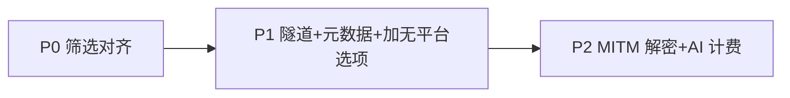

# PRD — /proxy 支持通用 HTTP 代理 + 无平台/无分组筛选

## 背景
aidog `/proxy` 当前仅处理 AI 协议(anthropic/openai/responses),fallback=handle_proxy 把所有非显式路由的 path 当 AI 流量。用户需要 `/proxy` 同时作为**通用 HTTP 代理**(客户端配 http_proxy 走标准 CONNECT),对所有 HTTP/HTTPS 流量解析记录,尝试匹配已注册平台,匹配不上记「无平台」,日志/统计页按「无分组」「无平台」筛选查看。

## 决策(用户已锁)
| 维度 | 决策 |
|---|---|
| 形态 | HTTP CONNECT 隧道(标准 http_proxy,客户端配代理即可,无 SDK 改造) |
| HTTPS | P1 不解密(纯 TCP 隧道,记 host/状态/字节/时长);P2 MITM 解密 |
| 平台匹配 | 目标 host 匹配平台 base_url host + apikey 匹配,双失败→无平台/无分组 |
| 计费 | P2 解密后所有 body 试 AI 解析(复用 converter),命中走 token+est_cost,非 AI cost=0 |
| CA 部署 | 应用生成自签 CA + 设置页引导用户手动装系统钥匙串(可审计可撤销) |
| 节奏 | P1 隧道+元数据+筛选;P2 MITM 解密+AI 计费 |

## 交付拆分(parent + 3 children)

### P0 — Stats/Logs 筛选对齐(前置 child: `07-02-stats-logs-filter-unify`)
抽公共 FilterDropdown,两页平台/模型/分组 3 维筛选 UI/主题/交互统一(以 Stats SearchableFilter 为基准)。**P1 前置**(P1 要在筛选加无平台/无分组选项,依赖本 child 抽好的组件)。详见该 child prd.md。

### P1 — CONNECT 隧道 + 元数据 + 筛选(child: `07-01-proxy-http-relay-p1`)
**目标**:aidog 作为标准 HTTP 代理工作,客户端配 http_proxy=127.0.0.1:<port> 后任意 HTTP/HTTPS 流量经隧道转发,记 proxy_log 元数据,可按无平台/无分组筛选。

**交付**:
1. axum 0.8 CONNECT method handler(在 `proxy/mod.rs` Router 注册或连接层分流;技术路径待 research 定)
2. TCP 隧道双向转发(tokio::io::copy 双向 + 字节计数 + duration)
3. proxy_log 写入:`platform_id`(host 匹配命中→平台 id;否则 0)、`group_name`(命中→关联分组;否则 '')、`source_protocol="http-connect"`、`request_url=<CONNECT target host:port>`、`status_code`(隧道建立 200 / 失败)、`duration_ms`、tokens/cost=0
4. host 匹配平台:从 CONNECT target host 段比对平台 base_url host(`router/mod.rs` + `endpoint.rs` 现有平台 host 集合)
5. 前端 Logs/Stats 筛选下拉加「无平台」(platform_id=0)「无分组」(group_name='')选项

**验收**:
- 配 http_proxy 指向 aidog,curl HTTP 站点 → 隧道通 + proxy_log 落一条 source_protocol=http-connect
- curl HTTPS 站点 → 隧道通(P1 不解密,body 空)+ proxy_log 落元数据
- 目标 host 命中某平台 base_url → proxy_log platform_id 关联该平台
- Logs 页选「无平台」→ 只看 platform_id=0 的隧道请求
- cargo clippy/test + yarn build/check-i18n 全绿

### P2 — MITM 解密 + AI 计费(child: `07-01-proxy-http-relay-p2`,依赖 P1)
**目标**:HTTPS 流量经自签 CA 解密,所有 body 试 AI 解析,命中走现有计费链。

**交付**:
1. 加依赖:rcgen + tokio-rustls + rustls(`Cargo.toml`)
2. CA 生成 + 持久化(应用数据目录)+ 动态 leaf 证书签发(cert resolver)
3. CONNECT 443 后 TLS MITM 拦截(TlsAcceptor + 动态签)
4. 解密 body → 复用 `adapter/converter` 试 AI 解析(anthropic/openai/responses)
5. 命中 AI:填 actual_model + tokens + est_cost(走 `estimate.rs resolve_price`)+ apikey 从解密 header/body 取补 apikey 匹配
6. 非 AI:记 body 元数据 + 字节流量,cost=0
7. 设置页:HTTP 代理开关 + CA 导出 + 引导装钥匙串(macOS security 命令 / Tauri shell)

**验收**:
- 装 CA 后,curl HTTPS AI 端点 → proxy_log 落 token+cost
- curl HTTPS 非 AI 站点 → body 记录,cost=0
- 解密 anthropic 请求 actual_model/tokens 与原生 /proxy 等价
- CA 撤销/重生成路径通

## 调度

P0 → P1 → P2 串行。P0 是筛选 UI 对齐(前置,改 Stats/Logs 共享组件);P1 加无平台/无分组选项依赖 P0 的 FilterDropdown;P2 MITM 依赖 P1 隧道 + research MITM 选型。

## research 结论(已落 `.trellis/tasks/07-01-proxy-http-relay/research/http-relay-research.md`)
- axum 0.8 原生支持 CONNECT(`axum::serve` 底层 hyper_util auto + upgrades),关键坑:hyper-util 私有 `Rewind<T>` 包 TcpStream,需 `downcast::<TcpStream>` 取回;CONNECT 响应 `200 + 空 body`,禁 `Connection: upgrade`
- TCP 双向:`tokio::io::copy`(返回字节 u64)+ `tokio::join!`
- MITM:rustls 0.23 仓库锁 `ring`(`Cargo.lock:4009`),新依赖必须 `default-features=false, features=["ring"]` + `crypto::ring::default_provider()`;rcgen 0.14 默认 ring 对齐;macOS `security add-trusted-cert -d -r trustRoot -k ~/Library/Keychains/login.keychain-db` 免 sudo
- 平台匹配:P1 复用 `endpoint_host()`(`endpoint.rs:72-92`)+ 新增 `match_platform_by_host`;P2 解密后 `resolve_group`(`endpoint.rs:148`)+ `parse_incoming_request`
- proxy_log 写入:新增 `upsert_connect_log`(不走 `upsert_log` 避免污染 stats_agg),底层 `insert_proxy_log_columns`(`db/proxy_log.rs:216`);P2 计费 `calc_est_cost` + `resolve_price`

## 待决策(implement 前 grep/问用户)
1. **schema 列名**:`schema_early.rs:78` 建表用 `group_name`,但 `PROXY_LOG_COLUMNS`(`db/proxy_log.rs:6`)+ struct 用 `group_key`。implement 前 grep migration 确认实际列名,否则 INSERT 失败。
2. **字节统计**:proxy_log 无 `bytes_up`/`bytes_down` 列。P1 若展示字节需 migration 加 2 列;否则放弃字节展示。**需用户决策**(P1 implement 前 AskUserQuestion)。
3. **rcgen 0.14 API**:签 leaf 的 API 链(0.13→0.14 改名)未逐行验证,P2 implement 时 `cargo doc -p rcgen` 核对 `CertificateParams::signed_by` / `serialize_request().self_signed()`。

## 非目标(YAGNI)
- SOCKS5 代理(只做 HTTP CONNECT)
- 非 80/443 端口特殊处理(隧道盲转即可)
- WebSocket over CONNECT 专项(MVP 隧道盲转)
- 无平台请求按流量/单价计费(决策=c cost=0)

## 风险
- axum 0.8 CONNECT 隧道实现路径(research 结论 1)未定,可能需连接层早期 method 分流而非 Router handler
- P2 MITM 工程量大(rcgen + rustls 动态签 + macOS 钥匙串引导),验收前 research 确认可行
- CA 信任是用户敏感操作,需明确引导 + 可撤销
