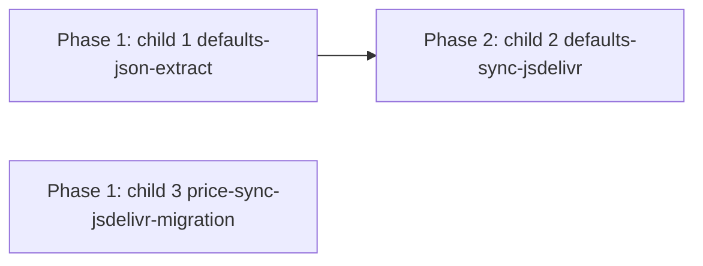

# 平台默认配置 JSON 化 + GitHub master 同步 (jsDelivr)

## Goal

把 `src/domains/platforms/defaults.ts` 硬编码的平台默认配置（base_url / 模型槽位 / 候选模型列表 / client_type）抽到 JSON 文件, 支持从 GitHub master 分支异步同步替换本地版本。改默认值不再依赖发新版。

## Children + DAG

本 task 拆 3 child (parent 作组织容器, 不直接执行):

| child | slug | phase | 依赖 |
|---|---|---|---|
| 1. defaults.ts JSON 抽取 + async 化 | `07-06-defaults-json-extract` | Phase 1 | 无 |
| 2. defaults.json jsDelivr+raw 同步机制 | `07-06-defaults-sync-jsdelivr` | Phase 2 | child 1 |
| 3. price_sync.rs models.json URL 迁移 | `07-06-price-sync-jsdelivr-migration` | Phase 1 | 无 |



- Phase 1: child 1 + child 3 并行 (task 并发上限 2, 文件域不冲突: 前端 defaults.ts vs 后端 price_sync.rs)
- Phase 2: child 1 完成后 start child 2 (同步的是 resources/defaults.json)

---
## 现状事实源

- `src/domains/platforms/defaults.ts:7` `defaultClientForProtocol`
- `:15` `getDefaultEndpoints(protocol, codingPlan?)` — base_url 数组
- `:302` `getDefaultModels(protocol, codingPlan?)` — 模型槽位
- `:347` `getDefaultModelList(protocol, codingPlan?)` — 候选模型列表
- `:284` host+path 注入 PROTOCOLS (来自 `./constants.ts`)
- 后端 `STATIC_MODEL_IDS` (`passthrough.rs`) — 与 defaults 解耦, **本次不动**
- 后端无 seed, platform 表空起步, 用户 UI 创建平台时前端填默认值 → invoke 写 SQLite

## 决策 (用户已确认)

1. **JSON 范围**: 仅 defaults.ts 4 函数数据 (base_url/模型槽位/候选列表/client_type)。PROTOCOLS 常量 (62 protocol 名单) 维持代码。STATIC_MODEL_IDS 维持代码。
2. **同步时机**: 启动后台异步拉一次 + 定时 (每日) 后台拉 + 设置页手动「检查更新」按钮。24h 节流防抖。
3. **对已建平台影响**: 新默认仅影响**新建平台**填的初始值。已建平台 (用户改没改) 完全不动。纯增量, 无覆盖风险。
4. **本地存放**: 双层 — bundled (`resources/defaults.json` 编译进二进制, 只读 fallback) + app data (`~/.aidog/defaults.json`, 同步落此, 可覆盖)。启动优先读 app data, 缺失/损坏回退 bundled。

## 设计 (推荐方案, 待 grill 校对)

### JSON schema 形态
单文件 `defaults.json`, 按 protocol 为 key 的对象, 内嵌 endpoints/models/model_list/client_type + codingPlan 分支:
```json
{
  "version": "1",
  "last_updated": 1778000000,  // Unix 秒 (i64), 远程 > 本地才覆盖
  "protocols": {
    "anthropic": {
      "client_type": "claude_code",
      "endpoints": {
        "default": ["https://api.anthropic.com"],
        "coding_plan": ["https://..."]
      },
      "models": {
        "default": { "default": "claude-...", "opus": "...", "sonnet": "...", "haiku": "..." }
      },
      "model_list": {
        "default": ["claude-...", "..."]
      }
    }
    // ... 其余 61 protocol
  }
}
```
62 protocol × ~5 字段, 数据量小 (~50-100KB), 单文件可读可维护。

### 加载策略
`defaults.ts` 4 函数改为从内存加载的 JSON 读 (启动时 Tauri command 读盘 + 缓存到内存)。`getDefaultEndpoints` 等纯函数从缓存读, 签名不变, 调用点零改动。

### GitHub 同步源 (jsDelivr 主 + raw fallback)
主源 jsDelivr: `https://cdn.jsdelivr.net/gh/lazygophers/aidog@master/resources/defaults.json` (CDN + 抗 GFW, 10min-12h 缓存)。
fallback raw: `https://raw.githubusercontent.com/lazygophers/aidog/master/resources/defaults.json` (无缓存, jsDelivr 失败/缓存滞后时绕过, 抗 GFW 弱)。
`sync_defaults_json()` 先拉 jsDelivr, 失败或 last_updated <= 本地再试 raw, 取较新者写入。

### 同步流程
1. Tauri 后端 command `sync_defaults_json()` — fetch jsDelivr URL, 解析远程 JSON `last_updated` (Unix 秒时间戳), 与本地 app data `last_updated` 比对: 远程 > 本地 → 覆盖写 app data; 远程 <= 本地 → 跳过。本地缺失 → 直接写。
2. 启动 hook 异步触发 (24h 节流, 上次成功同步 < 24h 跳过)
3. 定时器每日触发
4. 设置页手动按钮 → 立即触发 (无视节流)
5. 失败 (离线/404) → 用本地 app data 或 bundled fallback, 不报错只 log

### 前端命令
- `get_defaults_json()` — 读 app data → fallback bundled, 返回 JSON 给前端 defaults.ts 用
- `sync_defaults_json()` — 触发同步, 返 {updated: bool, version: str, error: Option<str>}

## Acceptance Criteria

- [ ] `resources/defaults.json` 含 62 protocol 完整默认配置 (从 defaults.ts 抽, 数据零丢失)
- [ ] defaults.ts 4 函数从加载的 JSON 读, 签名不变, 调用点零改
- [ ] 启动读 app data → 缺失回退 bundled, 任一可工作
- [ ] Tauri command `sync_defaults_json` 拉 jsDelivr master + `last_updated` 比对 + 远程较新才写 app data
- [ ] 启动异步 + 每日定时 + 手动按钮三路触发, 24h 节流
- [ ] 同步失败离线不破坏现有功能 (用本地 fallback)
- [ ] 新建平台用最新 JSON 默认值; 已建平台不动
- [ ] price_sync.rs models.json URL 改 jsDelivr, 同步逻辑不变
- [ ] cargo test + yarn build 全绿

## 现有 models.json 同步源迁移 (并入本 task)

`src-tauri/src/gateway/price_sync.rs:12` 当前硬编码 raw.githubusercontent.com URL。一并改 jsDelivr 统一同步源策略。

**改动**:
- `price_sync.rs:12` URL → jsDelivr 主 (`cdn.jsdelivr.net/gh/lazygophers/aidog@master/data/models.json`) + raw fallback
- 注释 :3 同步更新
- 逻辑不变 (fetch + parse + upsert)


## Out of Scope

- STATIC_MODEL_IDS (后端 /models 端点) JSON 化 — 维持代码
- PROTOCOLS 常量 (62 protocol 名单) JSON 化 — 维持代码
- 已建平台默认值更新提议/迁移 — 仅影响新建
- 用户自定义默认值覆盖层 (用户改 JSON 个人化) — app data 可改但不强制 UI

## Technical Notes

- 仓库路径: `resources/defaults.json` (Tauri resources, 编译进二进制, **手维护**, 改默认值直接改 JSON)
- app data: `~/.aidog/defaults.json` (`shared.rs::aidog_data_dir()`)
- 版本判定: JSON 内 `last_updated` 字段 (**Unix 秒时间戳 i64**), 远程 > 本地才覆盖 (无需 ETag/单独时间戳文件)
- 24h 节流时间戳: `~/.aidog/defaults.json.last_sync` (防抖, 与版本判定独立)
- raw URL owner/repo 从 Cargo.toml `[package]` repository 字段或硬编码
