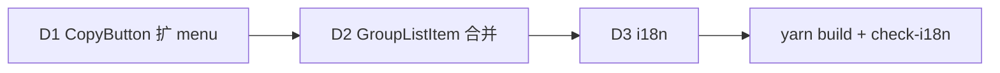

# PRD: 分组列表项复制按钮合并（密钥 + Claude/Codex 启动命令三合一）

## 背景

`GroupListItem.tsx:144-146` 现有 3 个 icon-only `CopyButton` 并排：
1. 复制 API Key（`group.group_key`）
2. 复制 Claude Code 启动命令（`buildClaudeCommand(group_key)`，Claude icon）
3. 复制 Codex 启动命令（`buildCodexCommand(group_key, env_vars)`，Codex icon）

旁侧还有 stats / test / add 三个 action 按钮，整行拥挤。3 个复制按钮语义同族（都是「复制该分组对接信息」），合并省空间 + 文字描述降歧义（现 icon-only 需 hover title 才知用途）。

`CopyButton`（`components/shared/CopyButton.tsx`）= 共享组件，Groups/Home 两处用。i18n key 齐（`group.copyCommand` / `group.copyCodexCommand` / `group.copyApiKeyTitle`）。无 floating-ui/popper 库依赖，全自定义 popover（`FilterDropdown` 用 ref + mousedown 本地定位）。

## 目标 (axis A)

- 3 复制按钮 → 1 单按钮（仅 `GroupListItem.tsx`，`GroupEditPanel` 不改）
- 单按钮 click 弹小菜单 3 项：API Key / Claude 启动命令 / Codex 启动命令
- 按钮显 icon + 文字（非纯 icon）：
  - **默认（未悬浮）文案**：「复制启动命令」（表达复制 CLI 启动命令语义）
  - **悬浮文案**：「复制密钥」（表达复制密钥语义）
  - 两者切换仅视觉提示，click 行为固定 = 弹菜单（触屏友好）
- 扩 `CopyButton` 加 dropdown 支持（不新增组件）

## 非目标 (out of scope)

- GroupEditPanel 的 3 按钮合并（用户明确仅列表项）
- 菜单内加搜索 / 多级（3 项固定，YAGNI）
- 重构其他 CopyButton 调用点（Home / GroupEditPanel 保原样）

## 设计

### CopyButton 扩展（向后兼容）

加可选 props（不传 = 原行为，Home / GroupEditPanel 零回归）：

```ts
export interface CopyMenuItem {
  key: string;
  label: string;        // 菜单项显示文字
  text: string;         // 复制内容
  icon?: ReactNode;     // 可选（Claude/Codex icon）
}

export interface CopyButtonProps {
  // 现有：text / title / label / icon / size
  ...
  /** 传入则 click 弹菜单（替代直接复制）。 */
  menu?: CopyMenuItem[];
  /** 默认态文案（menu 模式下用，配合 hoverLabel 做视觉切换）。 */
  defaultLabel?: string;
  /** 悬浮态文案（menu 模式下，hover 切换提示）。 */
  hoverLabel?: string;
}
```

行为：
- `menu` 缺失 → 原逻辑（click 直接 writeText）
- `menu` 传入 → click 弹菜单；菜单项 click → writeText + copied 反馈 + 关菜单
- `defaultLabel` / `hoverLabel` 传入 → 按钮 label 随 hover 态切换（onMouseEnter/Leave）

### 菜单渲染

- `createPortal(document.body)`（liquid-glass 主题 transform 祖先会让 absolute 退化，参 memory `modal-window-center-rule`）
- 锚定按钮：`getBoundingClientRect()` 算菜单位置（按钮下方右对齐 / 翻转边界）
- 关闭：mousedown 检测外部 + Esc 键 + 选项 click 后
- 视觉：`glass-elevated` 同 `FilterDropdown`（zIndex 1000）

### GroupListItem.tsx 改

3 个 CopyButton → 1 个：

```tsx
<CopyButton
  text={group.group_key}   // fallback（menu 模式不用，保类型必填）
  defaultLabel={t("group.copyCommand", "复制启动命令")}
  hoverLabel={t("group.copyKeyLabel", "复制密钥")}
  menu={[
    { key: "key", label: t("group.menuCopyKey", "API Key"), text: group.group_key },
    { key: "claude", label: t("group.menuCopyClaude", "Claude 启动命令"), text: buildClaudeCommand(group.group_key), icon:  },
    { key: "codex", label: t("group.menuCopyCodex", "Codex 启动命令"), text: buildCodexCommand(group.group_key, group.env_vars), icon:  },
  ]}
/>
```

旁侧 stats / test / add 按钮不动。

## 交付 (axis B)

| # | 交付物 | 验收 |
|---|--------|------|
| D1 | `CopyButton.tsx` 扩 `menu?` / `defaultLabel?` / `hoverLabel?` props + 菜单渲染（portal + 锚定 + Esc/外点关） | 现有调用点（Home/GroupEditPanel）零回归（不传 menu 走原逻辑）；`yarn build` 过 |
| D2 | `GroupListItem.tsx:144-146` 3 按钮合并为 1（menu + defaultLabel/hoverLabel） | dev 手动验：click 弹 3 项菜单 / 各项复制生效 / hover 文字切换 / Esc + 外点关 |
| D3 | i18n：8 locale 加 key（`group.copyKeyLabel` / `group.menuCopyKey` / `group.menuCopyClaude` / `group.menuCopyCodex`） | `node scripts/check-i18n.mjs` 过 |

## 调度

单 task，轻量（1 组件扩 + 1 调用点改 + i18n）。trellis-implement 内联直做。



执行层：main 派 trellis-implement（跨组件 + i18n）。无 worktree。

## 风险

- **中**：CopyButton 扩 props 向后兼容性。→ 缓解：新 props 全 optional，不传走原逻辑；现有 3 调用点（Home ×2 / GroupEditPanel ×多）grep 确认零回归。
- **中**：菜单定位在 liquid-glass transform 祖先下退化。→ 缓解：`createPortal(document.body)` + `getBoundingClientRect` 锚定（参 modal 规则）。
- **低**：hover 文字切换在触屏无 hover。→ 缓解：触屏显默认文案，click 仍弹菜单（行为不依赖 hover）。
- **低**：菜单边界翻转（列表项近屏底时菜单溢出）。→ 缓解：算 viewport 边界，溢出则上方展开。

## 决策 (ADR-lite)

- **Context**：分组卡片 3 复制按钮拥挤 + icon-only 需 hover 才知用途；用户要合并 + 加文字。
- **Decision**：
  - 形态 = 单按钮 click 弹菜单（3 项）
  - 文字 = 默认「复制启动命令」/ hover「复制密钥」（视觉切换，click 行为固定）
  - 范围 = 仅 GroupListItem（GroupEditPanel 不改）
  - 组件 = 扩 CopyButton 加 `menu?`（保向后兼容）
  - 菜单 = createPortal + rect 锚定（liquid-glass 安全）
- **Consequences**：CopyButton 变超集（单纯复制 + 菜单触发双职），但 optional props 保兼容；GroupEditPanel 体验不一致（用户已知，仅列表项）。
