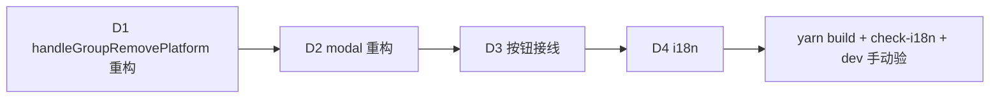

# PRD: 修复分组内删平台只移出未删除 + 删除语义重设计

> 用户反复中招（"已经出现了很多次了"）。静态读码链路看似正确（下文），但运行时 `groupCountOf` 不可靠 / state race 致单组平台被默默移出而非删除。
> 修复策略 = **根因旁路**：去掉「按 groupCountOf 自动决定行为」的依赖，改为总弹 modal 让用户明确选 → 无论 count 是否 stale 都不致误删 / 误移。

## 现状链路（静态读码，看似对）

1. `Groups.tsx:183` `makeGroupCardActions(gid).onDelete(id)` → `handleGroupRemovePlatform(p, gid)`
2. `Groups.tsx:144` `handleGroupRemovePlatform`：
   - `groupCountOf(p.id) <= 1` → `setRemoveTarget`（弹删平台确认 modal）
   - else → `removePlatformFromGroup`（直接移出，无 modal）
3. modal 确认 → `confirmDeletePlatform` → `cards.handleDelete` → `platformApi.delete` → 后端 `delete_platform`（`platform_lifecycle.rs:29`，软删 platform + 清所有 group_platform 关联）

后端 + modal 接线正确。bug 在 `groupCountOf`（`Groups.tsx:122`，基于 `details` 状态计数）stale 时返 >1 → 走移出分支，单组平台被默默移出（用户视角 = "没删"）。

## 根因（推断）

`groupCountOf` 依赖前端 `details` state（`details.reduce(...)`）。`details` 在以下场景可能 stale：
- 平台刚从别组移除 / 加入，`load()` 未及时刷新
- `onGroupsChanged` 链路遗漏触发 `details` reload
- 拖拽 / 编辑后 details 与后端不一致

用户答「弹窗显但点后移出」= groupCountOf 返了 >1（走了 removePlatformFromGroup）但用户记忆有 modal（可能是其他场景的 modal 残留印象，或 details stale 致先弹后 race）。无论细节，**count 决定行为**本身就是脆弱设计。

## 目标 (axis A)

- 点删除图标 → **总弹 modal**（不再按 count 自动决定走移出分支）
- modal 按平台实际归属给明确选项：
  - **单组平台**（count==1）：显「将永久删除平台 X，不可撤销」+ [取消] [删除平台]
  - **多组平台**（count>1）：显「平台 X 属 N 个分组：A, B, ...」+ [取消] [移出本组] [删除平台（移出全部组并销毁）]
- count 仅作**展示**（显示属几个组 + 组名），不再决定行为路径 → 根因旁路
- 后端不动（`delete_platform` / `removePlatformFromGroup` 现有实现正确）

## 非目标 (out of scope)

- 改 `groupCountOf` 计数正确性（改为展示用，精度非关键）
- 改后端 delete_platform（已正确）
- Platforms 主列表页的删除（本 task 仅 Groups 页分组上下文）
- 批量删除

## 设计

### state 扩展

`removeTarget` 加动作区分（modal 渲染按此显按钮）：

```ts
const [removeTarget, setRemoveTarget] = useState<
  { platform: Platform; gid: number; groupCount: number; groupNames: string[] } | null
>(null);
```

### handleGroupRemovePlatform 重构

```ts
const handleGroupRemovePlatform = useCallback((p: Platform, gid: number) => {
  const groupCount = groupCountOf(p.id);
  const groupNames = details
    .filter(d => d.platforms.some(gp => gp.platform.id === p.id))
    .map(d => d.group.name);
  setRemoveTarget({ platform: p, gid, groupCount, groupNames });
}, [groupCountOf, details]);
```

不再 if/else 分流 — 总弹 modal。

### modal 重构（GroupListView.tsx:255-281）

- 单组（groupCount<=1）：现 modal 文案 + [取消] [删除平台]（保现状）
- 多组（groupCount>1）：
  - 文案：「平台 X 属 N 个分组：A、B。选择操作：」
  - [取消] [移出本组] [删除平台（全部组）]
  - 「移出本组」→ `removePlatformFromGroup(platform.id, gid)` + 关 modal
  - 「删除平台」→ `confirmDeletePlatform()`（删全部组 + 销毁）

### confirmDeletePlatform

不动（已正确调 cards.handleDelete）。

## 交付 (axis B)

| # | 交付物 | 验收 |
|---|--------|------|
| D1 | `Groups.tsx` `handleGroupRemovePlatform` 重构：总 setRemoveTarget（带 groupCount + groupNames），删 if/else 分流 | 单组平台点删 → 弹 modal（不直接移出）|
| D2 | `GroupListView.tsx:255-281` modal 重构：单组单按钮 / 多组双按钮（移出本组 + 删除平台） | 多组平台点删 → 弹双选 modal；两按钮各走对应路径 |
| D3 | 多组「移出本组」按钮接 `removePlatformFromGroup`；「删除平台」接 `confirmDeletePlatform` | 手动验：移出仅离本组 / 删除全组销毁 |
| D4 | i18n：8 locale 加 key（`group.deletePlatformMultiTitle` / `group.deletePlatformMultiDesc` / `group.removeFromGroupAction` / `group.deleteFromAllGroupsAction`） | check-i18n 过 |
| D5 | 根因诊断记录：PRD「根因」段 + commit message 标注 groupCountOf stale 风险（后续 spec sediment 候选，反复犯错 ③） | 文档段存在 |

## 调度

单 task，2 文件改 + i18n。trellis-implement 内联直做。



执行层：main 派 trellis-implement（轻量）。无 worktree。

## 风险

- **高**：根因未完全定位（静态读码链路对，运行 race 未复现）。→ 缓解：新设计**旁路** groupCountOf 决定行为，count 仅展示 → 即使 stale 也不致误删/误移（用户总能看到明确选项）。若需彻底定位 count stale，另开诊断 task。
- **中**：多组 modal 双按钮文案歧义（用户分不清「移出本组」vs「删除平台」）。→ 缓解：文案明确（移出 = 仅本组 / 删除 = 全部组销毁）+ 危险按钮 btn-danger。
- **低**：groupNames stale 致展示组名与实际不符。→ 缓解：展示用，不影响行为；点删除后 load() 刷新。

## 决策 (ADR-lite)

- **Context**：分组内删平台反复「只移出未删除」，根因疑似 groupCountOf state stale，但静态链路正确难复现。
- **Decision**：根因旁路 — 去掉 count 决定行为，改为总弹 modal 让用户明确选（单组删 / 多组移出 or 删全部）。count 降级为展示。
- **Consequences**：用户永远看到明确选项，count stale 不再致误操作；多组场景新增「删除全部组」能力（原仅移出）；UX 多一步确认但安全。

## 反复犯错标记（spec sediment 候选）

用户明确「已经出现了很多次了」→ 触发 spec sediment 判定 ③（反复 ≥2 task）。finish 步将按 trace 判定是否沉淀为 spec 契约（候选：「破坏性操作禁按易 stale 的前端派生计数自动决定行为，必须用户明确确认」）。
