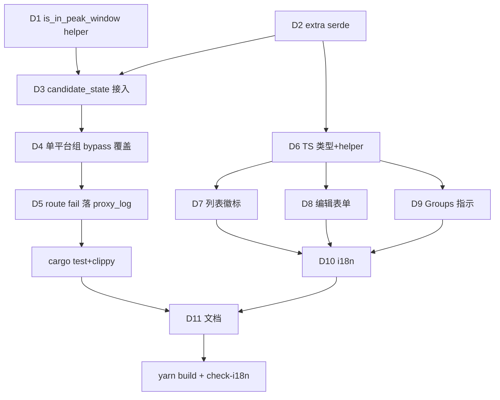

# PRD: 平台高峰期禁用开关（disable_during_peak）

> child of `07-07-peak-hours-multiplier`（依赖父 task 的 PeakWindow / peak_hours 解析）。
> 父 task 提供峰值时段判定；本 task 加「高峰期禁用」开关 + 路由排除 + 前端标记。

## 背景

`candidate_state(platform, now_ms)`（`router/mod.rs:50`）现按 `expires_at` + `status` 三态过滤候选。单平台组 bypass status filter（`candidates.rs:67-83` 必请求）。

proxy_log 已有 `blocked_by` / `blocked_reason` 字段（middleware 入站拦截用）。route fail 当前仅 `handler.rs:370` warn log，不落库。

父 task（peak-hours-multiplier）已建 `PeakWindow` + `resolve_multiplier(windows, epoch_ms)` + `platform.extra.peak_hours` 读取 + bundled preset 解析。

## 目标 (axis A)

- per-platform 开关 `disable_during_peak`（bool，默认 false），存 `platform.extra`，preset 可给 per-protocol 默认
- 启用后：高峰期（命中 peak_hours 任一窗口）该平台从路由候选排除；非高峰期正常纳入
- **不改 platform.status**（与三态正交，临时闸门；用户开关关掉/出窗口即恢复，无需退避）
- 单平台组**不 bypass**：此开关优先级高于 status bypass，单平台组高峰期请求直接 fail
- 整组所有候选都被高峰排除 → 请求 fail 时落 proxy_log（`blocked_reason='peak_hours'`, est_cost=0），审计可见
- 前端 3 处标记：平台列表徽标 + 编辑表单预览 + Stats/Groups 指示

## 非目标 (out of scope)

- 高峰期降级到廉价模型（仅禁用，不替换）
- 高峰期返回特殊 HTTP 状态码（照 route fail 现行错误响应）
- 按 group 粒度开关（per-platform 足够）
- 历史已落库 proxy_log 回填

## 设计

### 数据

```jsonc
// platform.extra 内（与 peak_hours 同层），或 preset protocol 条目内
"disable_during_peak": false   // bool，默认 false
```

### 路由排除（`router/mod.rs:50`）

`candidate_state()` 加正交维度（在 expires_at 检查之后、status match 之前）：

```rust
// 高峰禁用：开关 on && now 落在 peak window → 排除（不改 status，临时闸门）
if platform_extra_disable_during_peak(&platform.extra)
    && peak_hours::is_in_peak_window(&peak_windows_of(&platform, platform_type), now_ms)
{
    return None;
}
```

`is_in_peak_window`：父 task 的 first-match 命中判定（命中 = true，不关心 multiplier 值）。复用父 task 解析（extra → preset default → 空）。

### 单平台组 bypass 覆盖（`candidates.rs:67-83`）

现行：单平台组无视 status 必请求。新增：单平台组若被高峰禁用排除，**仍拦截**（此开关优先级高于 status bypass）。即 candidates.rs 单平台分支也调 `candidate_state`-style 高峰检查，命中则不纳入 → 路由返 NoCandidate → 整组失败。

### 整组失败落 proxy_log（`handler.rs:370`）

route fail 路径加分支：若失败原因是「所有候选高峰排除」（区别于熔断 / 无候选 / 模型不匹配），落 proxy_log：

```
blocked_by = "router"
blocked_reason = "peak_hours"
est_cost = 0
status_code = 503  # 照 route fail 现行
```

需 router 返回结构化错误变体区分 NoCandidate 原因（或 candidates 返 `Vec<ExcludedReason>`）。

### 前端标记（3 处）

1. **平台列表徽标**（`PlatformListView.tsx`）：实时算 `now 落在 peak_hours 任一窗口 && disable_during_peak` → 显「高峰禁用中」徽标（i18n label）。前端需访问该平台 peak_hours + 开关（已是 Platform 字段）+ 本地时区展示。
2. **编辑表单预览**（`formSections.tsx`）：开关 toggle + 旁显「当前: 高峰期 / 非高峰期」实时态（基于 now + 该平台 peak_hours）。
3. **Stats/Groups 指示**（`Groups.tsx` 平台状态列）：同列表徽标逻辑，标该平台是否高峰禁用中。

前端实时判定 helper（`utils/peakHours.ts`）：`isCurrentlyPeak(windows: PeakWindow[], now: number): boolean`，first-match 跨天/同天逻辑（与 Rust `is_in_peak_window` 对称，cross-layer 对齐）。

## 交付 (axis B)

| # | 交付物 | 验收 |
|---|--------|------|
| D1 | Rust：`peak_hours.rs` 加 `is_in_peak_window(windows, epoch_ms) -> bool`（父 task resolve_multiplier 拆出的判定 helper，复用） | 单元测试覆盖跨天/多窗口/absent |
| D2 | Rust：`models.rs` Platform extra serde 加 `disable_during_peak: Option<bool>`（同 peak_hours 模式） | cargo build 过 |
| D3 | `router/mod.rs:50` `candidate_state` 加高峰禁用正交维度（开关 + 窗口命中 → None） | 单元测试：开关 off / 开关 on 非高峰 / 开关 on 高峰 |
| D4 | `router/candidates.rs:67-83` 单平台组分支：高峰禁用优先级高于 status bypass，仍拦截 | 单元测试：单平台组高峰期请求被拦 |
| D5 | `proxy/handler.rs:370` route fail 路径：所有候选高峰排除 → 落 proxy_log blocked_reason='peak_hours' | 集成测试：整组失败有 proxy_log 行 |
| D6 | TS：`api/types/part1.ts` Platform extra 加 `disable_during_peak?: boolean`；`utils/peakHours.ts` 加 `isCurrentlyPeak` helper | yarn build 过；与 Rust 判定对称 |
| D7 | UI 列表徽标：`PlatformListView.tsx` 加「高峰禁用中」徽标（实时算） | dev 手动验：高峰段显徽标 |
| D8 | UI 编辑表单：`formSections.tsx` 加开关 toggle + 「当前: 高峰/非高峰」预览 | dev 手动验 |
| D9 | UI Stats/Groups：`Groups.tsx` 平台状态列加高峰禁用指示 | dev 手动验 |
| D10 | i18n：8 locale 补 key（`disable_during_peak` / `disable_during_peak_desc` / `currently_peak` / `currently_off_peak` / `peak_disabled_badge`） | check-i18n 过 |
| D11 | 文档：CLAUDE.md 路由段 + .wiki/modules/pricing.md 补 disable_during_peak 语义 | 文档段存在 |

## 调度

child task，依赖父 task（peak_hours 解析）。父 task ship 后启动。内部串行：



执行层：main 派 trellis-implement subagent（跨 Rust↔TS 边界）。无 worktree。

## 风险

- **高**：单平台组 bypass 覆盖（D4）改变现行 status 语义边界。→ 缓解：仅对「高峰禁用」维度覆盖，status 维度保 bypass；单元测试明确两维度独立。
- **中**：route fail 原因区分（D5）需 router 返结构化 NoCandidate 原因。→ 缓解：candidates 加 `ExcludedReason` 枚举，最小改。
- **中**：前端实时判定与 Rust 判定对称（cross-layer）。→ 缓解：D6 helper 逻辑 = D1 Rust 函数的 TS 镜像，cross-layer guide 门。
- **低**：前端 now 与后端 now 时差（时钟漂移）。→ 缓解：判定窗口是小时级，秒级漂移无影响。

## 决策 (ADR-lite)

- **Context**：用户要高峰期禁用平台，但不动 status（临时闸门，可逆）。
- **Decision**：
  - 开关 = `platform.extra.disable_during_peak`（bool，默认 false）
  - 路由排除 = `candidate_state` 加正交维度（与 expires_at 同模式，不改 status）
  - 单平台组 = 不 bypass（此开关优先级高于 status bypass）
  - 整组失败 = 落 proxy_log 审计（blocked_reason='peak_hours'）
  - 标记 = 前端 3 处实时算（列表徽标 + 表单预览 + Groups 指示）
- **Consequences**：单平台组高峰期完全不可用（用户已知，选了「生效」）；status 三态语义不动；前端判定需与 Rust 对称。
