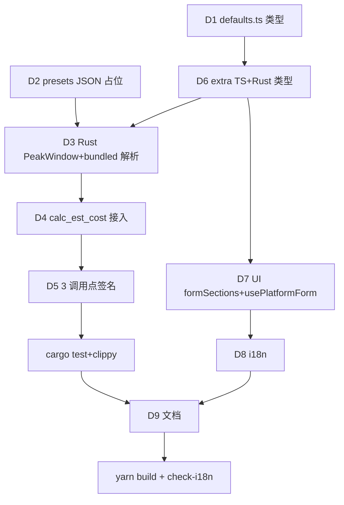

# PRD: platform peak_hours（高峰/低峰时段倍率，含 UI + 估算接入）

> 范围升级（原 schema-only 作废）：用户 2026-07-07 确认扩到「UI 可设 + 时区切换 + 计费实际生效」。

## 背景

aidog 估算链路：`calc_est_cost(db, model_name, platform_type, input, output, cache)`（`db/stats_today.rs:184`）→ `resolve_price` → 读 `model_price` 表。三调用点：`proxy/log.rs:45`、`proxy/log.rs:106`、`proxy/mock.rs:99`，均在 proxy_log 行落库上下文内（有 `platform_id` + `created_at`）。

`platform-presets.json` = per-protocol 默认模板（60 协议，前端 `defaults.ts:14` `DefaultsDoc` 消费，后端仅 `commands/defaults.rs::get_defaults_json` 整文件 `include_str!` RPC 透传 + `logo_sync.rs` 取 logo）。**估算链路当前不读 preset**。

`Platform`（DB，`api/types/part1.ts:149`）= 用户实例，含 `extra: string` JSON blob（已放 manual_budgets / breaker 等扩展位，无 migration 即可加子字段）。

## 目标 (axis A)

- peak_hours 多窗口 schema：preset 给 per-protocol 默认，用户可在平台编辑表单覆盖
- UI：平台编辑表单内可视化编辑（窗口列表 + 倍率 + 可选 days_of_week），UTC+0/本地时区切换（仅前端运行时态，默认本地，不持久化）
- 存储：恒 UTC+0，写 `platform.extra.peak_hours`
- 估算接入：`calc_est_cost` 按请求 UTC hour + platform 查 peak_hours，cost × multiplier，落 `proxy_log.est_cost`（替换单列，无新列）
- 向后兼容：absent peak_hours = 1.0，现有 60 协议零改动

## 非目标 (out of scope)

- Stats 页单独展示「高峰调整金额」列（YAGNI；est_cost 已含调整，用户可凭时间反推）
- preset 更新后回填存量平台（同 endpoints/models 现行行为，不自动同步）
- 跨平台全局 peak_hours 模板（per-platform 足够）
- 历史已落库 proxy_log 的 cost 回填重算

## schema（多窗口数组）

```jsonc
// platform-presets.json protocol 条目内（与 endpoints/models/source_urls 同层），
// 或 platform.extra JSON 内（用户覆盖，key = "peak_hours"）
"peak_hours": [
  {
    "start_hour": 14,            // UTC+0，0-23，含起始
    "end_hour": 22,              // UTC+0，0-23，不含结束（[start,end) 半开）
                                  // end < start 表跨天（22→6 = 22:00-06:00 次日）
    "multiplier": 1.5,           // >0；>1 高峰加价 / <1 低峰折扣 / =1 无意义（勿存）
    "days_of_week": [0,1,2,3,4]  // 可选；0=Sunday…6=Saturday；absent = 每天适用
  }
  // 多窗口：first-match wins（数组顺序，命中第一个即用其 multiplier；都不命中 = 1.0）
]
```

**判定规则**（消费方遵循，t = 请求 UTC+0 时间戳）：
- hour = `t.get_utc_hour()`，weekday = `t.get_utc_weekday()`（0=Sun…6=Sat）
- 对每个窗口：days_of_week absent 或含 weekday，且（end > start 时 `hour ∈ [start,end)`；end < start 跨天时 `hour >= start || hour < end`）→ 命中
- 返回首个命中窗口的 multiplier；无命中 = 1.0

## 估算链路接入（决策 B：混合源 + Rust 读 bundled preset）

peak_hours 解析顺序（`calc_est_cost` 内）：
1. `platform.extra.peak_hours`（用户覆盖，非空数组 → 用之）
2. 缺失/空 → 按 `platform_type` 查 Rust 端 bundled preset default（`include_str!` 同源 JSON，`OnceLock` 缓存解析）
3. 仍缺 → 1.0

**签名改**：`calc_est_cost(db, model_name, platform_type, input, output, cache, platform_id, created_at_ms)`。3 调用点同步改（log.rs 两处 + mock.rs）。

**cost 落库**（决策 C）：calc 返回 × multiplier 后值，直接写 `proxy_log.est_cost`。无新列。审计反推够（time + platform_id 可重建窗口命中）。

## 时区切换（仅前端）

- 全局前端运行时态（不持久化，默认用户本地时区 `Intl.DateTimeFormat().resolvedOptions().timeZone`），可在平台编辑表单顶部 toggle 切 UTC+0
- 切换只影响 peak_hours 窗口的**展示/输入**（展示时把 UTC 存值换算到选中时区显示；保存时一律换算回 UTC+0 存储）
- 不进后端、不进 DB

## 交付 (axis B)

| # | 交付物 | 验收 |
|---|--------|------|
| D1 | `src/domains/platforms/defaults.ts:14-27` `DefaultsDoc` protocol 类型加 `peak_hours?: PeakWindow[]`（含 JSDoc + 跨天/first-match 语义） | `yarn build` 过 |
| D2 | `src-tauri/defaults/platform-presets.json` schema 占位（不填任何协议实际值，留待用户手填；JSON 合法） | `python3 -m json.tool` 过 |
| D3 | Rust 端 peak_hours 模型 + bundled preset 解析：`gateway/estimate/`（或 `models.rs`）加 `PeakWindow` serde struct + `OnceLock<DefaultsDoc>` 缓存 `get_default_peak_hours(protocol)` | `cargo build` 过；单元测试覆盖跨天/多窗口 first-match/absent |
| D4 | `gateway/db/stats_today.rs:184` `calc_est_cost` 加 `platform_id: i64, created_at_ms: i64` 参，内部查 `platform.extra.peak_hours` → preset default → 1.0，cost × multiplier | 现有 test_algo/test_db_ops 过 + 新增 peak 测试（命中/跨天/absent/用户覆盖） |
| D5 | 3 调用点同步改签名：`proxy/log.rs:45`、`:106`、`proxy/mock.rs:99`（传 log.platform_id + log.created_at） | `cargo build` + `cargo test` 过 |
| D6 | 平台 extra TS/Rust 类型加 `peak_hours`：`api/types/part1.ts` Platform.extra 解析 + Rust `models.rs` extra serde（如 Breaker/manual_budgets 模式） | TS + Rust 类型对齐（cross-layer guide 门） |
| D7 | UI：`formSections.tsx` 加 PeakHoursSection（窗口列表 add/remove + start/end number input + multiplier + 可选 weekdays chips + 时区 toggle），`usePlatformForm.ts` 处理 extra.peak_hours 读写 + UTC↔本地换算 | `yarn build` 过；手动 dev 验证：切时区窗口换算正确、保存后 DB 存 UTC 值 |
| D8 | i18n：8 locale label 补齐（`peak_hours` / `peak_window` / `multiplier` / `start_hour` / `end_hour` / `days_of_week` / `timezone_toggle`） | `node scripts/check-i18n.mjs` 过 |
| D9 | 文档：`CLAUDE.md` 「平台默认配置」段补 peak_hours 指针 + `.wiki/modules/pricing.md` 加 schema + 判定伪码 + 估算接入说明 | 文档段存在 |

## 调度

单 task，分层串行（共享 calc_est_cost 签名 + extra 类型，禁并行改同一文件）：



执行层：main 同步派 trellis-implement subagent（跨 Rust↔TS 边界，jsonl 上下文）。无 worktree（局部、单仓）。

## 风险

- **高**：calc_est_cost 签名改牵动 3 调用点 + 测试。→ 缓解：MVP 优先 D3-D5 串行先过 cargo test，再上 UI。
- **中**：Rust 读 bundled preset 引入新解析路径（preset 原仅 RPC 透传）。→ 缓解：`OnceLock` 缓存 + 复用 `include_str!` 同源文件，禁抄第二份 preset 真值（CLAUDE.md 约定）。
- **中**：跨天 + 多窗口 first-match 消费方易错。→ 缓解：D3 单元测试覆盖全分支 + wiki 伪码。
- **低**：时区换算前端 bug（DST / 半小时偏移时区）。→ 缓解：用 `Intl.DateTimeFormat` 原生，禁手写偏移表。
- **低**：preset JSON 加字段后体积（60 协议 × 占位 absent）。→ 缓解：absent 不占字符，仅 schema 文档化。

## 决策 (ADR-lite)

- **Context**：peak_hours 需同时满足「preset 给默认 + 用户可覆盖 + 估算实际生效」，跨 Rust↔TS 三层。
- **Decision**：
  - 存储 = `platform.extra.peak_hours`（无 migration，复用 blob）
  - 估算源 = 用户 extra 覆盖 → Rust bundled preset default → 1.0（混合）
  - cost = × multiplier 落 est_cost 单列（无新列）
  - 时区 = 前端运行时态（默认本地，不持久化）
  - 窗口 = 多窗口数组 first-match
- **Consequences**：preset 更新不同步存量平台（用户可清空 extra 让 default 生效）；历史 proxy_log 不回填；审计需凭时间反推窗口命中。
