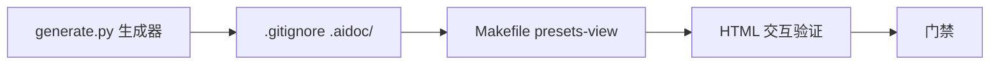

# PRD: Makefile presets-view — 平台预设可视化 HTML

## 背景

- `src-tauri/defaults/platform-presets.json`: 60 协议预设（endpoints/models/model_list/name i18n/desc/source_urls/homepage/logo_url）
- `src-tauri/defaults/models.json`: 575 模型定价（per-token cost + `pricing[platform]` override + max_tokens/context_window）
- 关联键: 协议的 `model_list.default/coding_plan` ↔ `models.json` 的 model key

用户要 Makefile 一键命令：读两 JSON → 生成交互式 HTML → 自动打开，便于可视化理解平台/模型/价格。

## 目标 (axis A)

- Makefile `presets-view` target：生成单 HTML（内嵌数据 + vanilla JS）+ 自动 `open`/`xdg-open`/`start` 打开浏览器
- Python stdlib 生成器，零新依赖
- HTML 含：平台卡片网格、搜索/排序/折叠、模型价格关联展示（platform override 优先 top-level fallback）
- 输出 gitignore 临时目录，随数据重生

## 非目标

- 不改 preset/model 数据本身
- 不集成进 app UI（纯离线工具）
- 不做多语言切换 UI（默认 zh-Hans，fallback en-US）
- 不含 prices-sync（Python 聚合管线，另 task 处理）

## 交付 (axis B)

| # | 交付物 | 验收 |
|---|--------|------|
| D1 | `scripts/presets_view/generate.py` — Python stdlib 生成器：读两 JSON + 关联（model_list ↔ models）+ 输出单 HTML（内嵌 JSON data + vanilla JS + 内联 CSS） | `python3 scripts/presets_view/generate.py` exit 0；生成 `.aidoc/presets.html` |
| D2 | `Makefile` 加 `##@ Docs` 段（或复用 `##@ Maintenance`）+ `.PHONY: presets-view` + target：调生成器 + 跨平台 open（mac `open`/linux `xdg-open`/win `start`，`uname -s` 分派） | `make presets-view` 生成 + 打开；`make help` 列出 target |
| D3 | `.gitignore` 加 `.aidoc/`（输出目录） | `.aidoc/presets.html` 不入 `git status` |
| D4 | HTML 交互：搜索（平台/模型名实时过滤）、排序（平台名/模型数/最低 input 价）、平台折叠展开、价格 $/M tokens 展示（per-token × 1e6）、模型在该平台的 override 价高亮（vs top-level） | 手动开 HTML 验证：搜索/排序/折叠可用；价格换算正确；override 标记 |
| D5 | 生成器门禁：`python3 scripts/presets_view/generate.py && test -f .aidoc/presets.html && python3 -c "import os; s=os.path.getsize('.aidoc/presets.html'); assert s>10000, s"` | exit 0 |

## HTML 内容设计

**平台卡片**（每协议一张）：
- 头部: name (zh-Hans, fallback en-US) + protocol key + client_type badge
- meta: homepage 链接 + source_urls(pricing/docs) + logo（simpleicons CDN，无则占位）
- endpoints: 列 default + coding_plan 的 base_url（带 protocol badge）
- model_list: default 模型 id 列表（折叠展开）

**模型价格行**（展开后，每模型一条）：
- model name + default_platform badge
- 价格（$/M tokens）: input / output / cache_read
  - 该平台在 `pricing[<protocol>]` 有条目 → 用 override，行标 `platform override`
  - 否则用 top-level `input_cost_per_token` 等，标 `top-level`
  - 都无 → 标 `无价`
- max_input / max_output / context_window（K 展示）

**顶部控制栏**：
- 搜索框（平台名 / 模型名 / protocol key，实时 filter）
- 排序下拉（平台名 A-Z / 模型数 / 最低 input 价）
- 「仅显示有 override 的平台」开关

## 调度

单 task，串行。无 worktree（局部、纯新增脚本 + Makefile）。

## 风险

- **低**：575 模型 + 60 平台数据量大，单 HTML 体积。→ 缓解：内嵌 JSON 由 JS 运行时渲染（非服务端预渲染 60×N 行 DOM），初始只渲染平台卡片，模型行点击展开。预期 HTML < 1MB。
- **低**：`open`/`xdg-open`/`start` 跨平台检测错。→ 缓解：`uname -s` 分派，未知平台打印路径让用户手开（不 fail）。
- **低**：模型在 model_list 但不在 models.json（数据漂移）。→ 缓解：渲染「无价」标记，不报错。
