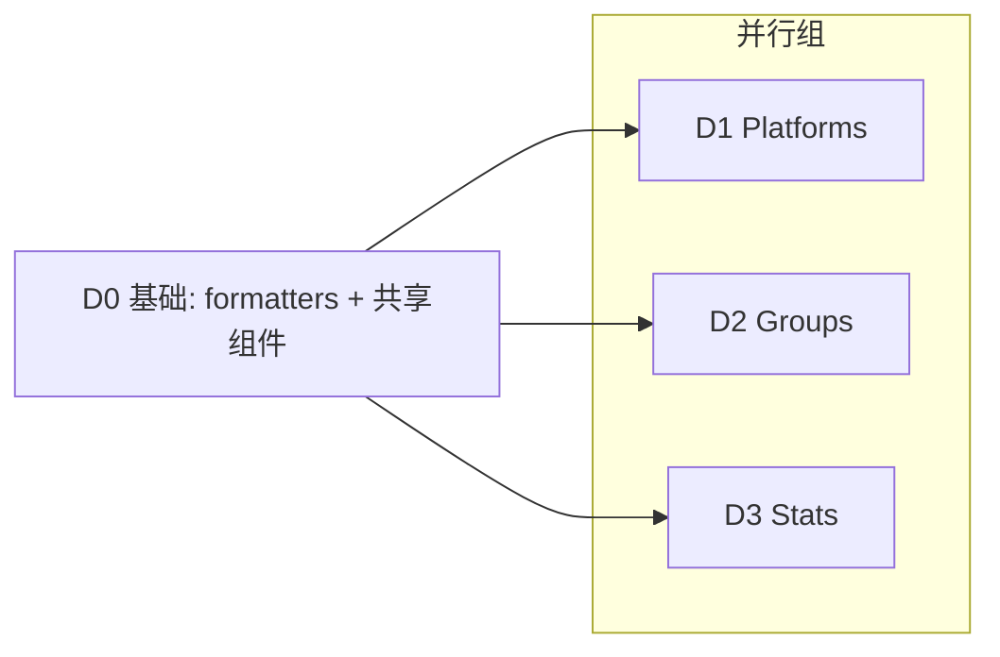

# 重设计 Platforms / Groups / Stats 三页（列表 + 详情）

## Goal

全维度重设计 aidog 三个核心页面的列表页与详情/编辑页——布局、UI/UX、信息展示方式、展示内容：`Platforms.tsx`(96KB)、`Groups.tsx`(39KB)、`Stats.tsx`。解决信息密度过高、层次不清、余额/聚合数据埋太深、formatter 重复、i18n 硬编码。功能零回退。

## What I already know（现状测绘）

### Platforms
- 列表：纵向卡片+拖拽排序；单卡 8+ 信息（名称/协议色点/base_url/endpoints badge/模型 badge/统计行/健康点）→ 密度过高、折行。余额 quotaMap 存在但**未在列表展示**，需点刷新。
- 编辑：全屏替代列表；分段（基础→endpoints→models→Mock/NewAPI/ClaudeCode 特例）。SearchableProtocolSelect 98 选项。一处做三件事。

### Groups
- 列表：SortableList 卡片+expandable（平台 badge→4chip 聚合统计→模型映射→inline 快加表单）→ 卡片高度不一、统计埋展开。
- 编辑：全屏；拖拽平台排序+up/down 混搭、行式模型映射；timeout 无单位提示。聚合统计前端求和无缓存。

### Stats
- overview cards + bar chart + dimension table（按平台/分组/模型下钻）；时间(today/7d/30d/custom)+粒度+filter。
- 痛点：图表无 hover tooltip/对比；filter 无搜索虚拟化；维度表无排序/分页。

### 跨页共性
- glass 容器 + badge/btn/toggle/status-dot 高复用。formatNumber/成本格式化在 Groups/Stats/Logs **重复**。PROTOCOL_COLORS 50+ + 系统色混用无对比度检查。Groups 有 2-3 处中文硬编码(line 322/563)。

## Decisions（ADR-lite）

| 维度 | 决策 |
|------|------|
| 详情/编辑承载 | **保留全屏替代列表**，重排为清晰分区卡片 + 视觉层次（不改抽屉/双栏） |
| 列表卡片 | **Compact + 展开二级**：默认只显关键指标，次要信息折叠点开 |
| 信息增强 | 全纳入：① 余额直观化（列表直显，Groups 聚合）② 成本/状态色编码 ③ Stats 图表增强（hover/对比/表排序分页）④ 抽取 formatters |
| 视觉 | 沿用 Liquid Glass + 现有主题变量，精修层次/对比度 |

**Consequences**：三页文件独立可并行，但共享基础（formatters + 通用组件）须先行；回归面广（增删改/拖拽/测试/启停/刷余额/导入/筛选下钻逐一验证）。

## Requirements

### R-共享（D0 基础）
- R0.1 `src/utils/formatters.ts`：统一 formatNumber（1.2M/3.5K）、成本格式化（按量级 toFixed）、token 汇总、百分比。替换 Groups/Stats/Logs 重复定义。
- R0.2 通用展示组件 `src/components/shared/`：`CompactCard`（折叠/展开二级）、`StatChip`、`BalanceBar`（余额/配额进度条）、色编码工具（成本/成功率/错误率 → 色梯度，**带对比度保障**，走 CSS 变量）。
- R0.3 不破坏现有引用：替换重复 formatter 时保证输出格式一致（或更优且无回归）。

### R-Platforms（D1）
- R1.1 列表卡片 Compact：默认显 名称+协议+状态点+**余额**+核心统计(请求/成本/成功率)+快操作(编辑/启停/刷余额/删除)；endpoints/模型明细折叠展开。
- R1.2 余额直显（BalanceBar/数值），无需先点刷新（用已有 quotaMap，缺值占位不显空行——遵现有「无数据隐藏整行」约定）。
- R1.3 成本/成功率色编码。保留拖拽排序。
- R1.4 编辑页全屏信息分区化（基础/认证/端点/模型/特例 分组卡片+层次），保留 SearchableProtocolSelect/Mock/NewAPI/ClaudeCode 全部能力。

### R-Groups（D2）
- R2.1 列表卡片 Compact：默认显 名称+路由模式+关联平台数+聚合统计(token/成本/成功率)+**聚合余额**+快操作；模型映射明细折叠展开。
- R2.2 聚合余额（关联 platforms 余额求和，沿用聚合模式）。色编码。
- R2.3 编辑页全屏分区化：平台关联（拖拽体验改进）、模型映射（行式优化+单位提示）、timeout 加单位文案。补 line 322/563 硬编码 i18n。

### R-Stats（D3）
- R3.1 overview 色编码 + 环比/同期对比（昨日 vs 今日 等，基于现有 statsApi 数据，若需新查询字段则降级为前端可算范围）。
- R3.2 趋势图 hover tooltip（显具体数值/时间桶）。
- R3.3 维度排行表支持列排序 + 分页/虚拟滚动（超百条）。filter 大列表加搜索。

### R-不回退
- R4.1 三页全部操作（增删改/拖拽/测试/启停/刷余额/导入/Stats 筛选下钻）保留可用。
- R4.2 i18n 7 语言不破坏，新文案走 t()，补硬编码漏。明暗双模式 + RTL 正常。

## Acceptance Criteria

- [ ] formatters.ts 抽取完成，Groups/Stats/Logs 改用统一函数，输出无回归。
- [ ] 通用组件 CompactCard/StatChip/BalanceBar/色编码 落地，三页复用。
- [ ] Platforms 列表 Compact + 余额直显 + 色编码 + 折叠展开；拖拽/启停/刷余额/编辑正常。
- [ ] Groups 列表 Compact + 聚合余额 + 折叠映射；编辑页分区化 + timeout 单位 + 硬编码补 i18n。
- [ ] Stats 色编码 + 对比 + hover tooltip + 维度表排序/分页 + filter 搜索；筛选下钻正常。
- [ ] 三页详情/编辑全屏分区化，所有原能力保留。
- [ ] typecheck/lint green；明暗双模式 + 7 语言（含 RTL）正常。

## Definition of Done

- 功能零回退；Tauri command 契约不变（platformApi/groupApi/groupDetailApi/statsApi/quotaApi）。
- i18n 不破坏，新文案 t()；沿用 Liquid Glass 主题变量。
- typecheck/lint green。

## Out of Scope

- 不改后端 Rust command / DB schema（Stats 对比仅用现有可查/可算数据）。
- 不改 Settings/AppSettings 页面（formatters 抽取顺带改 Logs 的重复定义除外）。
- 不换设计系统 / 不引入图表库（除非现有手写图表无法满足 tooltip，需时再议）。

## 调度图

- **D0 是 gate**：先完成并落盘到 worktree，D1/D2/D3 依赖其 formatters + 共享组件。
- **D1/D2/D3 独立文件**（Platforms.tsx / Groups.tsx / Stats.tsx），D0 完成后并行。

## Technical Notes

- `src/pages/{Platforms,Groups,Stats}.tsx`、`src/services/api.ts`(类型)、`src/styles/globals.css`、`src/themes/`。
- 新建：`src/utils/formatters.ts`、`src/components/shared/`。
- formatNumber 重复点：Groups/Stats/Logs。
- 现有约定：无数据隐藏整行（不显「暂无数据」占位）、图标走 icons.tsx 禁 emoji、Group stats 前端聚合。
