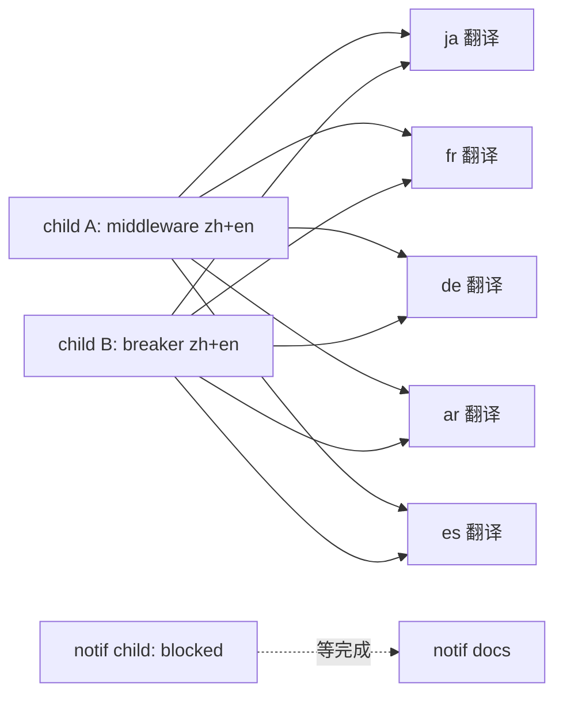

# PRD — 新功能 docs 补全 (middleware/熔断/通知) × 7 语言

## 背景

docs/ Rspress 站点（zh/en/ja/fr/de/ar/es）近期新功能完全缺失（grep middleware/熔断/调度/通知 零命中）。需补全：
- **middleware 规则引擎**（mw C1-C5 已完成）
- **group 调度与熔断器**（gsb 已完成）
- **system-notification**（进行中，blocked）

## 用户决策（已 AskUserQuestion）

1. **notif 时机** = 挂 child 但 blocked，等 system-notification parent 完成后激活
2. **语言策略** = zh+en 基准（main/sub-agent 写）+ 5 语言（ja/fr/de/ar/es）派 sub-agent 并行翻译
3. **文档结构** = middleware 独立顶层章节 + scheduling 入 groups/

## 调度

- **并行组 1**：child A (mw zh+en) + child B (breaker zh+en) 无依赖，同回复派 2 sub-agent
- **并行组 2**：A+B 完成后，5 语言翻译 sub-agent 并行（基于 zh+en 模板）
- **blocked**：notif child 等 system-notification 完成

## 文档结构规划

### middleware/ 独立章节（child A）
- `middleware/_meta.json` + i18n.json 词条
- `middleware/index.mdx` — 概览：规则引擎架构（单表 `middleware_rule` + Engine 单例 + 入站/出站挂载 + 三级就近覆盖 + 流式逐块）
- `middleware/inbound-rules.mdx` — 入站规则类型（过滤器/敏感词/脱敏/内容过滤/动态注入）
- `middleware/outbound-rules.mdx` — 出站规则 + 熔断器 + 流式逐块
- `middleware/builtin-presets.mdx` — 内置预设（密钥/邮箱/手机 + error_rules）
- `middleware/configuration.mdx` — 三级就近覆盖（全局/group/platform）+ 前端 UI

### groups/ 新增（child B）
- `groups/scheduling.mdx` — group 智能调度（4 策略）+ Platform 级熔断器（三态机）+ breaker∪auto_disabled 并集过滤
- 更新 `groups/_meta.json`

## 验证产物（Definition of Done）

- [ ] child A: middleware 章节 zh+en 各 5 篇 mdx + _meta.json + i18n.json 词条
- [ ] child B: groups/scheduling.mdx zh+en + _meta.json 更新
- [ ] 5 语言翻译（ja/fr/de/ar/es）覆盖 A+B 所有新 mdx
- [ ] 内容准确（对照代码：middleware_rule 表结构、breaker 三态/4 策略、调度配置）
- [ ] Rspress 导航完整（_meta.json + i18n.json 词条 7 语言同步）
- [ ] notif child created but blocked（不在本 parent 完成）

## 非目标

- 不改 docs 站点构建配置（rspress.config.ts locale 维持）
- notif docs 不在本 parent 完成（blocked）
- 不重构现有 docs 结构

## 资源（sub-agent 写 docs 时读代码确认细节）

- `src-tauri/src/gateway/middleware*` / `db.rs` (middleware_rule 表)
- `src-tauri/src/gateway/router.rs` + breaker 相关（调度 + 三态）
- memory: [[middleware-rule-engine]] / [[group-scheduling-breaker]]
- 现有 docs/zh/groups/* + docs/zh/proxy/* 作风格基准

## 风险

- middleware 技术深度高 → sub-agent 需读代码，PRD 给路径
- 7 语言词条同步 → i18n.json 7 语言全配
- notif blocked 期间 parent 部分完成 → parent 完成度按 mw+breaker 计，notif 另算
