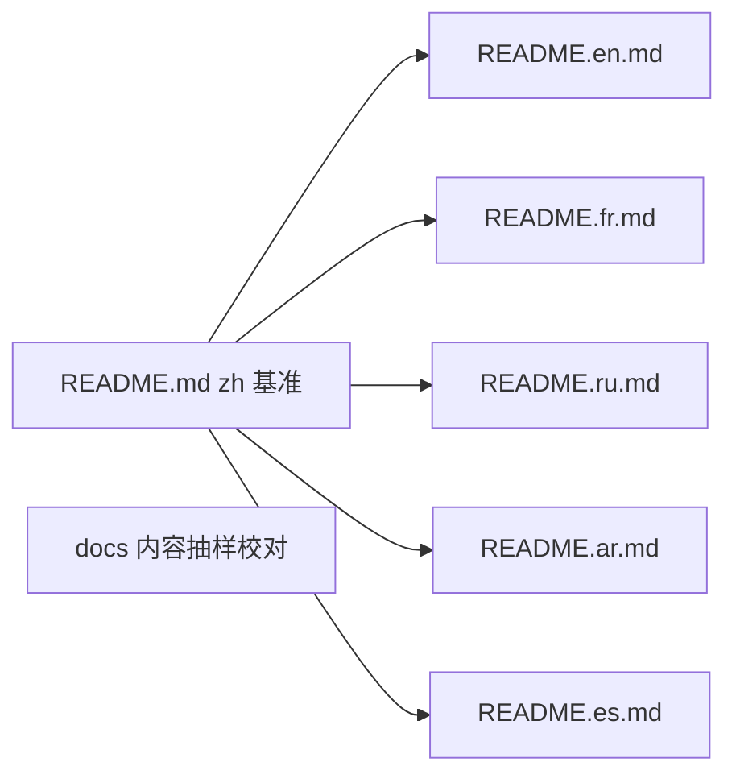

# PRD — 优化 README/docs + 文档地址引入 + README 多语言

## 背景

- README.md 当前仅中文单语言，内容简略，未链接文档站点
- docs/ 已是完善 Rspress 多语言站点（zh/en/ja/fr/de/ar/es），文档地址 `https://lazygophers.github.io/aidog`（base=`/aidog/`），结构完整、内容质量高
- 应用 i18n 含 ru-RU，但 docs 站点无 ru locale

## 用户决策（已 AskUserQuestion 确认）

1. **README 语言范围** = 联合国 6 种：`zh / en / fr / ru / ar / es`
2. **docs 优化范围** = 内容校对/补充（不新增 locale、不改结构）
3. **文件组织** = `README.md`（zh 默认） + `README.<lang>.md`（GitHub 官方语言切换识别）

## 验证产物（Definition of Done）

- [ ] `README.md`（zh）重写：内容与 docs/zh 对齐 + 顶部语言切换链接 + 文档地址徽章/链接
- [ ] `README.en.md` / `README.fr.md` / `README.ru.md` / `README.ar.md` / `README.es.md` 五份，内容与 zh 一致（翻译），每份顶部含语言切换链接 + 文档地址
- [ ] 文档地址 `https://lazygophers.github.io/aidog` 在所有 README 出现，zh/en/fr/ar/es 指向对应 locale（`/<lang>/`），ru 指向 en locale（docs 无 ru，标注）
- [ ] docs 内容校对：抽样核查关键准确性（代理端口/路径、平台名、技术栈、命令），修复过时/错误；范围限定 zh 基准 + 关键准确性，不全量逐语言
- [ ] ru-README 文档链接策略：指向 docs `/en/`，README 内标注「docs 暂无俄语，跳转英文」
- [ ] GitHub 仓库主页 README 语言切换按钮可用（README.<lang>.md 命名约定）

## 非目标（Out of Scope）

- 不给 docs 新增 ru locale（用户未选）
- 不重构 docs 结构/导航
- 不逐语言全量校对 docs 所有 mdx
- 不改 docs 站点构建配置（rspress.config.ts locale 维持现状）

## 调度

- README.md(zh) 为基准先写定（main，worktree 内）
- 其余 5 语言基于 zh 模板翻译（可并行 sub-agent，基于 zh + en 双模板保证术语一致）
- docs 校对独立并行（main 抽样核查）

## 资源

- 现有 README.md（参考 + 校验准确性）
- docs/zh/* mdx（内容基准源）
- CLAUDE.md（技术栈/结构/约束事实源）
- GitHub README 语言切换约定：`README.<lang>.md`

## 风险

- ru README 翻译质量（项目无现成 ru 文档可参照）→ 以联合国俄文规范 + 应用 ru-RU i18n 词条为术语源
- ar README RTL：GitHub 渲染 markdown 不强制 RTL，正文按常规左对齐，仅文档地址/链接正常
- docs 校对范围蔓延 → 严格限定「关键准确性」，发现的大改另立 task
