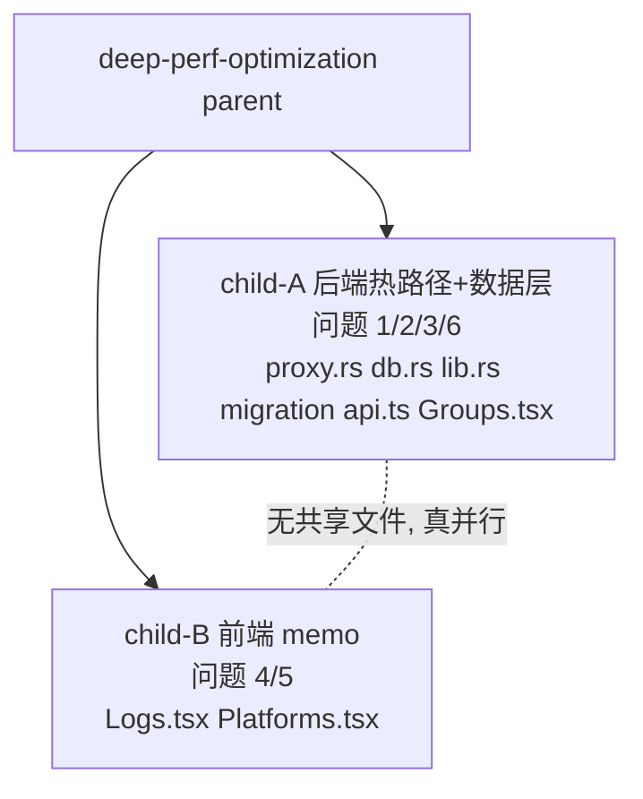

# 深度性能优化

## Goal

基于 `aidog-perf-audit` 实测，对 aidog 三层做深度性能优化。本轮范围 = **全 6 项热点**，问题 1 取**激进**方案。优化只变快、不变行为。

## 实测前提（已核实）

- `proxy_log` 仅 **232 行**、**7 group** → 数据规模相关项（3/4/6）当前体感收益低，但仍纳入（为增长埋 + 标准重构）。
- 真正大头 = 每请求热路径（1/2/5），与表规模无关。
- 编译基线：`cargo check` 通过（唯一 warning 来自第三方 `block v0.1.6`，非本项目）。

## 实测热点（aidog-perf-audit 产出，6 项全纳入）

| # | 层 | 问题 | 位置 | 方案 |
|---|---|---|---|---|
| 1 | Rust 热路径 | 每请求 ≤15 次 upsert_log，每次全量 clone 含大 body 的 ProxyLog | `proxy.rs:454/625-1505/1844` | **激进**：写入次数 15→3 关键节点(建立/上游完成/最终) + upsert_log 改接 `&ProxyLog`，仅 strip 时 clone 受影响字段 |
| 2 | Rust 热路径 | 单连接串行 + 每请求 4-6 次重查 settings（无缓存） | `db.rs:13`；`proxy.rs:429/22/2175`；`calc_est_cost db.rs:1093` | settings(log/lang/sync) 进程内缓存 + 写时失效；`resolve_group` 用 group_name→Group 内存 map 替代每请求 `list_groups` 全表查 |
| 3 | 数据层 | Stats/today 聚合无覆盖索引，回表 | `db.rs:891/2275`；`migrations/001_init.sql:98` | 加覆盖索引 `idx_proxy_log_stats(created_at,est_cost,input_tokens,output_tokens,cache_tokens,status_code) WHERE deleted_at=0`（新 migration） |
| 4 | React 前端 | Logs 列表无虚拟化 + 逐行内联 style + 无行 memo | `Logs.tsx:496/499-520` | 抽 `LogRow` 为 `React.memo` + 固定 style 提模块常量 + 单页>100 行上 react-window |
| 5 | React 前端 | Platforms 派生 `.filter/.sort` 未 memo | `Platforms.tsx:1432`(42 useState, 27 处 map/filter/sort) | 渲染体内派生值包 `useMemo` + handler 包 `useCallback`（保 PlatformCard memo 生效） |
| 6 | 数据层+前端 | Groups N+1：逐 group 调 stats | `Groups.tsx:242`；`db.rs:2120` | 新增批量端点 `get_all_group_usage_stats`（单查 `GROUP BY group_name`）+ `api.ts` + Groups 一次 invoke |

## Requirements（MVP = 全 6 项）

- [ ] 问题 1：proxy.rs 渐进式日志激进重构（15→3 节点 + 消除全量 clone）
- [ ] 问题 2：settings 只读缓存 + resolve_group 内存 map
- [ ] 问题 3：覆盖索引 migration
- [ ] 问题 4：Logs LogRow memo + style 常量（+ 按需虚拟化）
- [ ] 问题 5：Platforms 派生值 useMemo + handler useCallback
- [ ] 问题 6：批量 group stats 端点 + Groups 改单次调用

## 拆分与调度（parent + 2 child，并行）

- **child-A**（后端串行链）：问题 1+2+3+6。全改 `proxy.rs`/`db.rs`/`lib.rs`/`migration`/`services/api.ts`/`Groups.tsx`。内部串行（共享 proxy.rs/db.rs）。
- **child-B**（前端独立）：问题 4+5。改 `Logs.tsx`/`Platforms.tsx`。
- **A ∩ B 文件集 = ∅** → 同一回复并行派两个 worktree agent。

## Acceptance Criteria

- [ ] 每项有「优化前/后」量化对比（写入次数 / clone 计数 / 重查次数 / 渲染重建 / 查询计划 / invoke 次数）。
- [ ] `cargo build` + `cargo clippy`(无新 warning) + `cargo test` 全过（child-A）。
- [ ] `yarn build` + `yarn check:i18n` 全过（两 child）。
- [ ] 无功能回归：日志仍完整记录（问题 1 后验证 proxy_log 各字段齐全）、Groups 统计数值不变、Stats 数值不变。

## Definition of Done

- 两 child check 通过 → 合并回 master → archive。
- 性能改动有 before/after 证据写入各 child 的收尾说明。

## Out of Scope

- Platforms.tsx 整文件拆分（42 state 职责过载是更大重构，本轮只 memo）。
- 读写连接池分离（问题 2 仅做缓存层，连接池改动大，留 backlog）。
- 改变任何用户可见行为 / UI 风格。

## Technical Notes

- 问题 1 激进重构需保证「行已存在才 UPDATE」——3 节点首节点 INSERT 建行，后续 UPDATE 增量字段。
- 问题 2 缓存失效必须挂到所有 settings/group 写路径，遗漏会致「改了不生效」。先确认写入点全集。
- 问题 6 注意 CLAUDE.md 约束「共享平台不重复计入」——`GROUP BY group_name` 天然满足。
- worktree：child 各自独立 worktree（trellis 生命周期 hook 自动建）。
