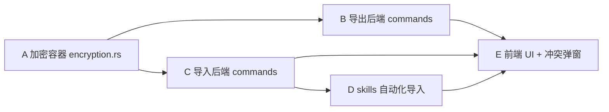

# PRD: 导入导出功能（加密单文件 + 自动化导入）

## 目标

为 aidog 增加完整的「导入 / 导出」子系统：用户可勾选范围，导出为**单文件加密包**（密钥隐藏在文件内但人眼无法识别），导入时自动解密、按冲突策略应用、Skills 自动安装（权限与原一致）。

## 用户决策（已确认）

| 决策点 | 选择 |
| --- | --- |
| 导出范围 | platform / group / group_platform / setting（proxy 全局设置）/ codex 设置（`~/.codex/config.toml` + 各 group profile）/ claude code 设置（`settings.{group}.json`）/ **model_price** / **skills（npx 安装 + enable 状态）** |
| 不导出 | proxy_log（历史日志）、notification（收件箱） |
| 加密方案 | **AES-256-GCM + 隐藏密钥**：密钥与密文同文件，密钥经字节混淆（XOR + 噪声区散布）藏在固定结构里，HMAC 校验完整性 |
| 导入冲突 | **逐项询问**（覆盖 / 跳过 / 重命名），由前端弹窗收集决定 |
| Cloud Code 含义 | app Settings 内的 Claude Code 设置 = 各 group 的 `settings.{group}.json`（statusLine / subagent_statusline / hooks / env / permissions） |

## 功能要求

### F1 导出
- F1.1 范围勾选 UI（7 类：platform / group / codex / claude-code-group-settings / proxy-setting / model_price / skills）
- F1.2 数据完整性：每类导出全表 / 全字段（含 sort_order / manual_budgets / retry 配置等 ALTER 后加的列）
- F1.3 元数据：`manifest` 含 `{format_version, aidog_version, created_at, source_machine, checksum(sha256 of plaintext), scopes[]}`
- F1.4 保存方式：Tauri `SaveDialog` 用户选路径，默认扩展名 `.aidogx`
- F1.5 加密：明文 JSON → AES-256-GCM → 输出文件 = `magic(4B) + format_version(1B) + nonce_len(1B) + nonce + ciphertext + tag`，密钥经隐藏写入

### F2 加密容器
- F2.1 隐藏密钥策略：
  - 真实密钥 K = `rand(32B)`
  - 文件头 `header` 区写入 `obfuscated_key = K XOR pad`，其中 `pad` = SHA256(magic + format_version + 固定 salt) 前 32B（程序可知，人眼看是普通头字节）
  - 重组：程序读 header → 算 pad → K = obfuscated_key XOR pad
  - 人眼看文件头是 magic + version + 一段看似随机的 nonce/字节流，无法分辨哪段是密钥
- F2.2 HMAC-SHA256 over (header + ciphertext) 防篡改，附录尾部
- F2.3 验证数据：manifest.checksum = SHA256(明文)，解密后比对

### F3 导入
- F3.1 Tauri `OpenDialog` 选 `.aidogx`
- F3.2 读 header → 重组密钥 → 解密 → 验 checksum → 解析 manifest
- F3.3 按勾选范围（或全部）逐类应用
- F3.4 同名冲突：前端弹窗逐项询问（覆盖 / 跳过 / 重命名），后端 command 接受决策列表
- F3.5 **Skills 自动化**：导出含 `skills = [{name, source, scope, agents: [{agent_slug, enabled}]}]`，导入时对每条执行 `npx skills add <source> -s <name> -a <slug> [-g] -y`，再按 `enabled` 调用 enable/disable，**安装权限（scope user/project, agent 列表）与原完全一致**

### F4 UI
- F4.1 Settings 页新增「导入 / 导出」tab（或独立页面）
- F4.2 导出区：范围勾选 + 导出按钮 → 进度 → 完成 toast
- F4.3 导入区：选文件 → 显示 manifest 摘要 → 冲突逐项弹窗 → 导入进度 → 完成 toast
- F4.4 i18n：7 语言全覆盖

## 非功能
- 加密强度：AES-256-GCM（行业标准）；密钥不外泄（不进日志、不写明文）
- 性能：导出 < 10k 行表应在 2s 内
- 不破坏现有 DB schema（导入用 INSERT OR REPLACE / 事务回滚）

## 验收
- 导出 → 删 DB → 导入 → 应用状态完全一致（platform/group/setting/codex/claude-code-settings/model_price/skills）
- 加密文件用 hexdump 人眼无法识别密钥段
- 同名导入触发逐项弹窗
- skills 导入后 `npx skills list` 显示已装且 enable 状态一致
- 7 语言 UI 无裸 key（check-i18n.mjs 过）

## 风险
- group_platform 外键：导入须先 group 后 platform 关联，顺序敏感
- codex / claude-code settings 涉及用户 home 目录文件，导入须备份原文件
- skills source 失效（仓库删/网络）：导入失败须优雅降级，不阻塞其他项

## 调度图

- **串行**：A 必须先（B/C 共享容器格式）
- **并行组 1**：B + C（A 完成后）
- **并行组 2**：D 随 C（skills 是 C 的子流程）
- **串行收尾**：E 依赖 B + C + D 全部 command 就绪

