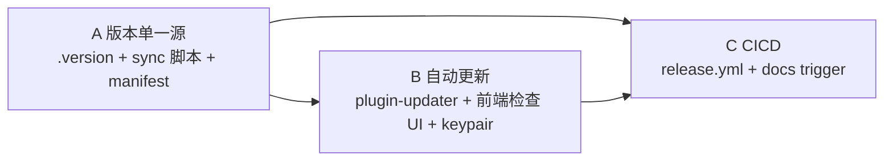

# Design — .version 单一源 + CICD + 自动更新

## 调度图（顺序依赖，无并行）

C 依赖 A(版本)+B(updater artifacts/pubkey)，故单 task 分阶段实现。

## A. 版本单一源

`/.version` = 单行 `0.1.0\n`（纯文本，无引号）。

`scripts/sync-version.mjs`（Node，无依赖，ESM）：
- 默认（write）：读 `.version` trim → 写
  - `package.json` `.version`
  - `docs/package.json` `.version`
  - `src-tauri/tauri.conf.json` `.version`
  - `src-tauri/Cargo.toml` `[package]` 下 `version = "x"`（正则：仅替换首个 `^version = "..."`，避免误伤 deps）
- `--check`：读 `.version`，逐 manifest 比对，任一 drift → 打印差异 + `process.exit(1)`；全一致 exit 0。
- package.json scripts：`"version:sync": "node scripts/sync-version.mjs"`、`"version:check": "node scripts/sync-version.mjs --check"`。

Cargo.toml version 必须字面量（Cargo 不支持运行时读外部文件），故 .version 经脚本写入 → build 消费 `CARGO_PKG_VERSION`（about_info 已用）。这是「.version 为基准」的落地：改 .version → sync → 各 manifest 跟随。

## B. 自动更新（Tauri v2 updater）

**Rust（src-tauri）**
- `Cargo.toml`: `tauri-plugin-updater = "2"`、`tauri-plugin-process = "2"`。
- `lib.rs`: builder 加 `.plugin(tauri_plugin_updater::Builder::new().build())` + `.plugin(tauri_plugin_process::init())`（desktop-only；与既有 plugin 注册并列）。
- `capabilities/default.json`: 加 `"updater:default"`、`"process:allow-restart"`。

**tauri.conf.json**
- `bundle.createUpdaterArtifacts: true`（v2：产 `.sig` + 供 latest.json）。
- `plugins.updater`: `{ "endpoints": ["https://github.com/lazygophers/aidog/releases/latest/download/latest.json"], "pubkey": "<生成的公钥>" }`。

**keypair**
- `yarn tauri signer generate -w ./.tauri-signing.key`（私钥写仓库外/或加 .gitignore，**不入库**）→ 输出 pubkey。pubkey 填 tauri.conf。私钥 + 密码 → 用户加 GH secrets `TAURI_SIGNING_PRIVATE_KEY` / `TAURI_SIGNING_PRIVATE_KEY_PASSWORD`。
- 私钥文件路径加入 `.gitignore`（防误提交）。

**前端**
- 依赖 `@tauri-apps/plugin-updater`、`@tauri-apps/plugin-process`（package.json）。
- About.tsx 加「检查更新」按钮：`const u = await check(); if (u) { await u.downloadAndInstall(); await relaunch(); } else toast(已是最新)`。失败 try/catch toast，不崩。状态：checking/downloading/up-to-date/error + 进度可选。
- i18n `about.checkUpdate` 等 × 8 locale。

## C. CICD

**`.github/workflows/release.yml`**
- trigger: `push: { branches:[master], paths:[".version"] }` + `workflow_dispatch`。
- job `read-version`: 读 `.version` → output `version`。
- job `release` needs read-version, `matrix.include`: `{os:macos-14,args:"--target aarch64-apple-darwin"}`、`{os:macos-13,args:"--target x86_64-apple-darwin"}`、`{os:windows-latest,args:""}`。
- steps: checkout、setup-node、setup rust(+ targets)、`node scripts/sync-version.mjs --check`(防 drift)、`yarn install`、`tauri-apps/tauri-action@v0` with `tagName: v__VERSION__`、`releaseName`、`releaseBody`、`includeUpdaterJson: true`、`createRelease`/`publish`; env: `GITHUB_TOKEN`、`TAURI_SIGNING_PRIVATE_KEY`、`TAURI_SIGNING_PRIVATE_KEY_PASSWORD`、`projectPath: .`、`args: ${{ matrix.args }}`。
- tauri-action 自动：建 release(tag v<ver>) + 多平台上传 + 生成/合并 `latest.json`（updater endpoint 命中 `releases/latest/download/latest.json`）。

**docs**
- `deploy-docs.yml` `on.push.paths` 追加 `.version`（版本变更重部署文档，文档展示新版本）。

**校验**（本地不可跑 CI）：`python3 -c "import yaml; yaml.safe_load(open(f))"` 校验 release.yml + deploy-docs.yml 语法。

## 风险 / 边界

- 私钥不入库（.gitignore + 仓库外路径）；pubkey 入库安全。
- 首次 release 前 latest.json 不存在 → 客户端 check 返回「无更新/网络错误」，已 try/catch 兜底。
- tauri-action 版本/参数以官方 v2 README 为准（exec 阶段对照）。
- macOS 双架构用两个 runner（macos-14 arm / macos-13 intel）出独立 artifact，tauri-action 合并 latest.json。
