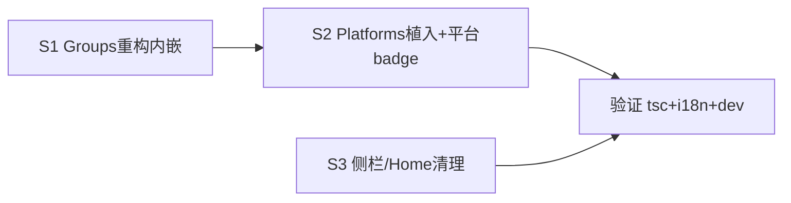

# PRD: 分组内嵌进平台页（侧栏只留「平台」）

## 现状（问题）

侧栏「AI 平台」与「分组」两项分离，管理资源需两页跳转。用户要求：**侧栏只留「平台」一项，分组弄进平台页里管理/展示**。不引入「资源」伞名，保留 group + platform 两概念。数据模型 N:N 不变。

## 目标（平台为中心 + 分组内嵌）

1. **侧栏**：移除 `groups` 项，只留 `platforms`（标签「AI 平台」/ 平台）。无新伞名。
2. **Platforms 页面**成为统一管理入口，列表视图内含两段：
   - **分组段**（顶部）：分组卡片列表（沿用 Groups.tsx 现有卡片：拖拽排序/展开/统计/余额/模型映射/中间件规则/编辑表单）。分组可编辑、可添加。
   - **平台段**（下部）：现有平台列表（可编辑、可添加）。平台卡片/行显示所属分组 badge。
3. **N:N 关系**：一平台属多分组，分组编辑内的平台选择（SortableList）+ 平台卡片显示归属，双向可见。
4. Groups.tsx 内容作为**内嵌组件**植入 Platforms 页（非独立路由页），Groups 路由移除。

## 不做（范围边界）

- ❌ 不引入「资源」概念/伞名。
- ❌ 不改后端 / db / router / 数据模型。
- ❌ 不改 Platforms 编辑表单逻辑（770 行）。
- ❌ 不改 Stats/Logs 的 platform 维度筛选（eff_pid 不变）。
- ❌ 不动分组编辑表单内部字段（routing/mappings/middleware/timeout 全保留）。

## 改动范围（文件集）

| 文件 | 改动 |
| --- | --- |
| `src/pages/Groups.tsx` | 重构为内嵌组件：去掉独立页头/`section-header`/代理 base_url 条（上移或复用），导出 `GroupsEmbedded`；保留卡片列表+编辑表单+所有逻辑 |
| `src/pages/Platforms.tsx` | 列表视图（L2963+）顶部渲染 `<GroupsEmbedded />`；平台列表项加所属分组 badge |
| `src/App.tsx` | BASE_NAV 删 `groups` 项；render 删 groups 分支；effectiveNav fallback 不涉 groups |
| `src/pages/Home.tsx` | 删「分组」按钮（L448），保留「平台」按钮（L445） |
| `src/locales/*/translation.json` ×7 | 删/调：`nav.groups` 侧栏不再用（键保留不删防他处引用）；平台卡分组 badge 复用现有键；必要时加 `platform belongsToGroups` 占位键 |

## 验收

1. `yarn tauri dev`：侧栏只见「AI 平台」一项（原 groups 消失）。
2. 平台页顶部见分组段（卡片列表+展开+编辑+添加全可用），下部见平台列表。
3. 分组编辑表单内增删平台 → 平台列表该平台归属 badge 同步；反之平台列表见所属分组。
4. 分组拖拽排序、统计/余额聚合、模型映射、中间件规则、编辑保存零回归。
5. Home 页只剩「平台」入口按钮。
6. `npx tsc --noEmit` 0 error；`node scripts/check-i18n.mjs` 0 缺键。
7. 7 语言 + 亮/暗主题视觉无违和。

## subtask 概览

| id | slug | 层 | 依赖 | 并行 |
| --- | --- | --- | --- | --- |
| S1 | groups-embedded-refactor | frontend | 无 | ✅ |
| S2 | platforms-embed-groups | frontend | S1 | 串行 |
| S3 | nav-home-cleanup | frontend | 无 | ✅（与 S1/S2 文件不同） |

> S1→S2 串行（S2 依赖 S1 导出的 GroupsEmbedded）。S3 文件独立（App.tsx/Home.tsx）可并行 S1。
