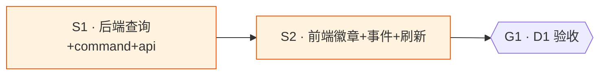

# platform-card-last-test-badge

## Goal

平台卡片常驻显示「最近一次测试结果」徽章（ok / fail / 耗时 / 时间），任一测试（Groups 批量测试 / Platforms 快速测试 / ModelTestPanel 自定义）完成后对应卡片实时刷新，跨页持久可见——不再只有点击快速测试时的瞬态闪现。

## What I already know

### 现状
- model_test（真实分支 lib.rs:1036-1041 / 失败 974 / 非2xx 1012 / mock 942）**已落 proxy_log**：`platform_id=真实id`、`source_protocol="test"`、`group_key="[test]"`、成功 `status_code=200`、失败 `status_code=上游码或502`、`duration_ms` 已记。
- `get_platform_usage_stats`（db.rs:2789）WHERE 含 `platform_id=?1`，测试日志**已被计入** `recent_total/recent_failures`，理论上 health 点已含测试结果。
- **断裂点 1（刷新）**：Platforms 页 `usageMap` 仅 mount 时拉一次（Platforms.tsx:1632 `useEffect(load,[])`），且仅 `total_requests>0` 填充（:1597）。Groups 页跑批量测试后 Platforms 不重挂载 → health 点不更新。
- **断裂点 2（呈现）**：唯一显式 ok/fail 反馈是 `testResults`（usePlatformCards.ts:67），**每页本地内存态**，不持久化、不跨页。Groups 批量测试写 `groupTest` 行集合（Groups.tsx:645），Platforms 快速测试写 `testResults`，零共享。
- 现有 health 徽章（PlatformCard.tsx:84 `healthStatus(recent_total,recent_failures)`）是**聚合点**（最近 5 次含真实流量+测试混合），非「最近一次测试」语义，且依赖 usageMap 加载。
- 全局事件先例：项目已用 `aidog-groups-changed` 等 CustomEvent 跨页通信。

### 调研结论
- 数据已齐（proxy_log 有测试日志），只需①新增「取最近一条 test 日志」查询 ②卡片常驻徽章消费 ③测试完成派发全局事件触发刷新。

## Assumptions (temporary)
- 「最近一次测试」= 该 platform 最近一条 `source_protocol='test'` 的 proxy_log 行（按 created_at DESC）。
- 徽章语义独立于聚合 health 点：徽章=最近测试 ok/fail/耗时；health 点=最近 5 次请求聚合（保留不删）。
- 测试完成事件粒度=per-platform（每测完一个平台派发一次，携带 platformId），Platforms 监听后单卡刷新。

## Open Questions
无（范围已明确）。

## Deliverable 矩阵

| ID | 交付物 | 类型 | 独立验收 | 优先级 |
| --- | --- | --- | --- | --- |
| D1 | 平台卡片常驻最近测试徽章 + 跨页实时刷新 | diff (Rust+TS) | 跑一次快速测试后卡片徽章即时出现；Groups 批量测试后切到 Platforms 页对应卡徽章已更新 | P0 |

## Requirements

- R1 (D1)：后端新增查询，取某 platform 最近一条 `source_protocol='test'` 的 proxy_log，返回 `{ success, duration_ms, created_at, error? }`。
- R2 (D1)：暴露为 Tauri command + api.ts 封装，类型跨 Rust↔TS 一致。
- R3 (D1)：PlatformCard 常驻渲染「最近测试」徽章（无测试记录时不显示；有则 ok/fail 色 + 耗时 + 相对时间）。
- R4 (D1)：任一测试完成（Groups 批量单平台完 / Platforms 快速测试完 / ModelTestPanel 测完）派发全局 CustomEvent `aidog-platform-test-completed`（detail: `{ platformId }`）。
- R5 (D1)：Platforms 页监听该事件，刷新对应 platform 的最近测试数据并更新徽章。
- R6 (D1)：徽章数据在 Platforms mount 时随 `load()` 一并拉取（首屏即显示历史最近测试，非空才有）。

## Subtask 拆分

| ID | Subtask | 所属 Deliverable | 边界 (改动 / 读取范围) | 简要说明 | 详情文件 |
| --- | --- | --- | --- | --- | --- |
| S1 | 后端查询 + command + api 封装 | D1 | `src-tauri/src/gateway/db.rs` `src-tauri/src/gateway/models.rs` `src-tauri/src/lib.rs` `src/services/api.ts` | 新增 `get_last_test_result` 查询 + command + TS 类型/方法 | `subtask/S1-backend-last-test.md` |
| S2 | 前端徽章 + 全局事件 + 跨页刷新 | D1 | `src/components/platforms/PlatformCard.tsx` `src/components/platforms/usePlatformCards.ts` `src/pages/Platforms.tsx` `src/pages/Groups.tsx` `src/pages/ModelTestPanel.tsx` | 卡片常驻徽章 + 事件派发/监听 + 单卡刷新 | `subtask/S2-frontend-badge-event.md` |

### Subtask 调度图



S2 依赖 S1 的 api.ts 方法签名（共享 `src/services/api.ts`），故串行。

## Acceptance Criteria

- [ ] `cargo build` + `cargo clippy`（零 warning）+ `cargo test` 通过
- [ ] `yarn build`（tsc exhaustive）+ `yarn check:i18n` 通过
- [ ] 手验：Platforms 页某卡点快速测试 → 徽章即时出现 ok/耗时；改测失败用例 → 徽章变 fail
- [ ] 手验：Groups 页对含多平台的分组跑批量测试 → 切到 Platforms 页，被测各卡徽章均为最近一次批量结果
- [ ] 手验：重启应用后徽章仍显示历史最近测试（持久，来自 proxy_log）
- [ ] 无测试记录的平台不显示徽章

## Definition of Done
- 全部 Requirements 实现 + Acceptance Criteria 勾选
- 变更已 commit（项目授权自动 commit，禁 push）
- task worktree 已合并 + 移除
- 非平凡发现落 memory
- bump .version（用户可见功能变更）

## Out of Scope
- 不改聚合 health 点语义（保留 recent 5 聚合，徽章是新增独立信号）
- 不改 model_test 落日志逻辑（已正确落 platform_id）
- 不加「最近测试历史列表」UI（只取最近一条）
- 不动 ModelTestPanel 内部测试流程，仅在测完后补一个事件派发
- 不改后端 i18n / 不新增 locale key 之外的多语言补全（如新增 key 需 check:i18n 全绿）

## Technical Notes

### 文件位置
- 后端：`src-tauri/src/gateway/db.rs`（新查询）、`models.rs`（新 struct）、`lib.rs`（新 command）
- 前端：`src/services/api.ts`（类型+方法）、`src/components/platforms/PlatformCard.tsx`（徽章）、`usePlatformCards.ts`（state+拉取+监听）、`src/pages/Platforms.tsx`（load 拉取+事件接线）、`src/pages/Groups.tsx`（批量测试单平台完派发）、`src/pages/ModelTestPanel.tsx`（测完派发）

### 回滚
- 纯增量（新查询/新 command/新徽章/新事件），无破坏性 schema 变更。
- 回滚 = revert 该 task 的 commit 集合；proxy_log 已有 test 日志不受影响。

### 验证命令
```bash
cd src-tauri && cargo build && cargo clippy -- -D warnings && cargo test
yarn build && yarn check:i18n
```
