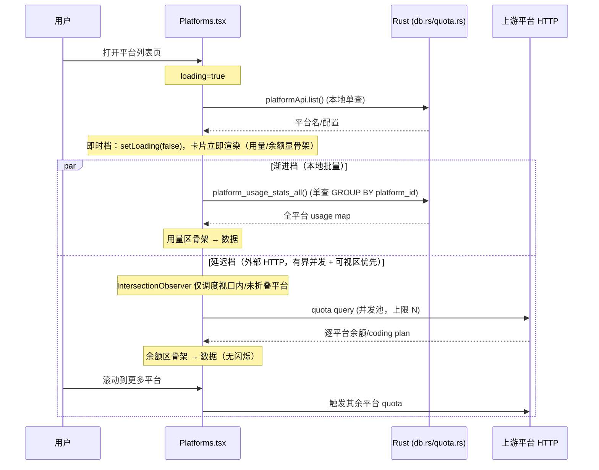

# PRD — AI 平台列表页分阶段异步加载优化

> Task: `06-19-platform-list-progressive-load` · 范围 **A+B**（后端负载优化 + 前端体感），**明确排除方案 C**（数据源大重构）。
> 调研已完成（静态分析，下方所有瓶颈带 file:line 引用）；需求已收敛，本文档只结构化落已定结论。

## 1. 背景与问题

平台管理列表页（`src/pages/Platforms.tsx`，内嵌 `GroupsEmbedded`）在平台数量增多时存在加载体感与后端负载问题。调研结论：

- **首屏白屏非问题（勿误改）**：平台名/配置已是单次本地 DB 快查（`platformApi.list` → `src-tauri/src/gateway/db.rs:710`），`loading` 仅覆盖它，到手即渲染（`src/pages/Platforms.tsx:1591` `setLoading(false)`）。
- **瓶颈 1 — quota per-platform 外部 HTTP 风暴**：`src/pages/Platforms.tsx:1603` `list.forEach` 裸并发 N 个外部 HTTP，**无并发上限**；timeout 10s / connect 5s（`src-tauri/src/gateway/quota.rs:109`）；newapi 两步串行（`quota.rs:540` / `quota.rs:554`）。已脱首屏阻塞（注释见 `Platforms.tsx:1590`），但 N 大时仍打满连接、拖慢全部 quota 返回。
- **瓶颈 2 — usage stats N+1 + 无索引**：`src/pages/Platforms.tsx:1594` 逐平台 `usageStats(p.id)`，每次后端 2 次查询（`db.rs:2789` 聚合 + recent5），`WHERE platform_id` **无可用索引**（`proxy_log` 唯一索引 `idx_proxy_log_stats` 前导列是 `created_at`，`db.rs:246`）。group 维度已批量化范例 `get_all_group_usage_stats`（`db.rs:2817`，单查 `GROUP BY group_key`）可直接仿写。

**已优化、勿回退**：quota 脱首屏阻塞；group stats 批量化（`get_all_group_usage_stats`）；分组卡 quota 懒加载（`usePlatformCards` `quotaMap` 首屏空，`src/components/platforms/usePlatformCards.ts:66`）。

## 2. 范围

| 范围 | 含 | 说明 |
| --- | --- | --- |
| **A 后端负载优化** | ✅ | usage stats 批量化、proxy_log 索引、quota 有界并发池 |
| **B 前端体感** | ✅ | 骨架占位三态、可视区优先 quota 调度 |
| **C 数据源大重构** | ❌ 排除 | 不改数据源架构/缓存层/订阅模型，本任务不触碰 |

## 3. 分阶段三档设计

加载分三档，按"本地快→本地批量→外部慢"递进，各档独立填充、互不阻塞：

| 档 | 数据 | 来源 | 时机 | 视觉 |
| --- | --- | --- | --- | --- |
| **即时档** | 平台名 / 配置 / 端点 | 本地 DB 单查（`platformApi.list`） | 首屏立即（`setLoading(false)` 后即渲染） | 完整卡片骨架 |
| **渐进档** | usage stats（请求数/token/cost） | 本地 DB **单次批量**（新 `platform_usage_stats_all`） | list 到手后一次性拉取，回填 | 用量区先骨架，批量结果到达替换 |
| **延迟档** | quota（余额 / coding plan） | 外部 HTTP（`quotaApi.query` / `queryNewapi`） | 有界并发池 + 可视区优先调度 | 余额区骨架占位，逐平台回填，禁 est_balance 闪烁 |

## 4. 改动点（①–⑤）需求与验收

### ① usage stats 批量化（后端 + 跨层 + 前端调用）

- **需求**：新增后端 `platform_usage_stats_all`，仿 `get_all_group_usage_stats`（`db.rs:2817`）做 `GROUP BY platform_id` 单查；**必须保留 `platform_id = 0` 回溯子查询语义**（`db.rs:2793`），即 platform_id=0 的日志按 group_key 回溯归属平台。前端 `Platforms.tsx:1594` 的 `forEach` 逐平台改为**单次批量**调用并填 `usageMap`；`refreshStats`（`Platforms.tsx:1622`）同步改为批量。
- **改动文件**：`src-tauri/src/gateway/db.rs`（新查询）、`src-tauri/src/lib.rs`（新 command）、`src/services/api.ts`（TS invoke 封装 + 类型）、`src/pages/Platforms.tsx`（两处调用点）。
- **验收**：N 平台首屏用量加载从 N 次 invoke / 2N 次 SQL 降为 1 次 invoke / 1 次 SQL；用量数值与改前逐平台结果一致（含 platform_id=0 回溯归属）；`refreshStats` 行为一致；`cargo test`（db 相关）绿、`yarn build` 绿。

### ② proxy_log 索引

- **需求**：走 `db.rs` migration（仿 `db.rs:246` 现有索引写法），新增 `CREATE INDEX ... ON proxy_log(platform_id) WHERE deleted_at = 0` 及 `ON proxy_log(group_key) WHERE deleted_at = 0`，加速 ① 的批量聚合及 group stats 的扫描。
- **验收**：migration 幂等（`IF NOT EXISTS`）；新装/老库均建索引；① 的批量查询走索引（可用 `EXPLAIN QUERY PLAN` 验证不再全表扫）；`cargo test` 绿。

### ③ quota HTTP 有界并发池

- **需求**：`Platforms.tsx:1603` 裸 `forEach` 并发改为**有界并发池**，复用项目已有 worker pool 范例（`src/pages/Groups.tsx:678-690`：共享游标 + N 个 worker 循环领取）。并发上限取常量（参照 `BATCH_TEST_CONCURRENCY`）。
- **验收**：同时在飞的 quota HTTP 数 ≤ 上限；全部平台 quota 最终都返回（不丢平台）；结果填 `quotaMap` 行为与改前一致；`yarn build` 绿。

### ④ PlatformCard 骨架占位三态

- **需求**：PlatformCard 余额/用量区在数据未回时显"加载中"骨架占位，复用 `quotaRefreshing` state（`usePlatformCards.ts:66` / `Platforms.tsx:1366`，PlatformCard 已消费 `refreshing` prop，`Platforms.tsx:2844`）。首屏 quota 未回时显骨架，**禁止空白或 est_balance 旧值闪烁**。用量区在渐进档批量结果到达前同样显骨架。
- **改动文件**：`src/components/platforms/PlatformCard.tsx`（+ 视情况 `usePlatformCards.ts` 暴露三态标志）。
- **验收**：首屏卡片余额/用量区为骨架而非空白；quota/usage 到达后骨架替换为真实值，无 est_balance 闪烁回填；分组内嵌卡（GroupsEmbedded 复用同卡）表现一致。

### ⑤ 可视区优先 quota 调度

- **需求**：用 `IntersectionObserver` 仅对**视口内 / 未折叠**平台先触发 quota 拉取，滚动到再拉其余（与 ③ 并发池协同：observer 决定入池时机/优先级，池控并发上限）。列表项需挂 `ref`。
- **改动文件**：`src/pages/Platforms.tsx`（quota 调度 + 列表项 ref）。
- **验收**：长列表首屏仅拉可视平台 quota；滚动后视口外平台 quota 被触发；不重复拉同一平台；折叠平台不触发；`yarn build` 绿。
- **需要 main 转达确认**：⑤ IntersectionObserver 是否纳入首版？引入了滚动/折叠/ref 生命周期的新回归面（见风险节）。若用户希望首版求稳，可将 ⑤ 降为二期，B 范围保留 ④ 骨架占位即可显著改善体感。**未获确认前 ⑤ 仍按纳入首版规划，不擅自删除。**

## 5. 非目标

- 不改数据源架构 / 不引入前端数据缓存层或订阅模型（方案 C）。
- 不改 quota 上游协议、不动 `quota.rs` 的 timeout/connect 配置（仅改前端调度并发）。
- 不动首屏 `platformApi.list` 本地查询路径（已快，非瓶颈）。
- 不改 group 维度统计（已批量化）。

## 6. 风险

| 风险 | 影响 | 缓解 |
| --- | --- | --- |
| ② 索引拖慢写路径 / 增大库体积 | proxy_log 高频写，新增 2 个偏索引增写放大与磁盘占用 | 用带 `WHERE deleted_at = 0` 的偏索引缩范围；上线后观察写延迟；可回滚 DROP |
| ① 批量查丢 platform_id=0 回溯语义 | 部分日志（共享平台/group 回溯）用量漏计或错计 | 严格复刻 `db.rs:2793` 子查询；用例对比改前逐平台结果一致 |
| ⑤ IntersectionObserver 回归面 | 滚动/折叠/卡片复用（Platforms 主列表 + GroupsEmbedded）下 observer 生命周期易漏触发或重复触发 | 首版可门控为二期（待 main 确认）；observer 解绑/去重严测；与 ③ 池解耦 |
| ③④⑤ 同改 `Platforms.tsx` 冲突 | 多 agent 并行编辑同一大文件易冲突 | 见 implement.md 串行化/分区编排 |

## 7. 引用清单（调研定位）

- `src/pages/Platforms.tsx:1590-1591`（注释 + setLoading）、`:1594`（usage forEach）、`:1603`（quota forEach）、`:1622`（refreshStats）、`:1366`（quotaRefreshing state）、`:2844`（PlatformCard refreshing prop）
- `src-tauri/src/gateway/db.rs:246`（现有索引）、`:710`（platform list 查询）、`:2789`（get_platform_usage_stats）、`:2793`（platform_id=0 回溯子查询）、`:2817`（get_all_group_usage_stats 批量范例）
- `src-tauri/src/gateway/quota.rs:109`（timeout/connect）、`:540`/`:554`（newapi 两步串行）
- `src/pages/Groups.tsx:678-690`（worker pool 范例）
- `src/components/platforms/usePlatformCards.ts:66`（quotaRefreshing / quotaMap 懒加载）
