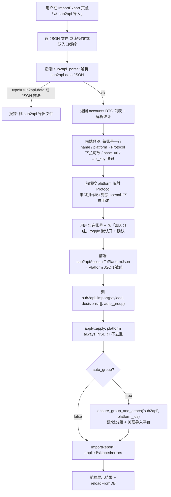

# PRD — 导入导出新增「从 sub2api 导入平台配置」+ 导入 auto-group

> Task: `.trellis/tasks/06-19-sub2api-import` · status: planning · P2
> 需求已收敛（sub2api 源格式已查实 + 映射范围已定 + 用户 4 项评审决策已落）。本文档结构化落已定结论，驱动 exec。

## 0. 本任务两部分（范围扩展说明）

经用户评审，本 task 现含 **两部分**：

- **(A) sub2api 导入全链**：新增「从 sub2api 导出 JSON 导入平台配置」异源导入路径（解析 + 双入口 UI + 预览 + 写入）。
- **(B) 导入 auto-group 机制（横向扩展，含 cc-switch）**：给 sub2api 导入 **与现有 cc-switch 导入** 都加「导入后自动建/加入分组」机制 + 「加入分组」开关（默认开）。sub2api → 分组 `sub2api`；cc-switch → 分组 `cc-switch`。两路共享同一套 `ensure-group-and-attach` 逻辑。

> 用户评审 4 项决策的反映位置：① 双入口 §5.1 / §3.1；② platform_type 预览下拉 §4.1；③ auto-group §5（新增章节）；④ "先调整再进" — 本次只改文档，main 重新评审。

## 1. 背景

aidog 导入导出模块已支持两条异源导入路径：

- `.aidogx` 加密容器（自家格式，`import_read_file` / `import_apply`）。
- cc-switch 本地配置（SQLite / 旧 JSON，`ccswitch_detect` / `ccswitch_read` / `ccswitch_import`）。

新增第三条异源导入：**从 [sub2api](https://github.com/Wei-Shaw/sub2api) 的账号数据导出 JSON 导入平台配置**。sub2api 是一个多账号聚合代理，其管理后台可导出账号数据；用户希望把这些账号的核心连接信息（平台类型 / base_url / api_key）一键导入 aidog，省去逐个手填。

与 cc-switch 路径的本质差异：

| 维度 | cc-switch | sub2api |
| --- | --- | --- |
| 数据来源 | 本地文件系统探测（`~/.cc-switch/`） | **用户提供的 JSON 文件 / 粘贴文本**（无本地探测） |
| 解析层 | 后端读 SQLite/JSON + 提取 DTO | 后端解析 sub2api-data JSON + 提取 DTO |
| 平台匹配 | 前端 `ccswitchMatch.ts` 回退链 | 前端按 `platform` 字段直映射 Protocol（更简单） |
| 写入 | `apply::apply`（platform always INSERT） | 同左，**完全复用** |

## 2. 源格式（sub2api-data JSON）

> 引用：GitHub `Wei-Shaw/sub2api` · `backend/internal/handler/admin/account_data.go`
> 导出 API：`GET /api/v1/admin/accounts/data`
> **字段名以该 struct 的 json tag 为准**（exec agent 实现时必须对照 struct 二次确认精确 json tag，下方为已查实的字段语义，个别 tag 大小写/命名可能有偏差）。

顶层结构：

```jsonc
{
  "type": "sub2api-data",   // 格式标识，校验用
  "version": 1,
  "exported_at": "2026-...",
  "proxies": [ ... ],        // 代理池 —— 不导入
  "accounts": [ /* DataAccount[] */ ]
}
```

`DataAccount`（已查实语义，精确 json tag 以 struct 为准）：

| 字段 | 语义 | aidog 是否消费 |
| --- | --- | --- |
| `name` | 账号显示名 | ✅ → platform.name |
| `platform` | `anthropic` / `openai` / `gemini` 等 | ✅ → platform_type（映射 Protocol） |
| `type` | `api_key` / `oauth` / `cookie` | ❌ 丢弃 |
| `credentials` | `{ api_key, base_url, access_token, ... }` | ✅ 取 `api_key` + `base_url` |
| `extra` | JSONB 扩展 | ❌ 丢弃（**不存 aidog extra**） |
| `proxy_key` | 关联代理 | ❌ 丢弃 |
| `concurrency` | 并发上限 | ❌ 丢弃 |
| `priority` | 优先级 | ❌ 丢弃 |
| `rate_multiplier` | 速率倍率 | ❌ 丢弃 |
| `expires_at` | 过期时间 | ❌ 丢弃 |
| `notes` | 备注 | ❌ 丢弃 |

> models 不在 `DataAccount`（在 sub2api 的 Channel 实体）→ **导不到，非目标**。

## 3. 范围

### 3.1 核心映射 only（已定决策）

| sub2api 源 | → aidog Platform | 规则 |
| --- | --- | --- |
| `account.name` | `name` | 直传 |
| `account.platform` | `platform_type`（Protocol 枚举） | 见 §4 映射表 |
| `account.credentials.api_key` | `api_key` | 直传，缺失 → 空串 |
| `account.credentials.base_url` | `base_url` | **缺失时走 aidog 预设默认 base_url**（见 §4.2） |

### 3.2 丢弃清单（严格不导入）

`proxies` 整段 / `type` / `extra` / `proxy_key` / `concurrency` / `priority` / `rate_multiplier` / `expires_at` / `notes` / models（不存在于 account）。
**不写 aidog platform.extra 字段**（保持空串）。

## 4. 映射设计

### 4.1 platform → Protocol 枚举

aidog Protocol 枚举 serde 值（`src-tauri/src/gateway/models.rs:5-16`）天然与 sub2api `platform` 值对齐（均小写）：

| sub2api `platform` | aidog Protocol（serde 值 / 前端 `Protocol` 类型） | 备注 |
| --- | --- | --- |
| `anthropic` | `anthropic` | Protocol::Anthropic |
| `openai` | `openai` | Protocol::OpenAI |
| `gemini` | `gemini` | Protocol::Gemini |
| 其他可识别（大小写/别名）| 归一化后匹配上表 | 归一化：lowercase + trim |
| **无法识别** | **默认归 `openai` 兜底**（见风险 §6） | 前端标记「未识别·已兜底为 OpenAI」，并允许用户在预览行手动改选 platform_type |

> **用户评审决策 ②（已定）**：未识别 platform **不跳过**，而是「**默认兜底 openai + 预览行提供 platform_type 手选下拉允许手改**」。既不阻塞批量导入又给用户纠错口。→ 保留 `sub2apiMatch.ts` + 预览表格每行下拉。

### 4.2 base_url 缺失回退

`credentials.base_url` 缺失 / 空时，走 aidog 平台预设默认 base_url：

- 复用 `src/pages/Platforms.tsx` 的 `getDefaultEndpoints(protocol)`，取对应 Protocol 默认 endpoint 的 `base_url`（preset 单一事实源住前端，记忆 `aidog-add-platform-skill` 反直觉点 1）。
- endpoints 构造同 `ccswitchMatch.ts` 的 `buildMatch`：取 `getDefaultEndpoints(protocol)` 骨架，若 sub2api 提供了 base_url 则覆盖同协议 endpoint 的 base_url，否则保留骨架默认。

### 4.3 Platform JSON 形态

转换产物喂给 `ccswitch_import` 同款入口（`super::apply::apply`），形态对齐 `ccProviderToPlatformJson`（`src/utils/ccswitchMatch.ts:231-260`）：`name` / `platform_type` / `base_url` / `api_key` / `endpoints` / `models:{}`（空）/ `extra:""` / `enabled:true` / `status:"enabled"` + 其余统计字段置 0/空。

## 5. 导入 auto-group 机制（部分 B，用户评审决策 ③）

### 5.1 决策内容

| 维度 | 决策 |
| --- | --- |
| **sub2api 导入** | 导入的平台自动建 / 加入名为 **`sub2api`** 的分组 |
| **cc-switch 导入** | 导入的平台自动建 / 加入名为 **`cc-switch`** 的分组（**本任务新扩展，现有 cc-switch 路径要改**） |
| **开关** | 两路都带「**加入分组**」toggle，**默认开**；用户可关，关掉则不 auto-group（纯导入平台，行为同改造前） |
| **分组查找/创建键** | 按 group **`name`** 查找/创建（`name` UNIQUE）；新建走 group create 逻辑生成 `group_key`（`gk_<32hex>`，记忆 `group-name-group-key-split`） |

### 5.2 ensure-group-and-attach 机制

**根因约束**：导入走 `apply::apply` 的 `insert_platform_row` 直接 INSERT，**不触发 `platform_create` 的命令级 auto-group 副作用**（记忆 `import-apply-bypasses-platform-create`）。故 auto-group 必须 **显式做**，不能指望命令副作用。

机制（后端共享 `ensure_group_and_attach(name, platform_ids)`，sub2api / cc-switch 两路共用）：

1. **拿到导入平台的 platform_id 列表**：`apply::apply` 对 platform always INSERT，ImportReport 须能回出新建行的 platform_id（若现有 report 不含 id，则 post-import 按 `name` 回查，参照记忆中 cc-switch auto_group 的 post-import 回挂手法）。
2. **ensure group(name)**：按 `name` 查 group；不存在则 create（生成 `group_key`）。返回 group id。
3. **attach**：把第 1 步的 platform_id 列表关联到该 group（platform↔group 关联表 / group join 字段，同 `platform_update` 回挂语义）。

> 实现位置二选一（exec 定）：(a) `*_import` 命令内、apply 之后串行调用 `ensure_group_and_attach`；(b) 独立 post-import 步骤。两者都在后端，避免前端多轮 invoke。

### 5.3 toggle 默认值与关闭语义

- toggle **默认开**（`autoGroup: true`）。前端 import 调用把开关值作为标志传后端命令（`sub2api_import` / `ccswitch_import` 各加 `auto_group: bool` 入参）。
- 关闭时后端跳过 `ensure_group_and_attach`，仅 apply 平台（行为完全等同改造前的 cc-switch 导入，向后兼容）。

## 6. 导入流程



> cc-switch 导入流程同构：仅入口为本地探测（保留）、auto_group 目标分组为 `cc-switch`。

要点：

- **sub2api 双入口**（区别于 cc-switch 的本地探测）：文件选择 + 文本粘贴 **都给**（用户评审决策 ①）。
- 解析在后端（`sub2api_parse`），平台匹配在前端（直映射 + 预览下拉手改，比 cc-switch 回退链简单）。
- 冲突预览：platform 不参与冲突检测（`apply.rs` `detect_conflicts` 注释 L6-8：platform.name 非 UNIQUE，always INSERT，无「覆盖」语义），故 conflicts 恒为空，流程无需冲突弹窗（可选保留 decisions 空数组传参以对齐 apply 签名）。
- auto_group 分支在 apply 之后串行执行，仅在 toggle 开时触发。

## 7. 非目标

- 不导入 sub2api `proxies`（代理池）。
- 不导入 models（不在 account 实体）。
- 不导入 quota / 余额 / 配额 / 并发 / 优先级 / 速率倍率 / 过期时间。
- 不连 sub2api 后台 API 在线拉取（只吃用户导出的 JSON 文件/文本）。
- 不做 oauth / cookie 凭证迁移（仅取 `credentials.api_key`）。
- auto-group 只建/加入 **固定名**分组（`sub2api` / `cc-switch`），不做用户自定义分组名输入框（toggle 二选一：开=固定名分组 / 关=不分组）。

## 8. 风险

| 风险 | 影响 | 缓解 |
| --- | --- | --- |
| **platform_type 无法识别** | 未知 platform 值映射不到 Protocol | 默认兜底 `openai` + 预览行下拉允许手改 + 标记「已兜底」徽标 |
| **字段名偏差** | json tag 大小写/命名与查实语义有出入 | exec 实现时**必须对照 `account_data.go` DataAccount struct 的 json tag** 二次确认；DTO 用 `#[serde(rename)]` 精确匹配 |
| **name 重复 always INSERT** | 同名平台重复导入产生多行 | 既有行为（记忆 `platform-name-not-unique-import`），符合 apply 语义，不去重；UI 提示「导入将新建平台，不覆盖同名」 |
| **base_url 缺失且 Protocol 无预设默认** | 个别 Protocol getDefaultEndpoints 可能无 base_url | endpoints 骨架仍生成，base_url 留空，平台需用户后续补全（不阻塞导入） |
| **auto-group × always-INSERT 重复导入** | 同一份导出重复导入：platform always INSERT 产生多行同名平台，`ensure_group_and_attach` 把这些**新行**全关联到同一 `sub2api`/`cc-switch` 分组 → 分组内出现多个同名平台关联（关联不重复但平台重复） | group 按 name **幂等 ensure**（不重复建组）；platform 重复是 apply 既有语义（不在本任务收口）。**关联去重策略待定见 §10「需要:」**（推荐：接受重复，关联 = 本次导入新建的 platform_id 集合，不做跨次去重；或按 name+base_url 软去重平台行——后者改 apply 语义超范围） |
| **cc-switch 路径回归** | 改 `ccswitch_import` 加 auto_group 入参，旧调用方/默认值须兼容 | `auto_group` 默认 true 但前端显式传；toggle 关时后端跳过 ensure，行为等同改造前；单测覆盖 auto_group=false 不建组 |

## 9. 验收标准

1. 后端 `sub2api_parse` 能解析合法 sub2api-data JSON，返回 accounts DTO；`type != "sub2api-data"` 或 JSON 非法时返清晰错误。
2. 后端单测覆盖：合法 JSON 解析、type 校验失败、credentials 缺 base_url、缺 api_key、未知 platform 字段；**`ensure_group_and_attach` ensure 幂等（同名不重复建组）+ attach 关联 platform_ids**。
3. 前端 sub2api **双入口**（选 JSON 文件 / 粘贴文本）→ 预览每账号（name / 映射 Protocol 下拉可改 / base_url / api_key 脱敏）→ 勾选 → 导入 → 展示 ImportReport。
4. 映射严格限核心字段；丢弃清单字段确不写入 DB（platform.extra 为空）。
5. 未识别 platform 兜底 openai 且预览可手改（下拉）。
6. **auto-group**：sub2api 导入（toggle 开）后导入平台属于 `sub2api` 分组；cc-switch 导入（toggle 开）后导入平台属于 `cc-switch` 分组；toggle 关时均不建组、纯导入平台。
7. `cargo clippy` 无 warning；`cargo test` 绿；`yarn build` 通过；`yarn check:i18n`（新增文案 key，7 语言全补）通过。

## 10. 遗留疑问

见 implement.md 末「需要:」由 main 转达。
