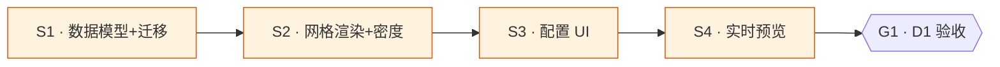

# 浮窗智能布局

## Goal

让 tray popover 从「固定单列堆叠」升级为「用户可自定义二维布局」：每行可独立设 1/2/3 列、卡片可跨行/行内拖拽吸附、每卡可选预制方格尺寸(s/m/l 联动内容富度)、每卡可填自定义颜色，且配置页内嵌实时预览即改即见。落地后 `popover_config_get` 返回的配置含 `row/size/color` 字段 + `rows[].cols`，浮窗按二维网格渲染，配置页改任一项预览区即时反映。

## What I already know

### 现状

- 数据模型：`PopoverItem`(api.ts:566-618 / models.rs:871-933) 现仅 `id/item_type/visible/order/scope/scope_ref/time_window`；`PopoverConfig.items: Vec<PopoverItem>`。DB 存 `settings` 表 scope="popover" key="config" 全量 JSON(db.rs:1560-1586)。
- 渲染：浮窗 `src/popover.tsx:625-635` 固定单列，`.filter(visible).sort(order).map(renderItem)`，无 `display:grid`。CSS 在 `src/styles/popover.css`。
- 配置 UI：`PopoverConfigTab.tsx:86-454`，`SortableList<PopoverItem>`(基于 @dnd-kit，verticalListSortingStrategy)做单列拖拽排序 + type-specific 配置折叠区。预览仅副行文字(trendSummary)，无真实卡片渲染。
- 颜色：浮窗无独立色配；仅 `platform_balance` 卡继承 Tray 的 `TrayColor`{mode:follow/preset/custom}，`resolveColor()`(popover.tsx:96-110) 已能解析 follow/preset/custom-hex。
- 卡片类型：12 种(api.ts PopoverItemType)，6 种多实例(MULTI_INSTANCE_TYPES)。

### 调研结论

- 现状全量报告见会话内 Explore agent 输出(已落 task 上下文)。复用 `TrayColor` + `resolveColor()` 即可满足「自定义颜色」，不需新颜色模型。
- 旧配置兼容靠 serde default：models.rs:935-970 已有 test 验证缺字段反序列化。新字段必带 `#[serde(default)]` + TS optional。

## Assumptions (temporary)

- s/m/l 尺寸**联动内容富度**(用户已确认)：s=只核心数值，m=当前样式，l=更多细节(曲线图加详情/平台行加 token 拆分)。每卡片组件需写 density 变体。
- 二维网格拖拽可在现有 @dnd-kit 基础扩展(rectSortingStrategy + 多容器)，但 WKWebView HTML5 DnD drop 失效(记忆 wkwebview-html5-dnd-drop-fails)——@dnd-kit PointerSensor 不依赖原生 DnD，单列已验证可用，二维需实测。
- 浮窗宽度上限 480px(popover.css)：3 列时每列 ≥ ~150px 可容纳精简卡，l 尺寸卡建议占满行(cols 自动降级或限制)。

## Open Questions

无 (范围已明确：4 项增强 + 设计选择已经 AskUserQuestion 定档)。

## Deliverable 矩阵

| ID | 交付物 | 类型 | 独立验收 | 优先级 |
| --- | --- | --- | --- | --- |
| D1 | 浮窗二维网格智能布局(模型+渲染+配置 UI+预览) | diff/UI | `cargo test` 旧配置兼容绿；浮窗按 row/cols 网格渲染；配置页改 row/cols/size/color 预览即时反映 | P0 |

> 单 deliverable：4 项增强强耦合于同一 `PopoverItem` 模型 + `popover.tsx` 渲染 + `PopoverConfigTab` 配置，不可独立交付，故单 task 单 D1，4 个**串行** subtask。

## Requirements

- R1 [D1] `PopoverItem` 加 `row:i32`(默认=order，老配置各占一行) / `size:"s"|"m"|"l"`(默认"m") / `color:TrayColor`(默认 follow)；`PopoverConfig` 加 `rows:Vec<RowMeta>{cols:i32}`(按 row 索引，缺省 1)。Rust + TS 双写，旧 JSON 反序列化兜底 + test。
- R2 [D1] 浮窗 `popover.tsx` 按 `row` 分组渲染，每行 `display:grid; grid-template-columns:repeat(cols,1fr)`，行内按 order 排；CSS 加 grid + s/m/l 尺寸/密度变体。
- R3 [D1] 各卡片组件支持 s/m/l 三档密度(s 仅核心数值，l 富信息)，由 `size` 字段驱动。
- R4 [D1] `PopoverConfigTab` 加：①每行列数选择(1/2/3) ②卡片跨行/行内拖拽吸附(pointer 事件) ③每卡尺寸选择(s/m/l) ④每卡颜色编辑器(follow/preset/custom-hex 输入)。
- R5 [D1] 配置页内嵌实时预览区，复用真实卡片组件渲染浮窗外观，改任一配置即时反映(本地 state，不需保存)。

## Subtask 拆分

每 subtask 独立文件 `subtask/<id>-<slug>.md`。本节概览。**全串行**(共享 `PopoverItem` 模型 + `popover.tsx` + `PopoverConfigTab`，顺序敏感)。

| ID | Subtask | Deliverable | 边界 | 简要说明 | 详情文件 |
| --- | --- | --- | --- | --- | --- |
| S1 | 扩展数据模型+迁移兼容 | D1 | `models.rs` `db.rs` `api.ts` | 加 row/size/color/rows 字段，serde default 兜底 + Rust test | `subtask/S1-data-model.md` |
| S2 | 浮窗网格渲染+尺寸密度 | D1 | `popover.tsx` `styles/popover.css` | 按 row 分组 grid 渲染 + 各卡 s/m/l 密度变体 | `subtask/S2-render-grid.md` |
| S3 | 配置 UI(列数/拖拽/尺寸/颜色) | D1 | `PopoverConfigTab.tsx` `SortableList.tsx` | 每行列数+二维拖拽+尺寸+颜色编辑器 | `subtask/S3-config-ui.md` |
| S4 | 配置页内嵌实时预览 | D1 | `PopoverConfigTab.tsx` (+ 抽共享卡片组件) | 复用真实卡片渲染浮窗预览，本地 state 即时刷新 | `subtask/S4-live-preview.md` |

### Subtask 调度图



> 全串行：S2 依赖 S1 的新字段；S3 依赖 S1 模型 + S2 渲染规则；S4 复用 S2 真实卡片组件 + S3 配置 state。无并行组(共享文件 + 强依赖)。

## Acceptance Criteria

- [ ] `cd src-tauri && cargo test` 绿，含旧配置(无 row/size/color)反序列化兜底 test
- [ ] `cd src-tauri && cargo clippy` 无 warning；`yarn build` tsc 通过
- [ ] 浮窗：设某行 cols=2 时该行两卡并排；cols=3 时三卡；卡片 size 改 s/l 视觉密度变化
- [ ] 配置页：拖卡跨行/行内吸附生效；改 cols/size/color 预览区即时反映(未保存)
- [ ] 自定义颜色 custom-hex 填入后卡片数值变色；follow 跟随主题
- [ ] 旧用户(已有 popover 配置)升级后浮窗外观不变(各卡各占一行 cols=1)

## Definition of Done

- 全部 R1-R5 实现 + Acceptance Criteria 勾选
- 变更自动暂存(项目授权 auto commit)
- task worktree 已合并回 master + 移除
- 非平凡发现落 cortex(二维拖拽 WKWebView 方案 / 密度变体模式)
- bump `.version`(用户可见功能变更)

## Out of Scope

- 不新增卡片类型(仅增强现有 12 种的样式/密度控制)
- 不改 Tray(托盘)配置，不动 platform_balance 颜色来源链路(其颜色仍来自 Tray)
- 不做自由像素拖拽(已定网格吸附)
- 不做全局统一列数(已定每行独立)
- 不做独立预览窗(已定内嵌)

## Technical Notes

### 文件位置

- 模型：`src-tauri/src/gateway/models.rs:871-933`、`src/services/api.ts:566-618`
- DB：`src-tauri/src/gateway/db.rs:1560-1586`
- 渲染：`src/popover.tsx:625-635` + `src/styles/popover.css`
- 配置：`src/pages/PopoverConfigTab.tsx` + `src/components/SortableList.tsx`

### 灰度 / 回滚

新字段 serde default → 老配置零变化(各占一行 cols=1)。回滚 = revert worktree commit；DB 配置含新字段也可被旧代码忽略(serde 容错)。详见 design。

### 验证命令

```bash
cd src-tauri && cargo test && cargo clippy 2>&1 | grep -i warning
cd /Users/luoxin/persons/lyxamour/aidog && yarn build
```
