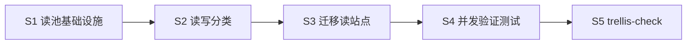

# Implement — SQLite 读写分离连接池

> 执行层编排 (subagent 职责 / 顺序 / 资源互斥)。需求/方案见 `prd.md`。

## 资源互斥分析
全部改动集中在 `src-tauri/src/gateway/db/**`(+ 少量调用侧), **强顺序依赖**(基础设施先落, 读路由后迁), **无冲突型并行** → 单 worktree, 单 writer 串行实施; 另一 checker 验证。**不拆 N worktree**。

## Subtask 划分 (单 writer 内串行 4 步 + 1 checker)

### S1 — 读连接池基础设施 (writer, 必先)
**文件**: `src-tauri/src/gateway/db/mod.rs`
- 结构改 `pub struct Db(pub AsyncConnection, Arc<DbCache>, ReadPoolHandle)` — **读池追加为 field 2**, 保持 `self.0`(写连接)/`self.1`(cache) 既有访问不破(135 站点零改)。
- 新类型 `ReadPoolHandle`(Arc 包裹 `Vec<AsyncConnection>` + `AtomicUsize` 轮询游标); `Clone` 廉价(Arc)。
- `Db::new(path)`:
  - 写连接(现有逻辑)不动。
  - 判 `is_memory = path == ":memory:" || path 含 "mode=memory" || path 空` → **fallback**: 读池仅放 1 个 `self.0.clone()`(复用写连接 sender), 不开新物理连接。
  - 非内存: 开 `READ_POOL_SIZE`(const=**8**, 单点可调; 动态扩容需连接生命周期/空闲回收, 本轮不做) 条 `AsyncConnection`, 各 `SQLITE_OPEN_READ_ONLY | SQLITE_OPEN_NO_MUTEX`(用 `open_with_flags`, 同 path), 各设 `journal_mode=WAL`(读 WAL 必需) + `busy_timeout=5000` + `foreign_keys=ON`(只读无影响, 保一致) + `c.profile(Some(sql_profile_callback))`。
  - 验证 tokio-rusqlite 0.6 API: `AsyncConnection::open_with_flags(path, flags)` 是否存在; 不存在则用 `Connection::open_with_flags`(rusqlite) 包进 `tokio_rusqlite::Connection::from`/或查 0.6 正确构造法(WebSearch/源码)。
- 新方法 `call_read_traced<F,R>(&self, req, caller, f)` — **完整复制 `call_traced` 语义**(req 解析链 + CURRENT_DB_CTX set/Clear guard + profile), 唯一差异: `let conn = self.2.pick();`(轮询取读连接 clone) 替代 `self.0.clone()`。thread-local 隔离仍成立(每读连接独立后台线程)。
- `ReadPoolHandle::pick(&self) -> AsyncConnection`: `idx = cursor.fetch_add(1, Relaxed) % len; conns[idx].clone()`。
**验收**: 编译过; `cargo test` 不回归(此步未迁任何调用, 纯加基础设施)。

### S2 — 分类读热路径调用站点 (writer, 依赖 S1)
**只读分析**, 产出迁移清单。判定规则: **纯 SELECT 无写副作用** + 属 UI 卡顿相关查询。
- 候选文件: `query_stats.rs` / `stats_today.rs` / `stats_agg.rs`(只读侧, 排除 rebuild upsert) / `usage_stats.rs`(读侧) / `proxy_log.rs`(日志列表查询, 排除 insert/update/cleanup) / `group.rs`+`group_platform.rs`+`platform.rs`(list/get 读) / `model_price.rs`(resolve 读) / `mcp.rs`+`middleware.rs`+`settings.rs`(get/list 读)。
- **保留写连接**(不迁): 任何 INSERT/UPDATE/DELETE/DDL/PRAGMA/事务含写/`invalidate_*` 相关、`schema*.rs`、`maintenance.rs`(VACUUM/checkpoint)、`platform_lifecycle.rs` 写、`trace.rs` 写。
- 输出: 逐方法标 `read`/`write` + 文件:行号清单, 写入本 task `research/read-write-classification.md`。
**验收**: 清单覆盖候选文件全部 `self.0.call*`/`call_traced` 站点, 每条有判据。

### S3 — 迁移读站点到读池 (writer, 依赖 S2)
- 按 S2 清单, 把判定 `read` 的站点 `self.call_traced(...)` → `self.call_read_traced(...)`(或 `self.0.call` 裸调用先包成 traced 再转读)。
- **保守**: 任一拿不准的留写连接。**禁迁** cache 写失效路径、事务、含 `RETURNING`/`last_insert_rowid` 的。
- DbCache 读命中逻辑不变(cache 在内存, 与连接无关)。
**验收**: `cargo build` 过; `cargo clippy` 零 warning; `cargo test` 全绿(:memory: fallback 保证读写同库一致)。

### S4 — 并发不阻塞验证 (writer, 依赖 S3)
- 加 `#[test]`(或 `#[tokio::test]`) 于 `mod.rs`/新 `test_rw_pool.rs`: **真实文件库**(tempfile, 非 :memory:, 才有多物理连接), 起一长写循环(密集 insert proxy_log) 并发 spawn 读查询, 断言读查询 P95 延迟 < 阈值 / 不被写串行阻塞(对比迁移前基线或断言读在写未完成时即返回)。
- 内存 fallback 路径单测: `Db::new(":memory:")` 后读写互见(写入立即读到), 防 fallback 退化破坏一致性。
**验收**: 新测试通过; 体现"读不阻塞于写"。

### S5 — check (checker agent, 依赖 S1-S4)
走 `trellis-check`: spec 合规 + `cd src-tauri && cargo test` + `cargo clippy`(零 warning) + `cargo build`; 若涉前端 `yarn build`(预期不涉)。未过 → 回 writer 定点修。

## 调度图

全链串行(强依赖), 单 worktree。

## 关键风险复述 (writer 必读)
1. 🔴 `:memory:` 必 fallback 复用写连接, 否则读池读空库 → 全测试崩。
2. tokio-rusqlite 0.6 只读连接构造 API 需先证实(open_with_flags 路径), 拿不准查源码再写。
3. 读连接 pragma 必含 `journal_mode=WAL`(否则读不到 WAL 已提交数据) + profile 回调(否则该连接 SQL 不进日志)。
4. `call_read_traced` 必须复制 thread-local set/clear, 漏则读路径 SQL 日志 req/caller 丢失。
5. 迁移保守: 含写副作用一律留写连接, 一致性 > 并发收益。
```
