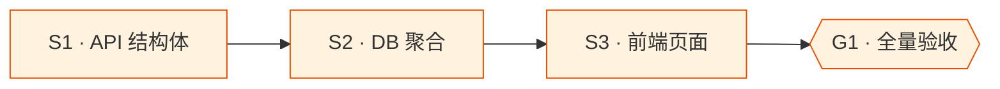

# usage-statistics

## Goal

新增「使用统计」独立页面，按平台 / 分组 / 模型维度展示请求量、Token 消耗、延迟等聚合指标，支持按天 / 小时粒度与时间范围筛选，使用户能直观了解各 AI 资源的使用情况。

## What I already know

### 现状

- 数据源：`proxy_logs` 表（`src-tauri/migrations/001_init.sql:59`），含 `group_name`, `model`, `actual_model`, `target_protocol`, `status_code`, `duration_ms`, `input_tokens`, `output_tokens`, `created_at`
- 已有索引：`idx_proxy_logs_group(group_name)`, `idx_proxy_logs_created(created_at)`
- 前端路由：`src/App.tsx` 基于 `activeNav` 状态切换页面组件，侧栏导航由 `src/components/Sidebar.tsx` 管理
- i18n：7 语言 `src/locales/*.json`，使用 `t(key, fallback)` 模式
- DB 层：`src-tauri/src/gateway/db.rs`，rusqlite，`Db` struct 封装 `Mutex<Connection>`
- Tauri command 模式：`#[tauri::command]` + `invoke` 前端调用

### 调研结论

- `proxy_logs` 缺 `platform_id`，仅有 `target_protocol`（协议类型，非平台实例）。统计可按 `target_protocol` 聚合作为"协议/平台类型"维度，或通过 `group_name` → `groups` → `group_platforms` → `platforms` 间接关联。
- 按 `target_protocol` 聚合更直接高效，对用户语义等同于"按平台类型"。

## Assumptions (temporary)

- 用户关注"协议类型"维度的统计（OpenAI / Anthropic / GLM 等），而非单个平台实例
- 日志量不大（单机场景），SQLite 聚合查询性能足够
- 前端图表使用纯 CSS/Canvas 自绘，不引入第三方图表库

## Open Questions

无 (范围已明确)

## Deliverable 矩阵

| ID | 交付物 | 类型 | 独立验收 | 优先级 |
| --- | --- | --- | --- | --- |
| D1 | Rust 后端统计 API（聚合查询 + Tauri command） | diff | `cargo check` 通过；前端调用返回结构化 JSON | P0 |
| D2 | 前端统计页面（筛选 + 图表 + 表格） | UI | 页面渲染正常，筛选交互生效，数据展示与 API 一致 | P0 |
| D3 | 导航入口 + i18n（7 语言） | diff | 侧栏出现统计入口；切换语言文案正确 | P0 |

## Requirements

### R1 (D1) — 后端聚合 API

- R1.1 新增 Tauri command `stats_query`，接受参数：`time_range` (start/end ISO 8601)、`granularity` (hourly/daily)、`group_by` (platform/model/group)
- R1.2 返回结构包含：时间桶列表、每桶的请求次数、成功次数、失败次数、总 input_tokens、总 output_tokens、平均 duration_ms
- R1.3 支持按 group_name / model / target_protocol 筛选（可选参数，不传 = 全部）
- R1.4 SQL 查询使用已有索引，避免全表扫描

### R2 (D2) — 前端统计页面

- R2.1 独立页面组件 `src/pages/Stats.tsx`
- R2.2 顶部筛选区：时间范围选择（预设：今天 / 近 7 天 / 近 30 天 / 自定义）、分组下拉、模型下拉、聚合粒度切换（小时 / 天）
- R2.3 核心指标卡片：总请求数、成功率、总 Token 数、平均延迟
- R2.4 趋势图：请求量 / Token / 延迟随时间变化
- R2.5 分布表格：按所选 group_by 维度的排行榜
- R2.6 Liquid Glass 视觉风格，与现有页面一致

### R3 (D3) — 导航与国际化

- R3.1 侧栏新增「使用统计」导航项，位于「代理服务」之后
- R3.2 7 语言翻译文件新增 `nav.stats` / `page.stats` / 统计相关文案 key

## Subtask 拆分

| ID | Subtask | 所属 Deliverable | 边界 | 简要说明 | 详情文件 |
| --- | --- | --- | --- | --- | --- |
| S1 | 定义统计 API 数据结构与 Tauri command | D1 | `src-tauri/src/gateway/models.rs`, `src-tauri/src/lib.rs` | 新增 StatsQuery / StatsResult 结构体 + command 注册 | `subtask/S1-stats-api-structs.md` |
| S2 | 实现 DB 聚合查询 | D1 | `src-tauri/src/gateway/db.rs` | SQL 聚合 proxy_logs，按时间/维度分组 | `subtask/S2-db-aggregation.md` |
| S3 | 前端统计页面 + 导航 + i18n | D2, D3 | `src/pages/Stats.tsx`, `src/App.tsx`, `src/locales/*.json`, `src/services/api.ts` | 完整页面实现 + 路由 + 国际化 | `subtask/S3-frontend-stats-page.md` |

### Subtask 调度图



## Acceptance Criteria

- [ ] D1: `cargo check` 编译通过；前端能调用 `stats_query` 并获取 JSON 响应
- [ ] D2: 统计页面渲染无报错；切换时间范围 / 粒度 / 筛选条件，数据正确刷新
- [ ] D3: 侧栏出现「使用统计」入口；7 种语言文案正确显示

## Definition of Done

- 全部 Requirements 实现 + Acceptance Criteria 勾选
- 变更已 commit
- task worktree 已合并 + 移除 (环境干净)
- 非平凡发现落 cortex

## Out of Scope

- 实时统计 / WebSocket 推送
- 数据导出 (CSV/Excel)
- 第三方图表库引入 (ECharts / Chart.js)
- 按单个平台实例聚合（当前仅按协议类型）
- 统计数据缓存 / 预计算

## Technical Notes

### 文件位置

- DB schema: `src-tauri/migrations/001_init.sql`
- DB 查询层: `src-tauri/src/gateway/db.rs`
- 模型定义: `src-tauri/src/gateway/models.rs`
- Tauri commands: `src-tauri/src/lib.rs`
- 前端页面: `src/pages/`
- 路由: `src/App.tsx`
- API 服务: `src/services/api.ts`
- i18n: `src/locales/*.json`

### 验证命令

```bash
cd src-tauri && cargo check
cd .. && npx tsc --noEmit
```
