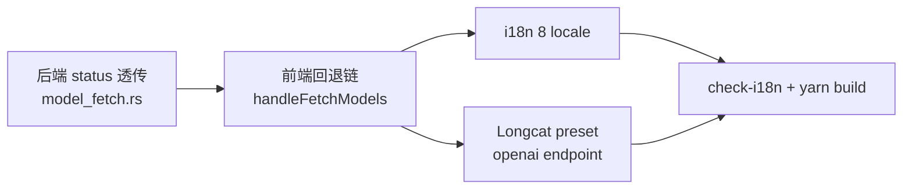

# Longcat fetchModels 协议回退链 + openai preset

- **Status**: planning（research 已回填，grill 硬门 2 通过，用户选定 D2 方案 b，待 start）
- **Source**: session:claude_96a0dd46-757b-40db-a9f7-4555767078d3
- **Research**: `research/longcat-openai-endpoint.md`（curl 实证 + 错误处理现状）

## 背景

Longcat (api.longcat.chat) preset 仅 anthropic endpoint (`https://api.longcat.chat/anthropic`, Platforms.tsx:269-271)。fetchModels 设计为「优先 openai endpoint」，但 Longcat 无 openai endpoint → 优先落空 → 回退 anthropic。

**research 实证真根因**（非端点缺失）：
- Longcat 两个协议 models 端点**都存在且都需鉴权**（`/openai/v1/models` 401 + `/anthropic/v1/models` 401）
- 当前 `model_fetch.rs:103-107` 对 401 错误体 `{"error":{...}}`（合法 JSON）解析「成功」→ 取不到 `data` → `unwrap_or_default()` 返空 Vec → 前端显示「未获取到可用模型」，**与 404 表现完全相同**
- status code 完全不参与控制流（model_fetch.rs:94 status 仅 log）

即用户报「拉不到」实为 **401 鉴权失败被吞成空数组**，而非端点不存在。

fetchModels 单协议单次：失败即 setFetchError，无 404 回退、无 401/403 区分。

## 目标

1. **Longcat preset 补 openai endpoint**（让优先 openai 命中）
2. **fetchModels 改多协议回退链**（通用，Longcat 是触发例）：
   - 优先 openai 协议拉模型
   - 404 / 网络错 → 回退试下一协议（anthropic / 其他已配 endpoint）
   - 🔴 **401/403 → 直接报错**，告知用户鉴权问题（不回退，鉴权错回退无意义）
   - 全部协议 404 → 报「拉不到模型」

## 决策（research 回填，待用户确认）

| ID | 决策 | 选定 | 据 |
|---|---|---|---|
| D1 | 回退链实现层 | **前端循环多协议调 fetchModels（方案 d）** | 后端零多协议逻辑，前端按 endpoints 顺序 try；后端只补 status 透传 |
| D2 | 401/403 透传 | **方案 b：后端 `Result<Vec<String>, FetchModelsError>` 强类型 enum**（用户选定）| enum `Auth{code,message}` / `NotFound{..}` / `Other{..}` + Serialize；Tauri command Err 须 serde-serializable，enum 满足；前端 catch 按 kind 分流；api.ts 加 FetchModelsError type |
| D3 | Longcat openai base_url | **`https://api.longcat.chat/openai/v1`** | curl 实测 401 鉴权墙确认端点存在（`/v1` 全 404 已证伪） |
| D4 | 范围 | **通用回退链** | 改造同时影响 17 openaiEp 平台 + 9 anthropic-only 平台，须通用向前兼容 |

## 范围

- **改**：
  - 后端 `platform_fetch_models` (model_fetch.rs)：返回类型 `Result<Vec<String>, FetchModelsError>`；`serde_json::from_str` 前加 `if !status.is_success()` 按 status 映射 `Auth(401/403)` / `NotFound(404)` / `Other`；新增 `FetchModelsError` enum（Serialize，tag=kind，字段 code/message）
  - 前端 `api.ts:501`：fetchModels 错误类型从 string 变 `FetchModelsError`（加 TS type 定义）；invoke reject 传 enum 序列化对象
  - 前端 `handleFetchModels` (Platforms.tsx:2389)：单次 → 按 endpoints 顺序循环（openai 优先 → anthropic → 其余），catch 按误差类型分流：`Auth` 立即 break + 鉴权文案 / `NotFound`+`Other` continue 试下一协议；全失败报错
  - 前端 fetchError 渲染 (Platforms.tsx:3074)：区分鉴权错专用文案
  - Longcat preset (Platforms.tsx:269)：加 `{ protocol: "openai", base_url: "https://api.longcat.chat/openai/v1", client_type: "codex_tui" }`
  - i18n：8 locale 加 `platform.fetchAuthError` key
- **复用**：build_models_url / apply_models_auth（model_fetch.rs 已有，按 protocol 构造）

## 验证

```bash
cd src-tauri
cargo test model_fetch -- --nocapture    # 新增 status 透传测试
cargo clippy                              # warning 必清
grep -n "is_success\|HTTP {}" src/commands/model_fetch.rs  # status 透传接入
cd ..
yarn build
node scripts/check-i18n.mjs              # exit 0（8 locale 新 key 齐全）
grep -n "openai/v1" src/pages/Platforms.tsx  # Longcat preset
grep -n "HTTP 401\|HTTP 403\|fetchAuthError" src/pages/Platforms.tsx  # 前端分流
```

断言：
- 后端：mock 401 响应 → `platform_fetch_models` 返 Err 含 `"HTTP 401"`（非空 Vec）
- 前端：openaiEp 404 + anthropic 200 → 返 anthropic 模型（回退生效）
- 前端：openaiEp 401 → 即时 setFetchError 鉴权文案，不试 anthropic

## 失败模式

| 触发 | 一线修复 | 兜底 |
|---|---|---|
| 后端 status 透传后，前端字符串 match `HTTP 401` 脆弱 | 统一 Err 格式 `HTTP {code}: {body}`，前端 startsWith 判 | 升级方案 b 强类型 enum（破坏 17 平台签名，需迁移）|
| Longcat openai base_url 月级腐化（spring 路由） | preset 注释标注实证日期 | 用户可改 preset base_url |
| 8 locale 漏 key | check-i18n.mjs exit 非 0 阻断 | 补齐 |

## 调度图



- 后端先（前端依赖 status 透传契约）；前端 / i18n / preset 并行（文件集不相交）

## 不做

- 静态默认模型列表硬编码（模型 id 未拿到静态来源，SPA+鉴权墙；维持 Platforms.tsx:544 注释，回退链修好后 fetchModels 实拉）
- 方案 b 强类型 enum（YAGNI，方案 a 足够；标注升级路径）
- openai_responses 端点验证（Codex TUI client_type 是否走 responses，scope 外）
