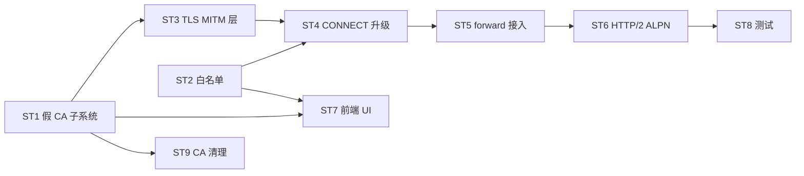

# Design: proxy MITM 解密隧道 P3

- **PRD**: `prd.md`
- **Date**: 2026-07-03
- **grill**: v2 补弱点（C 验证断言 / F 失败模式 / ST9 CA 清理 / pinning 降级 / 决策落定）

---

## 架构分层

```
src-tauri/src/gateway/
  mitm/
    mod.rs              # 模块入口 + MITM 分流入口
    ca.rs               # 假 CA 生成（rcgen）+ DB 存储（明文+权限0600）+ 装信任库（tauri-plugin-shell）+ 清理
    whitelist.rs        # 全局白名单（host suffix 匹配）+ DB 表
    tls.rs              # tokio-rustls accept（假证书）+ client connect（真上游）
    cert_signer.rs      # 动态签证书（按 SNI 签 host 证书，缓存）
  proxy/
    connect.rs          # 升级：CONNECT 分流（白名单命中→MITM / 未命中→P1 盲转 / pinning fail→降级盲转）
    handler.rs          # 明文 Request 灌入 handle_proxy_core（复用 forward_attempt）
```

前端 + DB：
```
src/components/settings/MitmConfig.tsx   # 白名单配置 + CA 安装状态/引导
src-tauri/src/gateway/db/schema_late.rs  # 新表：mitm_ca + mitm_whitelist
```

## 决策（已落定）

| ID | 决策 | 选定 |
|---|---|---|
| D1 | 假 CA 装信任库 UX | Tauri 自动装（tauri-plugin-shell + sudo 弹窗确认）|
| D2 | MITM 范围 | 可配白名单（默认 AI host + 用户自定义）|
| D3 | 客户端配置 | 保留 BASE_URL 自动写现状，禁自动写 HTTP_PROXY |
| D4 | 私钥存储 | DB（明文 + DB 文件权限 0600）|
| D5 | 私钥加密 | 明文 + 文件权限（不二次加密，与现状 DB 安全模型一致）|
| D6 | 白名单作用域 | 全局（MITM 是 AirDog 级能力，非 per-group；CONNECT 隧道无 group_key）|
| D7 | CA 生成时机 | 用户首次启用 MITM 时（明确动作触发，非首次启动默认）|
| D8 | 提权 UX | sudo 弹窗确认（透明，用户知情）|
| D9 | HTTP/2 | 自动 ALPN 协商（两段独立，必要时协议转换）|

## 子系统设计

### 1. 假 CA 子系统（ca.rs）

- **生成**（D7）：用户首次启用 MITM 时，rcgen 生成自签 Root CA（ECDSA P256）+ 私钥
- **存储**（D4/D5）：`mitm_ca` 表，`private_key_pem` / `cert_pem` / `created_at` / `enabled`；DB 文件权限 0600，私钥明文
- **装信任库**（D1/D8）：tauri-plugin-shell + sudo 弹窗确认
  - macOS: `security add-trusted-cert -d -r trustRoot -k /Library/Keychains/System.keychain <ca.pem>`
  - Windows: `certutil -addstore -f "Root" <ca.pem>`
  - Linux: 拷 `/usr/local/share/ca-certificates/aidog-ca.crt` + `update-ca-certificates`
  - **失败兜底**（弱点3）：sudo 拒绝/命令失败 → UI 弹窗给命令+路径，引导用户手动装；标记 `ca_installed=false`
- **清理**（ST9）：禁用 MITM / 卸载时移除系统 CA（reverse 命令）

### 2. 白名单（whitelist.rs）

- **全局**（D6）：`mitm_whitelist` 表，`host_pattern`（`api.anthropic.com` / `*.openai.com`）+ `enabled` + `source`（default/user）
- **默认**：启用时填 AI host（anthropic.com / openai.com + 已配平台 base_url host）
- **匹配**：CONNECT target host → suffix 匹配 → 命中 MITM，未命中 P1 盲转

### 3. TLS MITM 层（tls.rs + cert_signer.rs）

- **accept**：tokio-rustls TLS server，cert_signer 按 SNI 动态签 host 证书（假 CA 签），缓存
- **connect**：tokio-rustls TLS client，系统 root store 验证上游真证书
- **pinning 降级**（弱点6）：上游握手 fail（疑似 cert pinning）→ 该 host 标记 `pinning_suspect`，后续 CONNECT 降级 P1 盲转 + 告警日志

### 4. CONNECT 升级（connect.rs）

```
handle_connect(req):
  target = 多源解析（path/authority/Host）
  host = target.rsplit_once(':').0
  if whitelist.match(host) && !pinning_suspect(host):
    return mitm::handle_mitm(target, host)   # P3
  else:
    return blind_relay(target)                # P1 盲转（保留）
```

### 5. forward_attempt 复用（handler.rs）

- mitm::handle_mitm accept TLS → 解析明文 Request → 构造 axum Request
- 灌入 `handle_proxy_core`（middleware/路由/headers/retry/采集全套，95% 复用）
- 响应重新加密回 client
- **签名不匹配兜底**（弱点3）：明文 Request 构造与 handle_proxy_core 签名不符 → ST5 实装时按现有签名适配，禁改 handle_proxy_core 公共签名

## 依赖



## subtask + 验证断言（弱点1 补）

| ID | subtask | 验收断言（grep/test 门）|
|---|---|---|
| ST1 | 假 CA 子系统 | `cargo test ca_sign_cert`（rcgen 签证书 SAN 正确）+ `grep -n "add-trusted-cert\|certutil\|update-ca-certificates" ca.rs`（3 OS 命令齐）+ `grep -n "mitm_ca" schema_late.rs`（表建）|
| ST2 | 白名单 | `cargo test whitelist_match`（suffix 匹配：`api.anthropic.com` 命中 `*.anthropic.com`）+ `grep -n "mitm_whitelist" schema_late.rs` |
| ST3 | TLS MITM 层 | `cargo test tls_handshake`（mock client 信任假 CA → 握手成功）+ `grep -n "TokioIo\|rustls::ServerConfig" tls.rs` |
| ST4 | CONNECT 升级 | `cargo test connect_mitm分流`（白名单命中→MITM / 未命中→盲转）+ `grep -n "whitelist::match\|blind_relay" connect.rs` |
| ST5 | forward 接入 | `cargo test mitm_forward`（明文 Request → handle_proxy_core → middleware 命中）+ 现有 forward_attempt 不破 |
| ST6 | HTTP/2 ALPN | `grep -n "ALPN\|h2\|http/1.1" tls.rs`（两段协商）|
| ST7 | 前端 UI | `yarn build` + `node scripts/check-i18n.mjs` exit 0 + `grep -n "MitmConfig" AppSettings` |
| ST8 | 测试 | 端到端：mock CA 客户端 → CONNECT → TLS → 明文断言 → forward → 上游 mock → 响应回传；现有 5 connect 测试不回归 |
| ST9 | CA 清理 | `grep -n "remove-trusted-cert\|deletestore\|remove-ca" ca.rs`（3 OS reverse 命令）+ `cargo test ca_cleanup` |

## 失败模式三段式（弱点3 补）

| 触发 | 一线修复 | 兜底 |
|---|---|---|
| sudo 装 CA 拒绝/失败 | UI 给命令+路径引导手动装 | 标 `ca_installed=false`，MITM 不启用 + 告警 |
| TLS 握手 fail（client 不信任 CA）| 检测握手错误 → 引导装 CA | 降级盲转 + 告警 |
| 上游握手 fail（疑似 pinning）| 该 host 标 `pinning_suspect` | 后续降级 P1 盲转 + 告警日志 |
| 明文 Request 签名不匹配 handle_proxy_core | 按现有签名适配构造 | 禁改公共签名，回 planning |
| 假 CA 私钥泄露（DB 被拷）| 文件权限 0600 | 用户重生成 CA（轮换）+ 重装信任库 |

## 风险

| 风险 | 缓解 |
|---|---|
| 私钥 DB 明文，文件被拷 → 白名单内 HTTPS 被 MITM | DB 权限 0600 + 白名单限范围 + CA 轮换 |
| 客户端 cert pinning | research：CC 无 / Codex 推测无；实装 pinning_suspect 降级 |
| tauri-plugin-shell 新 capability | 权限审计，仅装 CA 命令 |
| 卸载后系统信任库残留 CA | ST9 清理钩子 |
| 性能（双 TLS）| 评估 |

## 工作量

| ST | 估算 |
|---|---|
| ST1 假 CA | 2-3 天 |
| ST2 白名单 | 0.5-1 天 |
| ST3 TLS 层 | 2-3 天 |
| ST4 CONNECT 升级 | 1 天 |
| ST5 forward 接入 | 1-2 天 |
| ST6 HTTP/2 | 1-2 天 |
| ST7 前端 | 1-2 天 |
| ST8 测试 | 1-2 天 |
| ST9 CA 清理 | 0.5-1 天 |
| 合计 | 10-17 天 |

## 不做

- 全量 HTTPS MITM（白名单限 AI host + 自定义）
- 移除 BASE_URL 自动配（D3 保留现状）
- P2 元数据补强（P3 后是子集）
- per-group 白名单（D6 全局）
